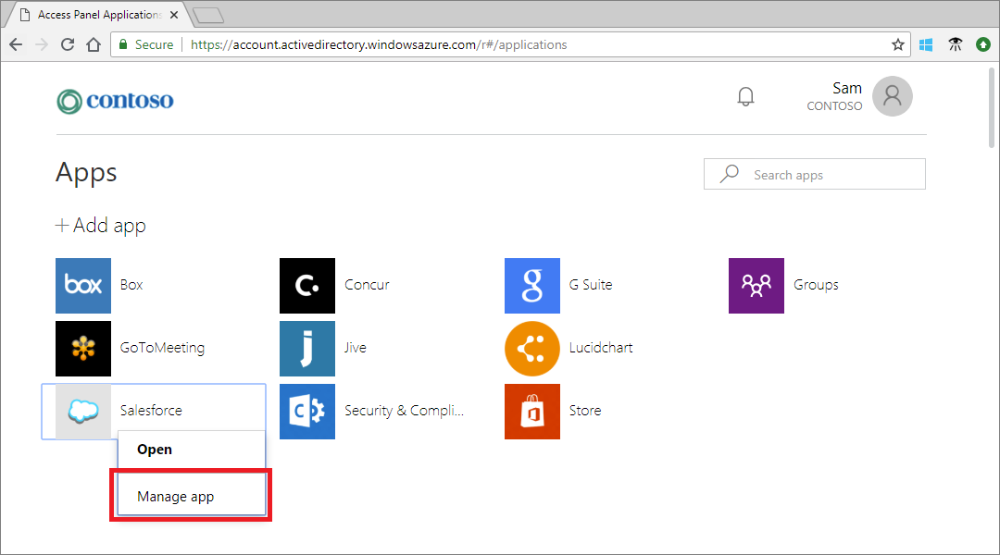
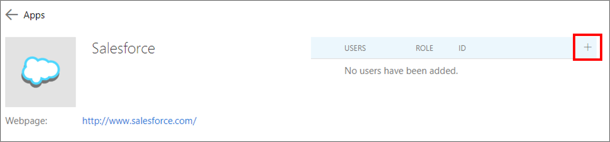

---

title: Add B2B collaboration users as an information worker - Azure AD
description: B2B collaboration allows information workers and app owners to add guest users to Azure AD for access | Microsoft Docs

services: active-directory
ms.service: active-directory
ms.subservice: B2B
ms.topic: conceptual
ms.date: 12/19/2018

ms.author: mimart
author: msmimart
manager: celestedg
ms.reviewer: mal
ms.custom: "it-pro, seo-update-azuread-jan"
ms.collection: M365-identity-device-management
---

# How users in your organization can invite guest users to an app

After a guest user has been added to the directory in Azure AD, an application owner can send the guest user a direct link to the app they want to share. Azure AD admins can also set up self-service management for gallery or SAML-based apps in their Azure AD tenant. This way, application owners can manage their own guest users, even if the guest users haven’t been added to the directory yet. When an app is configured for self-service, the application owner uses their Access Panel to invite a guest user to an app or add a guest user to a group that has access to the app. Self-service app management for gallery and SAML-based apps requires some initial setup by an admin. The following is a summary of the setup steps (for more detailed instructions, see [Prerequisites](#prerequisites) later on this page):

 - Enable self-service group management for your tenant
 - Create a group to assign to the app and make the user an owner
 - Configure the app for self-service and assign the group to the app

> [!NOTE]
> This article describes how to set up self-service management for gallery and SAML-based apps that you’ve added to your Azure AD tenant. You can also [set up self-service Office 365 groups](https://docs.microsoft.com/azure/active-directory/users-groups-roles/groups-self-service-management) so your users can manage access to their own Office 365 groups. For more ways users can share Office files and apps with guest users, see [Guest access in Office 365 groups](https://support.office.com/article/guest-access-in-office-365-groups-bfc7a840-868f-4fd6-a390-f347bf51aff6) and [Share SharePoint files or folders](https://support.office.com/article/share-sharepoint-files-or-folders-1fe37332-0f9a-4719-970e-d2578da4941c).

## Invite a guest user to an app from the Access Panel

After an app is configured for self-service, application owners can use their own Access Panel to invite a guest user to the app they want to share. The guest user doesn't necessarily need to be added to Azure AD in advance. 

1. Open your Access Panel by going to `https://myapps.microsoft.com`.
2. Point to the app, select the ellipses (**...**), and then select **Manage app**.
 
   
 
3. At the top of the users list, select **+**.
   
   
   
4. In the **Add members** search box, type the email address for the guest user. Optionally, include a welcome message.
   
   
   
5. Select **Add** to send an invitation to the guest user. After you send the invitation, the user account is automatically added to the directory as a guest.

## Invite someone to join a group that has access to the app
After an app is configured for self-service, application owners can invite guest users to the groups they manage that have access to the apps they want to share. The guest users don't have to already exist in the directory. The application owner follows these steps to invite a guest user to the group so that they can access the app.

1. Make sure you're an owner of the self-service group that has access to the app you want to share.
2. Open your Access Panel by going to `https://myapps.microsoft.com`.
3. Select the **Groups** app.
   
   
   
4. Under **Groups I own**, select the group that has access to the app you want to share.
   
   
   
5. At the top of the group members list, select **+**.
   
   
   
6. In the **Add members** search box, type the email address for the guest user. Optionally, include a welcome message.
   
   
   
7. Select **Add** to automatically send the invitation to the guest user. After you send the invitation, the user account is automatically added to the directory as a guest.

## Prerequisites

Self-service app management requires some initial setup by a Global Administrator and an Azure AD administrator. As part of this setup, you'll configure the app for self-service and assign a group to the app that the application owner can manage. You can also configure the group to allow anyone to request membership but require a group owner's approval. (Learn more about [self-service group management](https://docs.microsoft.com/azure/active-directory/users-groups-roles/groups-self-service-management).) 

> [!NOTE]
> You cannot add guest users to a dynamic group or to a group that is synced with on-premises Active Directory.

### Enable self-service group management for your tenant
1. Sign in to the [Azure portal](https://portal.azure.com) as a Global Administrator.
2. In the navigation panel, select **Azure Active Directory**.
3. Select **Groups**.
4. Under **Settings**, select **General**.
5. Under **Self Service Group Management**, next to **Owners can manage group membership requests in the Access Panel**, select **Yes**.
6. Select **Save**.

### Create a group to assign to the app and make the user an owner
1. Sign in to the [Azure portal](https://portal.azure.com) as an Azure AD administrator or Global Administrator.
2. In the navigation panel, select **Azure Active Directory**.
3. Select **Groups**.
4. Select **New group**.
5. Under **Group type**, select **Security**.
6. Type a **Group name** and **Group description**.
7. Under **Membership type**, select **Assigned**.
8. Select **Create**, and close the **Group** page.
9. On the **Groups - All groups** page, open the group. 
10. Under **Manage**, select **Owners** > **Add owners**. Search for the user who should manage access to the application. Select the user, and then click **Select**.

### Configure the app for self-service and assign the group to the app
1. Sign in to the [Azure portal](https://portal.azure.com) as an Azure AD administrator or Global Administrator.
2. In the navigation pane, select **Azure Active Directory**.
3. Under **Manage**, select **Enterprise applications** > **All applications**.
4. In the application list, find and open the app.
5. Under **Manage**, select **Single sign-on**, and configure the application for single sign-on. (For details, see [how to manage single sign-on for enterprise apps](https://docs.microsoft.com/azure/active-directory/manage-apps/configure-single-sign-on-non-gallery-applications).)
6. Under **Manage**, select **Self-service**, and set up self-service app access. (For details, see [how to use self-service app access](https://docs.microsoft.com/azure/active-directory/application-access-panel-self-service-applications-how-to).) 

    > [!NOTE]
    > For the setting **To which group should assigned users be added?** select the group you created in the previous section.
7. Under **Manage**, select **Users and groups**, and verify that the self-service group you created appears in the list.
8. To add the app to the group owner's Access Panel, select **Add user** > **Users and groups**. Search for the group owner and select the user, click **Select**, and then click **Assign** to add the user to the app.

## Next steps

See the following articles on Azure AD B2B collaboration:

- [What is Azure AD B2B collaboration?](what-is-b2b.md)
- [How do Azure Active Directory admins add B2B collaboration users?](add-users-administrator.md)
- [B2B collaboration invitation redemption](redemption-experience.md)
- [Azure AD B2B collaboration licensing](licensing-guidance.md)
