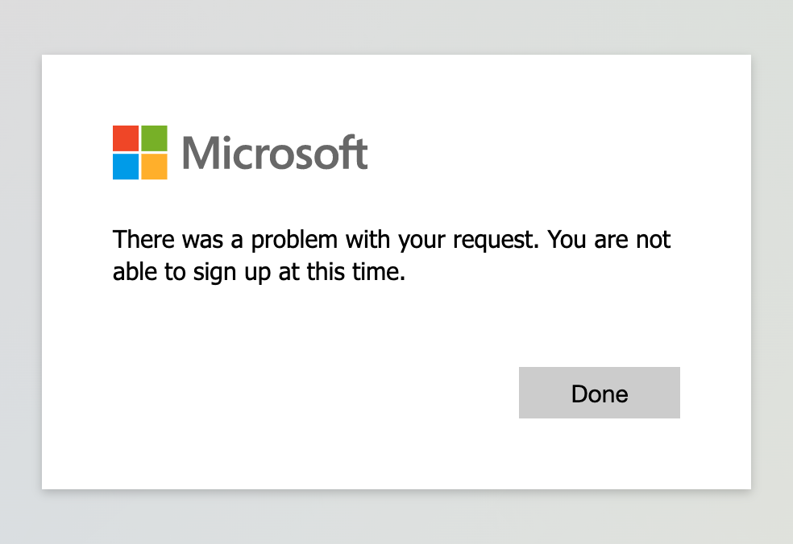
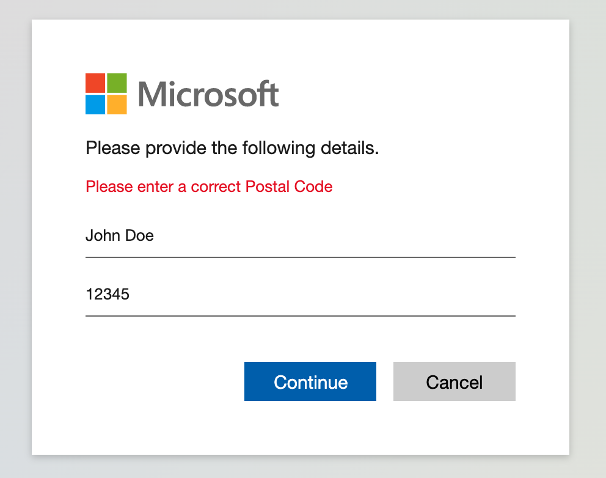

# Use API connectors to customize and extend your user flows by leveraging Web APIs

As a developer or IT administrator, you can use API connectors to integrate your user flows with external systems. For example, you can use API connectors to:

- **Enable custom approvals**. [Enable your custom user approval system](self-service-sign-up-add-approvals.md) for managing account creation.
- **Perform identity proofing**. Use an identity proofing and verification service to add an extra level of security to account creation decisions.
- **Validate user input data**. Prevent malformed or invalid user data. For example, you can validate user-provided data against existing data in an external data store or list of permitted values. Based on the validation, you can ask a user to provide valid data or block the user from continuing the sign-up flow.
- **Overwrite user attributes**. Reformat or assign an overwriting value to an attribute collected from the user . For example, if a user enters the first name in all lowercase or all uppercase letters, you can format the name with only the first letter capitalized. 
- **Enrich user data**. Integrate with your external cloud systems that store user information to pull them into the authentication flow. For example, your API can receive the user's email address, query a CRM system, and return the user's loyalty number. Returned claims can be used to pre-fill form fields or return additional data in the application token. 
- **Run custom business logic**. You can trigger downstream events in your cloud systems to send push notifications, update corporate databases, manage permissions, audit databases, and perform other custom actions.

An API connector represents a contract between Azure AD and an API endpoint by defining the HTTP **endpoint**, **authentication**, **request** and **expected response**. Once you configure an API connector, you can enable it for a specific step in a user flow. 

## Request to the API
An API connector materializes as an **HTTP POST** request, sending selected claims as key-value pairs in a JSON body. The response should also have the HTTP header **Content-Type: application/json**. Attributes are serialized similarly to Microsoft Graph user attributes. <!--# TODO: Add link to MS Graph or create separate reference.-->

### Example request
```http
POST <API-endpoint>
Content-type: application/json

{
 "email_address": "johnsmith@fabrikam.onmicrosoft.com",
 "identities": [ //Sent for Google and Facebook identity providers
     {
     "signInType":"federated",
     "issuer":"facebook.com",
     "issuerAssignedId":"0123456789"
     }
 ],
 "displayName": "John Smith",
 "postalCode": "33971",
 "extension_<app-id>_CustomAttribute1": "custom attribute value",
 "extension_<app-id>_CustomAttribute2": "custom attribute value",
 "ui_locales":"en-US"
}
```

## Where you can enable an API connector for a user flow

There are two places in a sign-up user flow where you can enable an API connector:

- After signing in with an identity provider
- Before creating the user

In both of these cases, the API connectors are invoked during sign-up, not sign-in.

### After signing in with an identity provider

An API connector at this step in the sign-up process is invoked immediately after the user signs in with an identity provider (Google, Facebook, Azure AD). This step precedes the **attribute collection page**, which is a form you can present to the user to collect user information. The following are examples of API connector scenarios you might enable at this step:

- Use the email or federated identity that the user just provided to look up claims in an existing system. Return these claims from the existing system, pre-fill the attribute collection page, and make them available to return in the token.
- Validate whether the user is included in an allow or deny list, and control whether they can continue with the sign-up flow.

### Before creating the user

An API connector at this step in the sign-up process is invoked after the attribute collection page, if one is included. This step is always invoked before a user account is created in Azure AD. The following are examples of scenarios you might enable at this point during sign-up:

- Validate user input data and ask a user to resubmit data.
- Block a user sign-up based on data entered by the user.
- Perform identity proofing.
- Query external systems for existing data about the user to return it in the application token or store it in Azure AD.

## Expected response types from the web API

When the web API receives an HTTP request from Azure AD during a user flow, it can return these responses:

- [Continuation response](#continuation-response)
- [Blocking response](#exit-response)
- [Validation-error response](#validation-error-response)

### Continuation response

A continuation response indicates that the user flow should continue to the next step. In a continuation response, the API can return claims.

If a claim is returned from the API and selected in the expected response configuration, the claim does the following:

- Pre-fills input fields in the attribute collection page if the claims are returned  before the page is presented. The claim must be selected in the **User attributes** for the user flow.
- Overrides any value that has already been assigned to the claim.
- Assigns a value to the claim if it was previously null.

> [!NOTE]
> A claim is stored in the directory only if it is selected in the **User attributes** blade and collected in the attribute collection page. You can always return a claim in the token by selecting it in the **Application claims** blade.

#### Example of a continuation response
```http
HTTP/1.1 200 OK
Content-type: application/json

{
    "version": "1.0.0", 
    "action": "Continue",  
    "postalCode": "12349" // return claim 
}
```

The continuation response contains the following parameters:

| Parameter  | Type  | Required | Description |
|---|---|---|---|
| version | String | Yes | The version of the API. |
| action  | String | Yes | Value must be "**Continue**". |
| \<userAttribute> | \<attribute-type> | No  | Returned values can be returned in the application token or stored in the directory. Must also be selected a 'Claim to receive' in the API connector configuration. |

### Blocking Response

A blocking response exits the user flow. It can be purposely issued by the API to stop the continuation of the user flow by displaying a block page to the user. The block page displays the `userMessage` provided by the API. The `code` value can be used for troubleshooting but is optional and not displayed to the user.

#### Example of a blocking response
```http
HTTP/1.1 200 OK
Content-type: application/json

{
    "version": "1.0.0",
    "action": "ShowBlockPage", 
    "userMessage": "There was a problem with your request. You are not able to sign up at this time."
}

```

The blocking response contains the following parameters:

| Parameter  | Type  | Required | Description |
|---|---|---|---|
| version         | String           | Yes      | The version of the API.    |
| action          | String           | Yes      | Value must be "**ShowBlockPage**"  |
| userMessage     | String           | Yes      | Message to display to the user.    |
| code            | String           | No       | Error code. Can be used for debugging purposes.    |

#### End user experience with a blocking response



### Validation-error response

An API call invoked after an attribute collection page may return a validation-error response. When doing so, the user flow stays on the attribute collection page and the `userMessage` is displayed to the user. The user can then edit and resubmit the form. This type of response can be used for input validation.

#### Example of a validation-error response

```http
HTTP/1.1 400 Bad Request
Content-type: application/json

{
    "version": "1.0.0", 
    "status": 400,
    "action": "ValidationError",  
    "userMessage": "Please enter a valid Postal Code."
}
```

The validation-error response contains the following parameters:

| Parameter  | Type  | Required | Description |
|---|---|---|---|
| version         | String           | Yes      | The version of the API.   |
| action          | String           | Yes      | Value must be "**ValidationError**".   |
| status          | Integer           | Yes      | Must be value **400** for a ValidationError response.  |
| userMessage     | String           | Yes      | Message to display to the user.   |
| code            | String           | No       | Error code. Can be used for debugging purposes.    |

#### End user experience with a validation-error response



<!-- > [!IMPORTANT]
> If an invalid response is returned or another error occurs (for example, a network error), the user will be redirected to the app with the error re -->

## Frequently asked questions (FAQ)

### How do I integrate with an existing API endpoint?
You can use an [HTTP trigger in Azure Functions](https://docs.microsoft.com/azure/azure-functions/functions-bindings-http-webhook-trigger?tabs=csharp) as a simple way to call and invoke other web APIs.

## Next steps
- Learn how to [add an API connector to a user flow](self-service-sign-up-add-api-connector.md)
- Learn how to [add a custom approval system to self-service sign-up](self-service-sign-up-add-approvals.md)
- Learn how to [use API connectors for identity proofing](sample-identity-proofing-idology.md) <!--#TODO: Make doc, link.-->