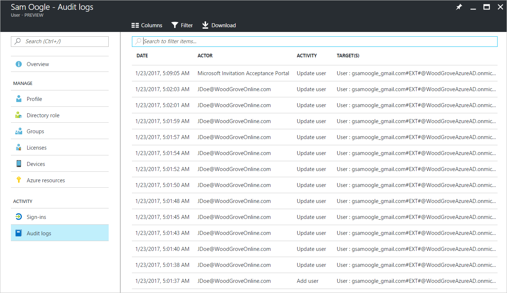

# Auditing and reporting a B2B collaboration user
With guest users, you have auditing capabilities similar to with member users. 

## Access reviews
You can use access reviews to periodically verify whether guest users still need access to your resources. The **Access reviews** feature is available in **Azure Active Directory** under **External Identities** > **Access reviews**. You can also search for "access reviews" from **All services** in the Azure portal. To learn how to use access reviews, see [Manage guest access with Azure AD access reviews](../governance/manage-guest-access-with-access-reviews.md).

## Audit logs

The Azure AD audit logs provide records of system and user activities, including activities initiated by guest users. To access audit logs, in **Azure Active Directory**, under **Monitoring**, select **Audit logs**. Here's an example of the invitation and redemption history of invitee Sam Oogle:

You can dive into each of these events to get the details. For example, let's look at the acceptance details.

You can also export these logs from Azure AD and use the reporting tool of your choice to get customized reports.

### Next steps

- [B2B collaboration user properties](user-properties.md)

