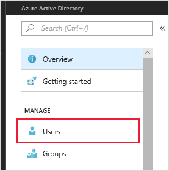
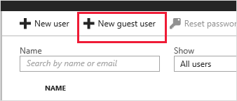
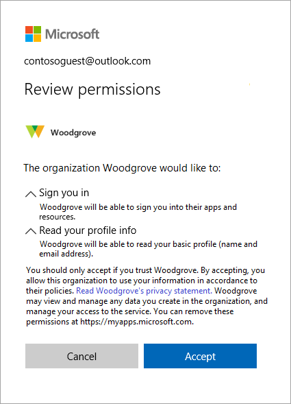

# Quickstart: Add B2B guest users from within the Azure portal

As an Azure Active Directory (Azure AD) admin, you can invite a user to collaborate with your organization by adding them to your directory as a guest user. Then you can either send an invitation email that contains a redemption link or send a direct link to an app you want to share.

In this quickstart, you'll add a new guest user to Azure AD, send an invitation, and see what the guest user's invitation redemption process looks like.

If you don’t have an Azure subscription, create a [free account](https://azure.microsoft.com/free/?WT.mc_id=A261C142F) before you begin.

## Prerequisites

To complete the scenario in this tutorial, you need:

 - A role that allows you to create users in your tenant directory, like the Global Administrator role or any of the limited administrator directory roles.
 - A valid email account that you can add to your tenant directory, and that you can use to receive the test invitation email.

## Create a test guest user in Azure AD and send an invitation

1. Sign in to the [Azure portal](https://portal.azure.com/) as an Azure AD administrator.
2. In the left pane, select **Azure Active Directory**.

    

3.	Under **Manage**, select **Users**.

    

4.	Select **New guest user**.

    

5.	Under **User name**, enter the email address of the external user. Under **Include a personal message with the invitation**, type a welcome message. 

    

6. Select **Invite** to automatically send the invitation to the guest user. In the **Notification** area, look for a **Successfully invited user** message. 
7.	After you send the invitation, the user account is automatically added to the directory as a guest.

## Sign in as the guest user to see the invitation

1.	Sign in to your test guest user's email account.
2.	In your inbox, find the "You're invited" email.

    

3.	In the email body, select **Get Started**. A **Review permissions** page opens in the browser. 

    

4. Select **Accept**. A page opens that lists the applications the guest user can access.

## Clean up resources
1.	Sign in to the Azure portal as an Azure AD administrator.
2.	In the left pane, select **Azure Active Directory**.
3.	Under **Manage**, select **Users**.
4.	Select the test user, and then select **Delete user**.

    

## Next steps
In this tutorial, you created a guest user in the Azure portal, sent an invitation to share resources, and viewed the redemption process from the guest user's perspective. To learn more about adding guest users for collaboration, see [Add Azure Active Directory B2B collaboration users in the Azure portal](add-users-administrator.md).