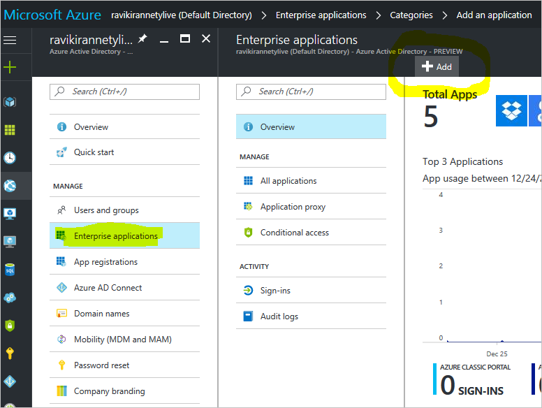
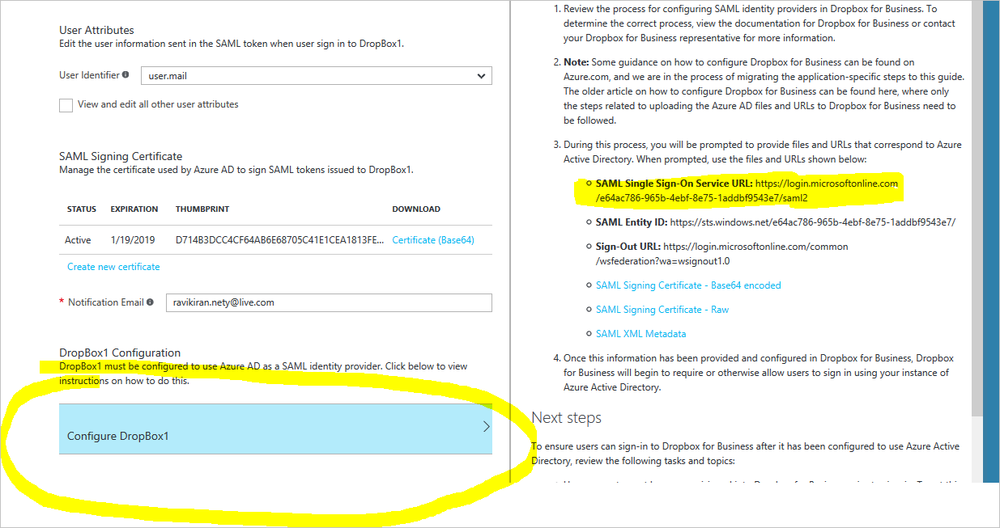
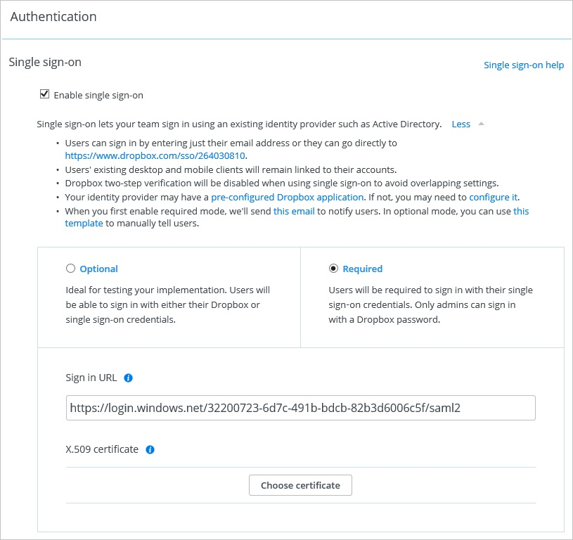

# Configure SaaS apps for B2B collaboration

Azure Active Directory (Azure AD) B2B collaboration works with most apps that integrate with Azure AD. In this section, we walk through instructions for configuring some popular SaaS apps for use with Azure AD B2B.

Before you look at app-specific instructions, here are some rules of thumb:

* For most of the apps, user setup needs to happen manually. That is, users must be created manually in the app as well.

* For apps that support automatic setup, such as Dropbox, separate invitations are created from the apps. Users must be sure to accept each invitation.

* In the user attributes, to mitigate any issues with mangled user profile disk (UPD) in guest users, always set **User Identifier** to **user.mail**.

## Dropbox Business

To enable users to sign in using their organization account, you must manually configure Dropbox Business to use Azure AD as a Security Assertion Markup Language (SAML) identity provider. If Dropbox Business has not been configured to do so, it cannot prompt or otherwise allow users to sign in using Azure AD.

1. To add the Dropbox Business app into Azure AD, select **Enterprise applications** in the left pane, and then click **Add**.

  

2. In the **Add an application** window, enter **dropbox** in the search box, and then select **Dropbox for Business** in the results list.

  

3. On the **Single sign-on** page, select **Single sign-on** in the left pane, and then enter **user.mail** in the **User Identifier** box. (It's set as UPN by default.)

  

4. To download the certificate to use for Dropbox configuration, select **Configure DropBox**, and then select **SAML Single Sign On Service URL** in the list.

  

5. Sign in to Dropbox with the sign-on URL from the **Single sign-on** page.

  

6. On the menu, select **Admin Console**.

  

7. In the **Authentication** dialog box, select **More**, upload the certificate and then, in the **Sign in URL** box, enter the SAML single sign-on URL.

  

  

8. To configure automatic user setup in the Azure portal, select **Provisioning** in the left pane, select **Automatic** in the **Provisioning Mode** box, and then select **Authorize**.

  

After guest or member users have been set up in the Dropbox app, they receive a separate invitation from Dropbox. To use Dropbox single sign-on, invitees must accept the invitation by clicking a link in it.

## Box
You can enable users to authenticate Box guest users with their Azure AD account by using federation that's based on the SAML protocol. In this procedure, you upload metadata to Box.com.

1. Add the Box app from the enterprise apps.

2. Configure single sign-on in the following order:

  

 a. In the **Sign on URL** box, ensure that the sign-on URL is set appropriately for Box in the Azure portal. This URL is the URL of your Box.com tenant. It should follow the naming convention *https://.box.com*.  
 The **Identifier** does not apply to this app, but it still appears as a mandatory field.

 b. In the **User identifier** box, enter **user.mail** (for SSO for guest accounts).

 c. Under **SAML Signing Certificate**, click **Create new certificate**.

 d. To begin configuring your Box.com tenant to use Azure AD as an identity provider, download the metadata file and then save it to your local drive.

 e. Forward the metadata file to the Box support team, which configures single sign-on for you.

3. For Azure AD automatic user setup, in the left pane, select **Provisioning**, and then select **Authorize**.

  

Like Dropbox invitees, Box invitees must redeem their invitation from the Box app.

## Next steps

See the following articles on Azure AD B2B collaboration:

- [What is Azure AD B2B collaboration?](what-is-b2b.md)
- [Dynamic groups and B2B collaboration](use-dynamic-groups.md)
- [B2B collaboration user claims mapping](claims-mapping.md)
- [Office 365 external sharing](o365-external-user.md)

