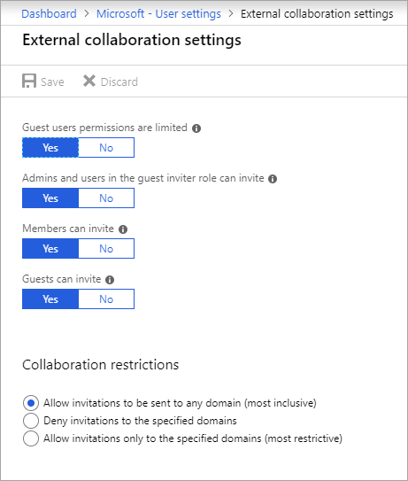

# Enable B2B external collaboration and manage who can invite guests

This article describes how to enable Azure Active Directory (Azure AD) B2B collaboration and determine who can invite guests. By default, all users and guests in your directory can invite guests even if they're not assigned to an admin role. External collaboration settings let you turn guest invitations on or off for different types of users in your organization. You can also delegate invitations to individual users by assigning roles that allow them to invite guests.

## Configure B2B external collaboration settings

With Azure AD B2B collaboration, a tenant admin can set the following invitation policies:

- Turn off invitations
- Only admins and users in the Guest Inviter role can invite
- Admins, the Guest Inviter role, and members can invite
- All users, including guests, can invite

By default, all users, including guests, can invite guest users.

### To configure external collaboration settings:

1. Sign in to the [Azure portal](https://portal.azure.com) as a tenant administrator.
2. Select **Azure Active Directory**.
3. Select **External Identities** > **External collaboration settings**.
6. On the **External collaboration settings** page, choose the policies you want to enable.

   

  - **Guest users permissions are limited**: This policy determines permissions for guests in your directory. Select **Yes** to block guests from certain directory tasks, like enumerating users, groups, or other directory resources. Select **No** to give guests the same access to directory data as  regular users in your directory.
   - **Admins and users in the guest inviter role can invite**: To allow admins and users in the "Guest Inviter" role to invite guests, set this policy to **Yes**.
   - **Members can invite**: To allow non-admin members of your directory to invite guests, set this policy to **Yes**.
   - **Guests can invite**: To allow guests to invite other guests, set this policy to **Yes**.
   - **Enable Email One-Time Passcode for guests (Preview)**: For more information about the one-time passcode feature, see [Email one-time passcode authentication (preview)](one-time-passcode.md).
   - **Collaboration restrictions**: For more information about allowing or blocking invitations to specific domains, see [Allow or block invitations to B2B users from specific organizations](allow-deny-list.md).
   
   > [!NOTE]
   > If **Members can invite** is set to **No** and **Admins and users in the guest inviter role can invite** is set to **Yes**, users in the **Guest Inviter** role will still be able to invite guests.

## Assign the Guest Inviter role to a user

With the Guest Inviter role, you can give individual users the ability to invite guests without assigning them a global administrator or other admin role. Assign the Guest inviter role to individuals. Then make sure you set **Admins and users in the guest inviter role can invite** to **Yes**.

Here's an example that shows how to use PowerShell to add a user to the Guest Inviter role:

```
Add-MsolRoleMember -RoleObjectId 95e79109-95c0-4d8e-aee3-d01accf2d47b -RoleMemberEmailAddress <RoleMemberEmailAddress>
```

## Next steps

See the following articles on Azure AD B2B collaboration:

- [What is Azure AD B2B collaboration?](what-is-b2b.md)
- [Add B2B collaboration guest users without an invitation](add-user-without-invite.md)
- [Adding a B2B collaboration user to a role](add-guest-to-role.md)

