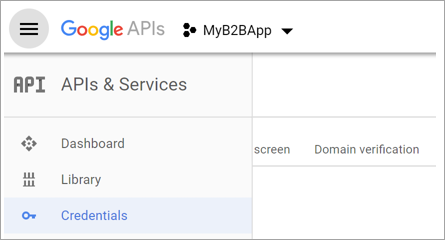

# Direct federation with AD FS and third-party identity providers

When you set up direct federation with a partner organization, guest users from that organization can use their own work credentials to sign in and start collaborating with you. There’s no need for the guest user to create a separate Azure AD account. You can set up direct federation with any organization with an identity provider that supports the SAML or WS-Fed protocol. 
> [!NOTE]
> Direct federation guest users must sign in using a link that includes the tenant context (for example, `https://myapps.microsoft.com/?tenantid=<tenant id>` or `https://portal.azure.com/<tenant id>`, or in the case of a verified domain, `https://myapps.microsoft.com/<verified domain>.onmicrosoft.com`). Direct links to applications and resources also work as long as they include the tenant context. Guest users are currently unable to sign in using endpoints that have no tenant context. For example, using `https://myapps.microsoft.com`, `https://portal.azure.com`, or the Teams common endpoint will result in an error.
 
## When is a guest user authenticated with direct federation?
After you set up direct federation with an organization, any new guest users you invite will be authenticated using direct federation. It’s important to note that setting up direct federation doesn’t change the authentication method for guest users who have already redeemed an invitation from you. Here are some examples:
 - If guest users have already redeemed invitations from you, and you subsequently set up direct federation with their organization, those guest users will continue to use the same authentication method they used before you set up direct federation.
 - If you set up direct federation with a partner organization and invite guest users, and then the partner organization later moves to Azure AD, the guest users who have already redeemed invitations will continue to use direct federation.
 - If you stop direct federation with a partner organization, any guest users currently using direct federation will be unable to sign in.
In any of these scenarios, you can update a guest user’s authentication method by deleting the guest user account from your directory and reinviting them.

## Step 1: Configure the third-party identity provider
First, your partner organization needs to configure their identity provider. As an example, we’ll set up Active Directory Federation Services (AD FS) as either a SAML identity provider or a WS-Fed identity provider. 

### SAML configuration steps

Azure AD B2B can be configured to federate with identity providers that use the SAML protocol with specific requirements listed below. To illustrate the SAML configuration steps, this section shows how to set up AD FS for SAML 2.0.

#### Required attributes

|Attribute  |Value  |
|---------|---------|
|SSO URL     |https://login.microsoftonline.com/<tenantid>/saml2         |
|Audience     |urn:federation:MicrosoftOnline         |
|NameID Format     |urn:oasis:names:tc:SAML:2.0:nameid-format:persistent         |
|Application Username     |Email, ex: t1@directfedtest1.com         |
|emailaddress     |http://schemas.xmlsoap.org/ws/2005/05/identity/claims/emailaddress         |

1. Go to the Google APIs at https://console.developers.google.com, and sign in with your Google account. We recommend that you use a shared team Google account.
2. Create a new project: On the Dashboard, select **Create Project**, and then select **Create**. On the New Project page, enter a **Project Name**, and then select **Create**.
   
   

3. Make sure your new project is selected in the project menu. Then open the menu in the upper left and select **APIs & Services** > **Credentials**.

   
 
4. Choose the **OAuth consent screen** tab and enter an **Application name**. (Leave the other settings.)

   

5. Scroll to the **Authorized domains** section and enter microsoftonline.com.

   

6. Select **Save**.

7. Choose the **Credentials** tab. In the **Create credentials** menu, choose **OAuth client ID**.

   

8. Under **Application type**, choose **Web application**, and then under **Authorized redirect URIs**, enter the following URIs:
   - `https://login.microsoftonline.com` 
   - `https://login.microsoftonline.com/te/<directory id>/oauth2/authresp`  (where `<directory id>` is your directory ID)
   
     > [!NOTE]
     > To find your directory ID, go to https://portal.azure.com, and under **Azure Active Directory**, choose **Properties** and copy the **Directory ID**.

   

9. Select **Create**. Copy the client ID and client secret, which you'll use when you add the identity provider in the Azure AD portal.

   

## Step 2: Configure Google federation in Azure AD 
Now you'll set the Google client ID and client secret, either by entering it in the Azure AD portal or by using PowerShell. Be sure to test your Google federation configuration by inviting yourself using a Gmail address and trying to redeem the invitation with your invited Google account. 

#### To configure Google federation in the Azure AD portal 
1. Go to the [Azure portal](https://portal.azure.com). In the left pane, select **Azure Active Directory**. 
2. Select **Organizational Relationships**.
3. Select **Identity providers**, and then click the **Google** button.
4. Enter a name. Then enter the client ID and client secret you obtained earlier. Select **Save**. 

   

#### To configure Google federation by using PowerShell
1. Install the latest version of the Azure AD PowerShell for Graph module ([AzureADPreview](https://www.powershellgallery.com/packages/AzureADPreview)).
2. Run the following command:
   `Connect-AzureAD`.
3. At the sign-in prompt, sign in with the managed Global Administrator account.  
4. Run the following command: 
   
   `New-AzureADMSIdentityProvider -Type Google -Name Google -ClientId [Client ID] -ClientSecret [Client secret]`
 
   > [!NOTE]
   > Use the client id and client secret from the app you created in "Step 1: Configure a Google developer project." For more information, see the [New-AzureADMSIdentityProvider](https://docs.microsoft.com/powershell/module/azuread/new-azureadmsidentityprovider?view=azureadps-2.0-preview) article. 
 
## How do I remove Google federation?
You can delete your Google federation setup. If you do so, Google guest users who have already redeemed their invitation will not be able to sign in, but you can give them access to your resources again by deleting them from the directory and re-inviting them. 
 
### To delete Google federation in the Azure AD portal: 
1. Go to the [Azure portal](https://portal.azure.com). In the left pane, select **Azure Active Directory**. 
2. Select **Organizational Relationships**.
3. Select **Identity providers**.
4. On the **Google** line, select the context menu (**...**) and then select **Delete**. 
   
   

1. Select **Yes** to confirm deletion. 

### To delete Google federation by using PowerShell: 
1. Install the latest version of the Azure AD PowerShell for Graph module ([AzureADPreview](https://www.powershellgallery.com/packages/AzureADPreview)).
2. Run `Connect-AzureAD`.  
4. In the login in prompt, sign in with the managed Global Administrator account.  
5. Enter the following command:

    `Remove-AzureADMSIdentityProvider -Id Google-OAUTH`

   > [!NOTE]
   > For more information, see [Remove-AzureADMSIdentityProvider](https://docs.microsoft.com/powershell/module/azuread/Remove-AzureADMSIdentityProvider?view=azureadps-2.0-preview). 
