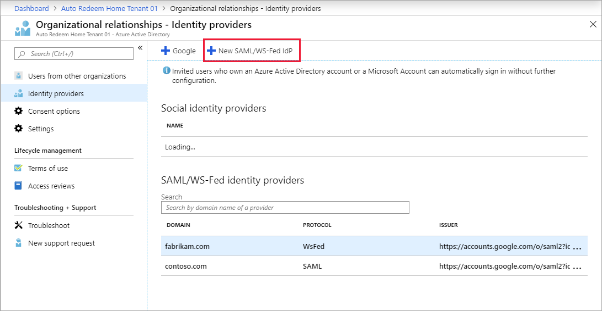
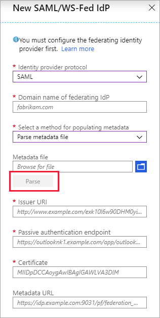

# Direct federation with AD FS and third-party providers for guest users (preview)
|     |
| --- |
| Direct federation is a public preview feature of Azure Active Directory. For more information about previews, see [Supplemental Terms of Use for Microsoft Azure Previews](https://azure.microsoft.com/support/legal/preview-supplemental-terms/).|
|     |

This article describes how to set up direct federation with another organization for B2B collaboration. You can set up direct federation with any organization whose identity provider (IdP) supports the SAML 2.0 or WS-Fed protocol.
When you set up direct federation with a partner's IdP, new guest users from that domain can use their own IdP-managed organizational account to sign in to your Azure AD tenant and start collaborating with you. There's no need for the guest user to create a separate Azure AD account.
> [!NOTE]
> Direct federation guest users must sign in using a link that includes the tenant context (for example, `https://myapps.microsoft.com/?tenantid=<tenant id>` or `https://portal.azure.com/<tenant id>`, or in the case of a verified domain, `https://myapps.microsoft.com/\<verified domain>.onmicrosoft.com`). Direct links to applications and resources also work as long as they include the tenant context. Direct federation users are currently unable to sign in using common endpoints that have no tenant context. For example, using `https://myapps.microsoft.com`, `https://portal.azure.com`, or `https://teams.microsoft.com` will result in an error.
 
## When is a guest user authenticated with direct federation?
After you set up direct federation with an organization, any new guest users you invite will be authenticated using direct federation. It’s important to note that setting up direct federation doesn’t change the authentication method for guest users who have already redeemed an invitation from you. Here are some examples:
 - If guest users have already redeemed invitations from you, and you subsequently set up direct federation with their organization, those guest users will continue to use the same authentication method they used before you set up direct federation.
 - If you set up direct federation with a partner organization and invite guest users, and then the partner organization later moves to Azure AD, the guest users who have already redeemed invitations will continue to use direct federation, as long as the direct federation policy in your tenant exists.
 - If you delete direct federation with a partner organization, any guest users currently using direct federation will be unable to sign in.

In any of these scenarios, you can update a guest user’s authentication method by deleting the guest user account from your directory and reinviting them.

Direct federation is tied to domain namespaces, such as contoso.com and fabrikam.com. When establishing a direct federation configuration with AD FS or a third-party IdP, organizations associate one or more domain namespaces to these IdPs. 

## End-user experience 
With direct federation, guest users sign into your Azure AD tenant using their own organizational account. When they are accessing shared resources and are prompted for sign-in, direct federation users are redirected to their IdP. After successful sign-in, they are returned to Azure AD to access resources. Direct federation users’ refresh tokens are valid for 12 hours, the [default length for passthrough refresh token](../develop/active-directory-configurable-token-lifetimes.md#exceptions) in Azure AD. If the federated IdP has SSO enabled, the user will experience SSO and will not see any sign-in prompt after initial authentication.

## Limitations

### DNS-verified domains in Azure AD
The domain you want to federate with must ***not*** be DNS-verified in Azure AD. You're allowed to set up direct federation with unmanaged (email-verified or "viral") Azure AD tenants because they aren't DNS-verified.

### Authentication URL
Direct federation is only allowed for policies where the authentication URL’s domain matches the target domain, or where the authentication URL is one of these allowed identity providers (this list is subject to change):

-	accounts.google.com
-	pingidentity.com
-	login.pingone.com
-	okta.com
-	oktapreview.com
-	okta-emea.com
-	my.salesforce.com
-	federation.exostar.com
-	federation.exostartest.com

For example, when setting up direct federation for **fabrikam.com**, the authentication URL `https://fabrikam.com/adfs` will pass the validation. A host in the same domain will also pass, for example `https://sts.fabrikam.com/adfs`. However, the authentication URL `https://fabrikamconglomerate.com/adfs` or `https://fabrikam.com.uk/adfs` for the same domain won't pass.

### Signing certificate renewal
If you specify the metadata URL in the identity provider settings, Azure AD will automatically renew the signing certificate when it expires. However, if the certificate is rotated for any reason before the expiration time, or if you don't provide a metadata URL, Azure AD will be unable to renew it. In this case, you'll need to update the signing certificate manually.

### Limit on federation relationships
Currently, a maximum of 1,000 federation relationships is supported. This limit includes both [internal federations](https://docs.microsoft.com/powershell/module/msonline/set-msoldomainfederationsettings?view=azureadps-1.0) and direct federations.

### Limit on multiple domains
We don’t currently support direct federation with multiple domains from the same tenant.

## Frequently asked questions
### Can I set up direct federation with a domain for which an unmanaged (email-verified) tenant exists? 
Yes. If the domain hasn't been verified and the tenant hasn't undergone an [admin takeover](../users-groups-roles/domains-admin-takeover.md), you can set up direct federation with that domain. Unmanaged, or email-verified, tenants are created when a user redeems a B2B invitation or performs a self-service sign-up for Azure AD using a domain that doesn’t currently exist. You can set up direct federation with these domains. If you try to set up direct federation with a DNS-verified domain, either in the Azure portal or via PowerShell, you'll see an error.
### If direct federation and email one-time passcode authentication are both enabled, which method takes precedence?
When direct federation is established with a partner organization, it takes precedence over email one-time passcode authentication for new guest users from that organization. If a guest user redeemed an invitation using one-time passcode authentication before you set up direct federation, they'll continue to use one-time passcode authentication. 
### Does direct federation address sign-in issues due to a partially synced tenancy?
No, the [email one-time passcode](one-time-passcode.md) feature should be used in this scenario. A “partially synced tenancy” refers to a partner Azure AD tenant where on-premises user identities aren't fully synced to the cloud. A guest whose identity doesn’t yet exist in the cloud but who tries to redeem your B2B invitation won’t be able to sign in. The one-time passcode feature would allow this guest to sign in. The direct federation feature addresses scenarios where the guest has their own IdP-managed organizational account, but the organization has no Azure AD presence at all.

## Step 1: Configure the partner organization’s identity provider
First, your partner organization needs to configure their identity provider with the required claims and relying party trusts. 

> [!NOTE]
> To illustrate how to configure an identity provider for direct federation, we’ll use Active Directory Federation Services (AD FS) as an example. See the article [Configure direct federation with AD FS](direct-federation-adfs.md), which gives examples of how to configure AD FS as a SAML 2.0 or WS-Fed identity provider in preparation for direct federation.

### SAML 2.0 configuration

Azure AD B2B can be configured to federate with identity providers that use the SAML protocol with specific requirements listed below. For more information about setting up a trust between your SAML identity provider and Azure AD, see  [Use a SAML 2.0 Identity Provider (IdP) for Single Sign-On](https://docs.microsoft.com/azure/active-directory/hybrid/how-to-connect-fed-saml-idp).  

> [!NOTE]
> The target domain for direct federation must not be DNS-verified on Azure AD. The authentication URL domain must match the target domain or it must be the domain of an allowed identity provider. See the [Limitations](#limitations) section for details. 

#### Required SAML 2.0 attributes and claims
The following tables show requirements for specific attributes and claims that must be configured at the third-party identity provider. To set up direct federation, the following attributes must be received in the SAML 2.0 response from the identity provider. These attributes can be configured by linking to the online security token service XML file or by entering them manually.

Required attributes for the SAML 2.0 response from the IdP:

|Attribute  |Value  |
|---------|---------|
|AssertionConsumerService     |`https://login.microsoftonline.com/login.srf`         |
|Audience     |`urn:federation:MicrosoftOnline`         |
|Issuer     |The issuer URI of the partner IdP, for example `http://www.example.com/exk10l6w90DHM0yi...`         |


Required claims for the SAML 2.0 token issued by the IdP:

|Attribute  |Value  |
|---------|---------|
|NameID Format     |`urn:oasis:names:tc:SAML:2.0:nameid-format:persistent`         |
|emailaddress     |`http://schemas.xmlsoap.org/ws/2005/05/identity/claims/emailaddress`         |

### WS-Fed configuration 
Azure AD B2B can be configured to federate with identity providers that use the WS-Fed protocol with some specific requirements as listed below. Currently, the two WS-Fed providers have been tested for compatibility with Azure AD include AD FS and Shibboleth. For more information about establishing a relying party trust between a WS-Fed compliant provider with Azure AD, see the "STS Integration Paper using WS Protocols" available in the [Azure AD Identity Provider Compatibility Docs](https://www.microsoft.com/download/details.aspx?id=56843).

> [!NOTE]
> The target domain for direct federation must not be DNS-verified on Azure AD. The authentication URL domain must match either the target domain or the domain of an allowed identity provider. See the [Limitations](#limitations) section for details. 

#### Required WS-Fed attributes and claims

The following tables show requirements for specific attributes and claims that must be configured at the third-party WS-Fed identity provider. To set up direct federation, the following attributes must be received in the WS-Fed message from the identity provider. These attributes can be configured by linking to the online security token service XML file or by entering them manually.

Required attributes in the WS-Fed message from the IdP:
 
|Attribute  |Value  |
|---------|---------|
|PassiveRequestorEndpoint     |`https://login.microsoftonline.com/login.srf`         |
|Audience     |`urn:federation:MicrosoftOnline`         |
|Issuer     |The issuer URI of the partner IdP, for example `http://www.example.com/exk10l6w90DHM0yi...`         |

Required claims for the WS-Fed token issued by the IdP:

|Attribute  |Value  |
|---------|---------|
|ImmutableID     |`http://schemas.microsoft.com/LiveID/Federation/2008/05/ImmutableID`         |
|emailaddress     |`http://schemas.xmlsoap.org/ws/2005/05/identity/claims/emailaddress`         |

## Step 2: Configure direct federation in Azure AD 
Next, you'll configure federation with the identity provider configured in step 1 in Azure AD. You can use either the Azure AD portal or PowerShell. It might take 5-10 minutes before the direct federation policy takes effect. During this time, don't attempt to redeem an invitation for the direct federation domain. The following attributes are required:
- Issuer URI of partner IdP
- Passive authentication endpoint of partner IdP (only https is supported)
- Certificate

### To configure direct federation in the Azure AD portal

1. Go to the [Azure portal](https://portal.azure.com/). In the left pane, select **Azure Active Directory**. 
2. Select **External Identities** > **All identity providers**.
3. Select , and then select **New SAML/WS-Fed IdP**.

    

4. On the **New SAML/WS-Fed IdP** page, under **Identity provider protocol**, select **SAML** or **WS-FED**.

    

5. Enter your partner organization’s domain name, which will be the target domain name for direct federation
6. You can upload a metadata file to populate metadata details. If you choose to input metadata manually, enter the following information:
   - Domain name of partner IdP
   - Entity ID of partner IdP
   - Passive requestor endpoint of partner IdP
   - Certificate
   > [!NOTE]
   > Metadata URL is optional, however we strongly recommend it. If you provide the metadata URL, Azure AD can automatically renew the signing certificate when it expires. If the certificate is rotated for any reason before the expiration time or if you do not provide a metadata URL, Azure AD will be unable to renew it. In this case, you'll need to update the signing certificate manually.

7. Select **Save**. 

### To configure direct federation in Azure AD using PowerShell

1. Install the latest version of the Azure AD PowerShell for Graph module ([AzureADPreview](https://www.powershellgallery.com/packages/AzureADPreview)). (If you need detailed steps, the quickstart for adding a guest user includes the section [Install the latest AzureADPreview module](b2b-quickstart-invite-powershell.md#install-the-latest-azureadpreview-module).) 
2. Run the following command: 
   ```powershell
   Connect-AzureAD
   ```
1. At the sign-in prompt, sign in with the managed Global Administrator account. 
2. Run the following commands, replacing the values from the federation metadata file. For AD FS Server and Okta, the federation file is federationmetadata.xml, for example: `https://sts.totheclouddemo.com/federationmetadata/2007-06/federationmetadata.xml`. 

   ```powershell
   $federationSettings = New-Object Microsoft.Open.AzureAD.Model.DomainFederationSettings
   $federationSettings.PassiveLogOnUri ="https://sts.totheclouddemo.com/adfs/ls/"
   $federationSettings.LogOffUri = $federationSettings.PassiveLogOnUri
   $federationSettings.IssuerUri = "http://sts.totheclouddemo.com/adfs/services/trust"
   $federationSettings.MetadataExchangeUri="https://sts.totheclouddemo.com/adfs/services/trust/mex"
   $federationSettings.SigningCertificate= <Replace with X509 signing cert’s public key>
   $federationSettings.PreferredAuthenticationProtocol="WsFed" OR "Samlp"
   $domainName = <Replace with domain name>
   New-AzureADExternalDomainFederation -ExternalDomainName $domainName  -FederationSettings $federationSettings
   ```

## Step 3: Test direct federation in Azure AD
Now test your direct federation setup by inviting a new B2B guest user. For details, see [Add Azure AD B2B collaboration users in the Azure portal](add-users-administrator.md).
 
## How do I edit a direct federation relationship?

1. Go to the [Azure portal](https://portal.azure.com/). In the left pane, select **Azure Active Directory**. 
2. Select **External Identities**.
3. Select **All identity providers**
4. Under **SAML/WS-Fed identity providers**, select the provider.
5. In the identity provider details pane, update the values.
6. Select **Save**.


## How do I remove direct federation?
You can remove your direct federation setup. If you do, direct federation guest users who have already redeemed their invitations won't be able to sign in. But you can give them access to your resources again by deleting them from the directory and reinviting them. 
To remove direct federation with an identity provider in the Azure AD portal:

1. Go to the [Azure portal](https://portal.azure.com/). In the left pane, select **Azure Active Directory**. 
2. Select **External Identities**.
3. Select **All identity providers**.
4. Select the identity provider, and then select **Delete**. 
5. Select **Yes** to confirm deletion. 

To remove direct federation with an identity provider by using PowerShell:
1. Install the latest version of the Azure AD PowerShell for Graph module ([AzureADPreview](https://www.powershellgallery.com/packages/AzureADPreview)).
2. Run the following command: 
   ```powershell
   Connect-AzureAD
   ```
3. At the sign-in prompt, sign in with the managed Global Administrator account. 
4. Enter the following command:
   ```powershell
   Remove-AzureADExternalDomainFederation -ExternalDomainName  $domainName
   ```
