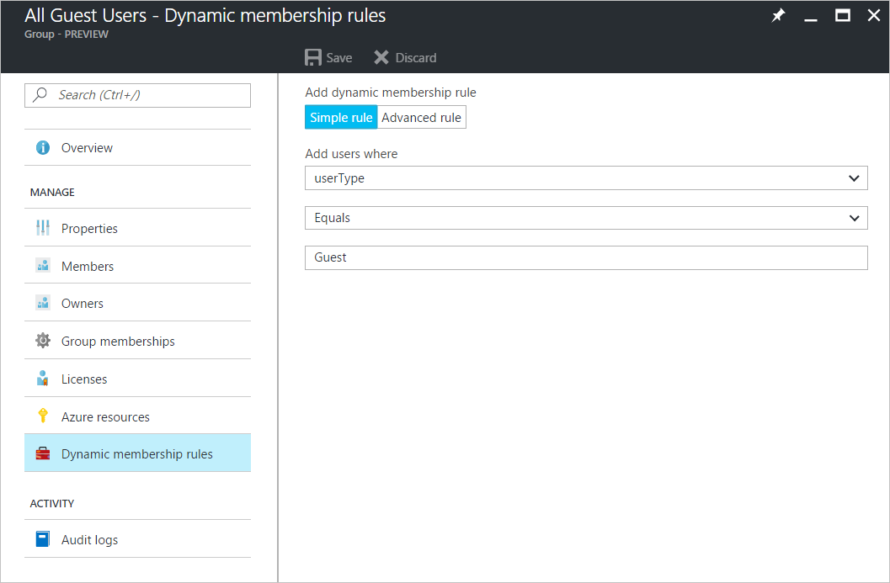

# Azure Active Directory B2B collaboration FAQs

These frequently asked questions (FAQs) about Azure Active Directory (Azure AD) business-to-business (B2B) collaboration are periodically updated to include new topics.

### Can we customize our sign-in page so it is more intuitive for our B2B collaboration guest users?
Absolutely! See our [blog post about this feature](https://blogs.technet.microsoft.com/enterprisemobility/2017/04/07/improving-the-branding-logic-of-azure-ad-login-pages/). For more information about how to customize your organization's sign-in page, see [Add company branding to sign in and Access Panel pages](../fundamentals/customize-branding.md).

### Can B2B collaboration users access SharePoint Online and OneDrive?
Yes. However, the ability to search for existing guest users in SharePoint Online by using the people picker is **Off** by default. To turn on the option to search for existing guest users, set **ShowPeoplePickerSuggestionsForGuestUsers** to **On**. You can turn this setting on either at the tenant level or at the site collection level. You can change this setting by using the Set-SPOTenant and Set-SPOSite cmdlets. With these cmdlets, members can search all existing guest users in the directory. Changes in the tenant scope do not affect SharePoint Online sites that have already been provisioned.

### Is the CSV upload feature still supported?
Yes. For more information about using the .csv file upload feature, see [this PowerShell sample](code-samples.md).

### How can I customize my invitation emails?
You can customize almost everything about the inviter process by using the [B2B invitation APIs](customize-invitation-api.md).

### Can guest users reset their multi-factor authentication method?
Yes. Guest users can reset their multi-factor authentication method the same way that regular users do.

### Which organization is responsible for multi-factor authentication licenses?
The inviting organization performs multi-factor authentication. The inviting organization must make sure that the organization has enough licenses for their B2B users who are using multi-factor authentication.

### What if a partner organization already has multi-factor authentication set up? Can we trust their multi-factor authentication, and not use our own multi-factor authentication?
This feature is planned for a future release, so that then you can select specific partners to exclude from your (the inviting organization's) multi-factor authentication.

### How can I use delayed invitations?
An organization might want to add B2B collaboration users, provision them to applications as needed, and then send invitations. You can use the B2B collaboration invitation API to customize the onboarding workflow.

### Can I make guest users visible in the Exchange Global Address List?
Yes. By default, guest objects are not visible in your organization's global address list, but you can use Azure Active Directory PowerShell to make them visible. For details, see **Can I make guest objects visible in the global address list?** in [Guest access in Office 365 Groups](https://support.office.com/article/guest-access-in-office-365-groups-bfc7a840-868f-4fd6-a390-f347bf51aff6#PickTab=FAQ).

### Can I make a guest user a limited administrator?
Absolutely. For more information, see [Adding guest users to a role](add-guest-to-role.md).

### Does Azure AD B2B collaboration allow B2B users to access the Azure portal?
Unless a user is assigned the role of limited administrator or global administrator, B2B collaboration users won't require access to the Azure portal. However, B2B collaboration users who are assigned the role of limited administrator or global administrator can access the portal. Also, if a guest user who is not assigned one of these admin roles accesses the portal, the user might be able to access certain parts of the experience. The guest user role has some permissions in the directory.

### Can I block access to the Azure portal for guest users?
Yes! When you configure this policy, be careful to avoid accidentally blocking access to members and admins.
To block a guest user's access to the [Azure portal](https://portal.azure.com), use a conditional access policy in the Windows Azure classic deployment model API:
1. Modify the **All Users** group so that it contains only members.
  
2. Create a dynamic group that contains guest users.
  
3. Set up a conditional access policy to block guest users from accessing the portal, as shown in the following video:
  
  > [!VIDEO https://channel9.msdn.com/Blogs/Azure/b2b-block-guest-user/Player] 

### Does Azure AD B2B collaboration support multi-factor authentication and consumer email accounts?
Yes. Multi-factor authentication and consumer email accounts are both supported for Azure AD B2B collaboration.

### Do you plan to support password reset for Azure AD B2B collaboration users?
Yes. Here are the important details for self-service password reset (SSPR) for a B2B user who is invited from a partner organization:
 
* SSPR occurs only in the identity tenant of the B2B user.
* If the identity tenant is a Microsoft account, the Microsoft account SSPR mechanism is used.
* If the identity tenant is a just-in-time (JIT) or "viral" tenant, a password reset email is sent.
* For other tenants, the standard SSPR process is followed for B2B users. Like member SSPR for B2B users, in the context of the resource, tenancy is blocked. 

### Is password reset available for guest users in a just-in-time (JIT) or "viral" tenant who accepted invitations with a work or school email address, but who didn't have a pre-existing Azure AD account?
Yes. A password reset mail can be sent that allows a user to reset their password in the JIT tenancy.

### Does Microsoft Dynamics 365 provide online support for Azure AD B2B collaboration?
Yes, Dynamics 365 (online) provides support for Azure AD B2B collaboration. For more information, see the Dynamics 365 article [Invite users with Azure AD B2B collaboration](https://docs.microsoft.com/dynamics365/customer-engagement/admin/invite-users-azure-active-directory-b2b-collaboration).

### What is the lifetime of an initial password for a newly created B2B collaboration user?
Azure AD has a fixed set of character, password strength, and account lockout requirements that apply equally to all Azure AD cloud user accounts. Cloud user accounts are accounts that are not federated with another identity provider, such as 
* Microsoft account
* Facebook
* Active Directory Federation Services
* Another cloud tenant (for B2B collaboration)

For federated accounts, password policy depends on the policy that is applied in the on-premises tenancy and the user's Microsoft account settings.

### An organization might want to have different experiences in their applications for tenant users and guest users. Is there standard guidance for this? Is the presence of the identity provider claim the correct model to use?
 A guest user can use any identity provider to authenticate. For more information, see [Properties of a B2B collaboration user](user-properties.md). Use the **UserType** property to determine user experience. The **UserType** claim is not currently included in the token. Applications should use the Graph API to query the directory for the user, and to get the UserType.

### Where can I find a B2B collaboration community to share solutions and to submit ideas?
We're constantly listening to your feedback, to improve B2B collaboration. We invite you to share your user scenarios, best practices, and what you like about Azure AD B2B collaboration. Join the discussion in the [Microsoft Tech Community](https://techcommunity.microsoft.com/t5/Azure-Active-Directory-B2B/bd-p/AzureAD_B2b).
 
We also invite you to submit your ideas and vote for future features at [B2B Collaboration Ideas](https://techcommunity.microsoft.com/t5/Azure-Active-Directory-B2B-Ideas/idb-p/AzureAD_B2B_Ideas).

### Can we send an invitation that is automatically redeemed, so that the user is just “ready to go”? Or does the user always have to click through to the redemption URL?
An inviter can invite other users in the partner organization by using the UI, PowerShell scripts, or APIs. Then, the inviter can send the guest user a direct link to a shared app. In most cases, there's no longer a need to open the email invitation and click a redemption URL. For more information, see [Azure Active Directory B2B collaboration invitation redemption](redemption-experience.md).

### How does B2B collaboration work when the invited partner is using federation to add their own on-premises authentication?
If the partner has an Azure AD tenant that is federated to the on-premises authentication infrastructure, on-premises single sign-on (SSO) is automatically achieved. If the partner doesn't have an Azure AD tenant, an Azure AD account is created for new users. 

### I thought Azure AD B2B didn't accept gmail.com and outlook.com email addresses, and that B2C was used for those kinds of accounts?
We are removing the differences between B2B and business-to-consumer (B2C) collaboration in terms of which identities are supported. The identity used is not a good reason to choose between using B2B or using B2C. For information about choosing your collaboration option, see [Compare B2B collaboration and B2C in Azure Active Directory](compare-with-b2c.md).

### What applications and services support Azure B2B guest users?
All Azure AD-integrated applications support Azure B2B guest users. 

### Can we force multi-factor authentication for B2B guest users if our partners don't have multi-factor authentication?
Yes. For more information, see [Conditional access for B2B collaboration users](conditional-access.md).

### In SharePoint, you can define an "allow" or "deny" list for external users. Can we do this in Azure?
Yes. Azure AD B2B collaboration supports allow lists and deny lists. 

### What licenses do we need to use Azure AD B2B?
For information about what licenses your organization needs to use Azure AD B2B, see [Azure Active Directory B2B collaboration licensing guidance](licensing-guidance.md).

### Next steps

- [What is Azure AD B2B collaboration?](what-is-b2b.md)

