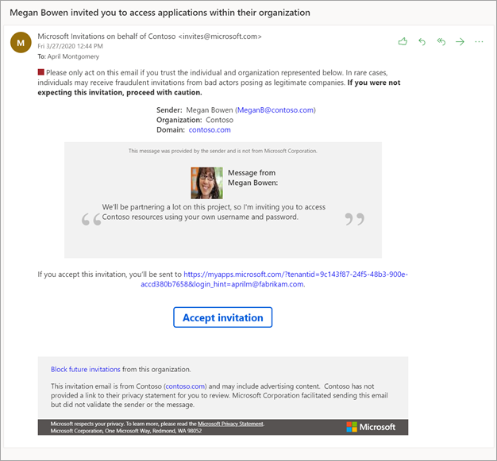
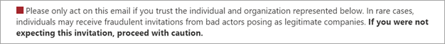
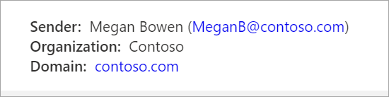
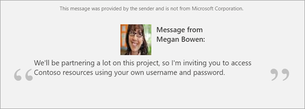
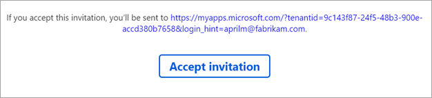

# The elements of the B2B collaboration invitation email - Azure Active Directory

Invitation emails are a critical component to bring partners on board as B2B collaboration users in Azure AD. While it’s [not required that you send an email to invite someone using B2B collaboration](add-user-without-invite.md), doing so gives the user all the information they need to make a decision about whether to accept your invite. It also gives them a link they can always refer to in the future when they need to return to your resources.

> [!NOTE]
> This new email template is still being rolled out to all tenants, so some tenants are still using an older design. By the end of May 2020, invitations from all tenants will be using this template.

## Explaining the email

Let's look at a few elements of the email so you know how best to use their capabilities.

### Subject

The subject of the email follows this pattern:

&lt;username&gt; invited you to access applications within their organization.

### From address

We use a LinkedIn-like pattern for the From address. This pattern should make it clear that although the email comes from invites@microsoft.com, the invitation is from another organization. The format is: Microsoft Invitations <invites@microsoft.com> or Microsoft invitations on behalf of &lt;tenantname&gt; <invites@microsoft.com>. 

### Reply To

The reply-to email is set to the inviter's email when available, so that replying to the email sends an email back to the inviter.

### Phishing warning

The email starts with a brief warning to the user about phishing, alerting them that they should only accept invitations they're expecting. It’s good practice to make sure the partners you’re inviting will not be surprised by your invitation by mentioning it to them ahead of time.

### Inviter's information

The email includes information about the inviter and the organization they’re sending the invitation from. This includes the sender’s name and email address, as well as the name and primary domain associated with the organization. All of this information should help the invitee make an informed decision about accepting the invitation.

### Invitation message

If the inviter includes a message as part of their invitation when they [invite a guest user to the directory, group, or app](add-users-administrator.md) or when they [use the invitation API](customize-invitation-api.md), the message is highlighted in the main section of the email. Also included are the inviter’s name and profile image if they’ve set one. The message itself is a text area, so for security reasons, it doesn't process HTML tags.

### Accept button and redirect URL

The next section of the email contains information about where the invitee will be taken after they accept the invitation, as well as a button to do so.  In the future, the invitee can always use this link to return to your resources directly.

### Footer section

The footer contains more information about the invitation being sent. There is always an option for the invitee to block future invitations. If the organization has [set a privacy statement](https://docs.microsoft.com/azure/active-directory/fundamentals/active-directory-properties-area), the link to the statement is displayed here.  Otherwise, a note indicates the organization hasn't set a privacy statement.

 
## How the language is determined

The language presented to the guest user in the invitation email is determined by the following settings. These settings are listed in order of precedence. If a setting isn’t configured, the next setting in the list determines the language.

- The **messageLanguage** property of the [invitedUserMessageInfo](https://docs.microsoft.com/graph/api/resources/invitedusermessageinfo?view=graph-rest-1.0) object if the Create invitation API is used
-	The **preferredLanguage** property specified in the guest's [user object](https://docs.microsoft.com/graph/api/resources/user?view=graph-rest-1.0)
-	The **Notification language** set in the properties of the guest user’s home tenant (for Azure AD tenants only)
-	The **Notification language** set in the properties of the resource tenant

If none of these settings are configured, the language defaults to English (US).

## Next steps

See the following articles on Azure AD B2B collaboration:

- [What is Azure AD B2B collaboration](what-is-b2b.md)
- [How do Azure Active Directory admins add B2B collaboration users?](add-users-administrator.md)
- [How do information workers add B2B collaboration users?](add-users-information-worker.md)
- [B2B collaboration invitation redemption](redemption-experience.md)
- [Add B2B collaboration users without an invitation](add-user-without-invite.md)
