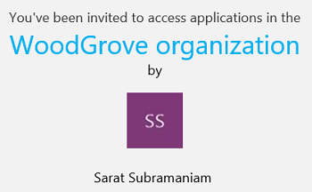
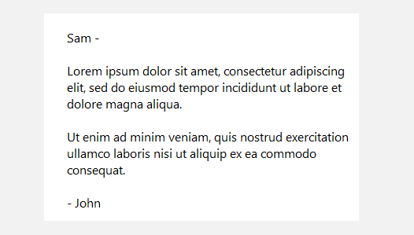
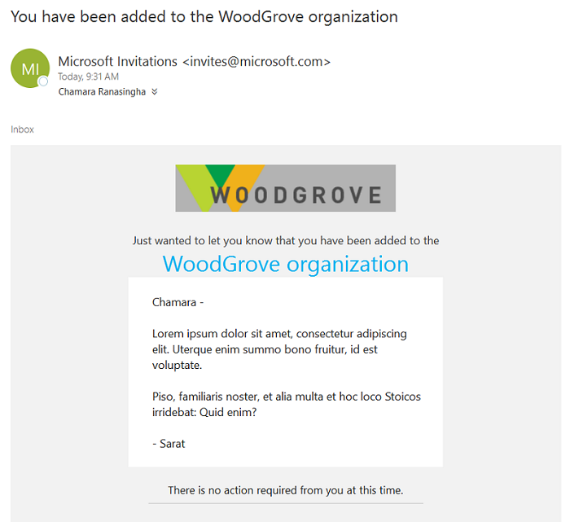

# The elements of the B2B collaboration invitation email - Azure Active Directory

Invitation emails are a critical component to bring partners on board as B2B collaboration users in Azure AD. You can use them to increase the recipient's trust. you can add legitimacy and social proof to the email, to make sure the recipient feels comfortable with selecting the **Get Started** button to accept the invitation. This trust is a key means to reduce sharing friction. And you also want to make the email look great!

## Explaining the email
Let's look at a few elements of the email so you know how best to use their capabilities.

### Subject
The subject of the email follows the following pattern:
You're invited to the &lt;tenantname&gt; organization

### From address
We use a LinkedIn-like pattern for the From address.  You should be clear who the inviter is and from which company, and also clarify that the email is coming from a Microsoft email address. The format is: Microsoft Invitations <invites@microsoft.com> or 
&lt;Display name of inviter&gt; from &lt;tenantname&gt; (via Microsoft) <invites@microsoft.com>.

### Reply To
The reply-to email is set to the inviter's email when available, so that replying to the email sends an email back to the inviter.

### Branding
The invitation emails from your tenant use the company branding that you may have set up for your tenant. If you want to take advantage of this capability, [here](https://docs.microsoft.com/azure/active-directory/active-directory-branding-custom-signon-azure-portal) are the details on how to configure it. The banner logo appears in the email. Follow the image size and quality instructions [here](https://docs.microsoft.com/azure/active-directory/active-directory-branding-custom-signon-azure-portal) for best results. In addition, the company name also shows up in the call to action.

### Call to action
The call to action consists of two parts: explaining why the recipient has received the mail and what the recipient is being asked to do about it.
- The "why" section can be addressed using the following pattern:
  You've been invited to access applications in the &lt;tenantname&gt; organization

- And the "what you're being asked to do" section is indicated by the presence of the **Get Started** button. When the recipient has been added without the need for invitations, this button doesn't show up.

### Inviter's information
The inviter's display name is included in the email. And in addition, if you've set up a profile picture for your Azure AD account, the inviting email will include that picture as well. Both are intended to increase your recipient's confidence in the email.

If you haven't yet set up your profile picture, an icon with the inviter's initials in place of the picture is shown:

  

### Body
The body contains the message that the inviter composes when [inviting a guest user to the directory, group, or app](add-users-administrator.md) or [by using the invitation API](customize-invitation-api.md). It is a text area, so it does not process HTML tags for security reasons.

  

### Footer section
The footer contains the Microsoft company brand and lets the recipient know if the email was sent from an unmonitored alias. 

Special cases:

- The inviter doesn't have an email address in the inviting tenancy

  

- The recipient doesn't need to redeem the invitation

  

## How the language is determined
The language presented to the guest user in the invitation email is determined by the following settings. These settings are listed in order of precedence. If a setting isn’t configured, the next setting in the list determines the language. 
- The **messageLanguage** property of the [invitedUserMessageInfo](https://docs.microsoft.com/graph/api/resources/invitedusermessageinfo?view=graph-rest-1.0) object if the Create invitation API is used
-	The **preferredLanguage** property specified in the guest's [user object](https://docs.microsoft.com/graph/api/resources/user?view=graph-rest-1.0)
-	The **Notification language** set in the properties of the guest user’s home tenant (for Azure AD tenants only)
-	The **Notification language** set in the properties of the resource tenant

If none of these settings are configured, the language defaults to English (US).

## Next steps

See the following articles on Azure AD B2B collaboration:

- [What is Azure AD B2B collaboration](what-is-b2b.md)
- [How do Azure Active Directory admins add B2B collaboration users?](add-users-administrator.md)
- [How do information workers add B2B collaboration users?](add-users-information-worker.md)
- [B2B collaboration invitation redemption](redemption-experience.md)
- [Add B2B collaboration users without an invitation](add-user-without-invite.md)
