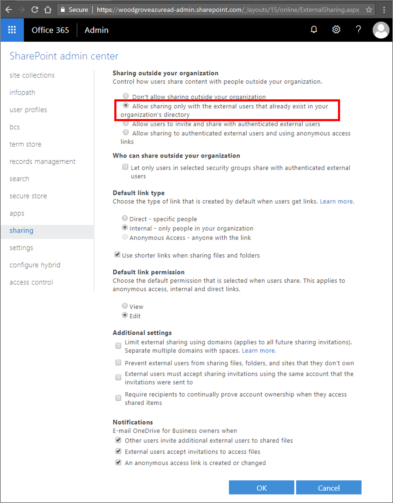

# Office 365 external sharing and Azure Active Directory B2B collaboration

External sharing in Office 365 (OneDrive, SharePoint Online, Unified Groups, etc.) and Azure Active Directory (Azure AD) B2B collaboration are technically the same thing. All external sharing (except OneDrive/SharePoint Online), including guests in Office 365 Groups, already uses the Azure AD B2B collaboration invitation APIs for sharing.

## How does Azure AD B2B differ from external sharing in SharePoint Online?

OneDrive/SharePoint Online has a separate invitation manager. Support for external sharing in OneDrive/SharePoint Online started before Azure AD developed its support. Over time, OneDrive/SharePoint Online external sharing has accrued several features and many millions of users who use the product's in-built sharing pattern. However, there are some subtle differences between how OneDrive/SharePoint Online external sharing works and how Azure AD B2B collaboration works. You can learn more about OneDrive/SharePoint Online external sharing in [External sharing overview](https://docs.microsoft.com/sharepoint/external-sharing-overview). The process generally differs from Azure AD B2B in these ways:

- OneDrive/SharePoint Online adds users to the directory after users have redeemed their invitations. So, before redemption, you don't see the user in Azure AD portal. If another site invites a user in the meantime, a new invitation is generated. However, when you use Azure AD B2B collaboration, users are added immediately on invitation so that they show up everywhere.

- The redemption experience in OneDrive/SharePoint Online looks different from the experience in Azure AD B2B collaboration. After a user redeems an invitation, the experiences look alike.

- Azure AD B2B collaboration invited users can be picked from OneDrive/SharePoint Online sharing dialog boxes. OneDrive/SharePoint Online invited users also show up in Azure AD after they redeem their invitations.

- The licensing requirements differ. For each paid Azure AD license, you can let up to 5 guest users access your paid Azure AD features. To learn more about licensing, see [Azure AD B2B licensing](https://docs.microsoft.com/azure/active-directory/b2b/licensing-guidance) and ["What is an external user?" in the SharePoint Online external sharing overview](https://docs.microsoft.com/sharepoint/external-sharing-overview#what-is-an-external-user).

To manage external sharing in OneDrive/SharePoint Online with Azure AD B2B collaboration, set the OneDrive/SharePoint Online external sharing setting to **Allow sharing only with the external users that already exist in your organization's directory**. Users can go to externally shared sites and pick from external collaborators that the admin has added. The admin can add the external collaborators through the B2B collaboration invitation APIs.

After enabling external sharing, the ability to search for existing guest users in the SharePoint Online (SPO) people picker is OFF by default to match legacy behavior.

You can enable this feature by using the setting 'ShowPeoplePickerSuggestionsForGuestUsers' at the tenant and site collection level. You can set the feature using the Set-SPOTenant and Set-SPOSite cmdlets, which allow members to search all existing guest users in the directory. Changes in the tenant scope do not affect already provisioned SPO sites.

## Next steps

* [What is Azure AD B2B collaboration?](what-is-b2b.md)
* [Adding a B2B collaboration user to a role](add-guest-to-role.md)
* [Delegate B2B collaboration invitations](delegate-invitations.md)
* [Dynamic groups and B2B collaboration](use-dynamic-groups.md)
* [Troubleshooting Azure Active Directory B2B collaboration](troubleshoot.md)
