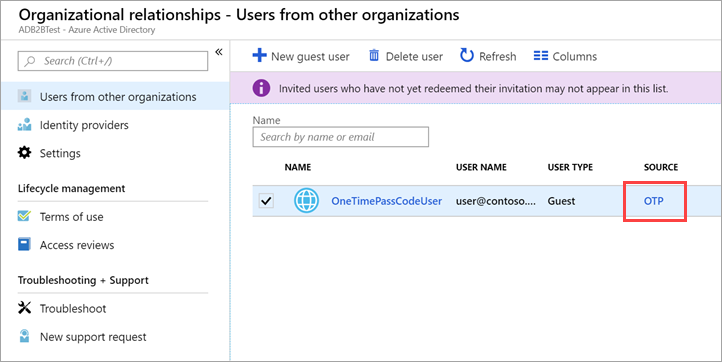

---

title: One-time passcode authentication for B2B guest users - Azure AD
description: How to use Email one-time passcode to authenticate B2B guest users without the need for a Microsoft account.

services: active-directory
ms.service: active-directory
ms.subservice: B2B
ms.topic: how-to
ms.date: 05/11/2020

ms.author: mimart
author: msmimart
manager: celestedg
ms.reviewer: mal
ms.custom: "it-pro, seo-update-azuread-jan, seoapril2019"
ms.collection: M365-identity-device-management
---

# Email one-time passcode authentication (preview)

|     |
| --- |
| Email one-time passcode is a public preview feature of Azure Active Directory. For more information about previews, see [Supplemental Terms of Use for Microsoft Azure Previews](https://azure.microsoft.com/support/legal/preview-supplemental-terms/).|
|     |

This article describes how to enable Email one-time passcode authentication for B2B guest users. The Email one-time passcode feature authenticates B2B guest users when they can't be authenticated through other means like Azure AD, a Microsoft account (MSA), or Google federation. With one-time passcode authentication, there's no need to create a Microsoft account. When the guest user redeems an invitation or accesses a shared resource, they can request a temporary code, which is sent to their email address. Then they enter this code to continue signing in.

This feature is currently available for preview (see [Opting in to the preview](#opting-in-to-the-preview) below). After preview, this feature will be turned on by default for all tenants.

> [!NOTE]
> One-time passcode users must sign in using a link that includes the tenant context (for example, `https://myapps.microsoft.com/?tenantid=<tenant id>` or `https://portal.azure.com/<tenant id>`, or in the case of a verified domain, `https://myapps.microsoft.com/<verified domain>.onmicrosoft.com`). Direct links to applications and resources also work as long as they include the tenant context. Guest users are currently unable to sign in using endpoints that have no tenant context. For example, using `https://myapps.microsoft.com`, `https://portal.azure.com`, or the Teams common endpoint will result in an error. 

## User experience for one-time passcode guest users
With one-time passcode authentication, the guest user can redeem your invitation by clicking a direct link or by using the invitation email. In either case, a message in the browser indicates that a code will be sent to the guest user's email address. The guest user selects **Send code**:
 
   
 
A passcode is sent to the user’s email address. The user retrieves the passcode from the email and enters it in the browser window:
 
   
 
The guest user is now authenticated, and they can see the shared resource or continue signing in. 

> [!NOTE]
> One-time passcodes are valid for 30 minutes. After 30 minutes, that specific one-time passcode is no longer valid, and the user must request a new one. User sessions expire after 24 hours. After that time, the guest user receives a new passcode when they access the resource. Session expiration provides added security, especially when a guest user leaves their company or no longer needs access.

## When does a guest user get a one-time passcode?

When a guest user redeems an invitation or uses a link to a resource that has been shared with them, they’ll receive a one-time passcode if:
- They do not have an Azure AD account 
- They do not have a Microsoft account 
- The inviting tenant did not set up Google federation for @gmail.com and @googlemail.com users 

At the time of invitation, there's no indication that the user you're inviting will use one-time passcode authentication. But when the guest user signs in, one-time passcode authentication will be the fallback method if no other authentication methods can be used. 

You can view guest users who authenticate with one-time passcodes in the Azure portal by going to **Azure Active Directory** > **Users**.



> [!NOTE]
> When a user redeems a one-time passcode and later obtains an MSA, Azure AD account, or other federated account, they'll continue to be authenticated using a one-time passcode. If you want to update their authentication method, you can delete their guest user account and reinvite them.

### Example
Guest user alexdoe@gmail.com is invited to Fabrikam, which does not have Google federation set up. Alex does not have a Microsoft account. They'll receive a one-time passcode for authentication.

## Opting in to the preview 
It might take a few minutes for the opt-in action to take effect. After that, only newly invited users who meet the conditions above will use one-time passcode authentication. Guest users who previously redeemed an invitation will continue to use their same authentication method.

### To opt in using the Azure AD portal
1.	Sign in to the [Azure portal](https://portal.azure.com/) as an Azure AD global administrator.
2.	In the navigation pane, select **Azure Active Directory**.
3.	Select **External Identities** > **External collaboration settings**.
5.	Under **Enable Email One-Time Passcode for guests (Preview)**, select **Yes**.
 
### To opt in using PowerShell

First, you'll need to install the latest version of the Azure AD PowerShell for Graph module (AzureADPreview). Then you'll determine whether B2B policies already exist and run the appropriate commands.

#### Prerequisite: Install the latest AzureADPreview module
First, check which modules you have installed. Open Windows PowerShell as an elevated user (Run as administrator), and run the following command:
 
```powershell  
Get-Module -ListAvailable AzureAD*
```

If the AzureADPreview module displays with no message indicating there’s a later version, you’re set. Otherwise, based on the output, do one of the following:

- If no results are returned, run the following command to install the AzureADPreview module:
  
   ```powershell  
   Install-Module AzureADPreview
   ```
- If only the AzureAD module shows up in the results, run the following commands to install the AzureADPreview module: 

   ```powershell 
   Uninstall-Module AzureAD 
   Install-Module AzureADPreview 
   ```
- If only the AzureADPreview module shows up in the results, but you receive a message that indicates there's a later version, run the following commands to update the module: 

   ```powershell 
   Uninstall-Module AzureADPreview 
   Install-Module AzureADPreview 
  ```

You might receive a prompt that you're installing the module from an untrusted repository. This occurs if you haven't previously set the PSGallery repository as a trusted repository. Press **Y** to install the module.

#### Check for existing policies and opt in

Next, check to see if a B2BManagementPolicy currently exists by running the following:

```powershell 
$currentpolicy =  Get-AzureADPolicy | ?{$_.Type -eq 'B2BManagementPolicy' -and $_.IsOrganizationDefault -eq $true} | select -First 1
$currentpolicy -ne $null
```
- If the output is False, the policy doesn't currently exist. Create a new B2BManagementPolicy and opt in to the preview by running the following:

   ```powershell 
   $policyValue=@("{`"B2BManagementPolicy`":{`"PreviewPolicy`":{`"Features`":[`"OneTimePasscode`"]}}}")
   New-AzureADPolicy -Definition $policyValue -DisplayName B2BManagementPolicy -Type B2BManagementPolicy -IsOrganizationDefault $true
   ```

- If the output is True, the B2BManagementPolicy policy currently exists. To update the policy and opt in to the preview, run the following:
  
   ```powershell 
   $policy = $currentpolicy.Definition | ConvertFrom-Json
   $features=[PSCustomObject]@{'Features'=@('OneTimePasscode')}; $policy.B2BManagementPolicy | Add-Member 'PreviewPolicy' $features -Force; $policy.B2BManagementPolicy
   $updatedPolicy = $policy | ConvertTo-Json -Depth 3
   Set-AzureADPolicy -Definition $updatedPolicy -Id $currentpolicy.Id
   ```

## Opting out of the preview after opting in
It may take a few minutes for the opt-out action to take effect. If you turn off the preview, any guest users who have redeemed a one-time passcode will not be able to sign in. You can delete the guest user and reinvite the user to enable them to sign in again using another authentication method.

### To turn off the preview using the Azure AD portal
1.	Sign in to the [Azure portal](https://portal.azure.com/) as an Azure AD global administrator.
2.	In the navigation pane, select **Azure Active Directory**.
3.	Select **External Identities** > **External collaboration settings**.
5.	Under **Enable Email One-Time Passcode for guests (Preview)**, select **No**.

### To turn off the preview using PowerShell
Install the latest AzureADPreview module if you don’t have it already (see [Prerequisite: Install the latest AzureADPreview module](#prerequisite-install-the-latest-azureadpreview-module) above). Then, verify that the one-time passcode preview policy currently exists by running the following:

```powershell 
$currentpolicy = Get-AzureADPolicy | ?{$_.Type -eq 'B2BManagementPolicy' -and $_.IsOrganizationDefault -eq $true} | select -First 1
($currentPolicy -ne $null) -and ($currentPolicy.Definition -like "*OneTimePasscode*")
```

If the output is True, opt out of the preview by running the following:

```powershell 
$policy = $currentpolicy.Definition | ConvertFrom-Json
$policy.B2BManagementPolicy.PreviewPolicy.Features = $policy.B2BManagementPolicy.PreviewPolicy.Features.Where({$_ -ne "OneTimePasscode"})
$updatedPolicy = $policy | ConvertTo-Json -Depth 3
Set-AzureADPolicy -Definition $updatedPolicy -Id $currentpolicy.Id
```

