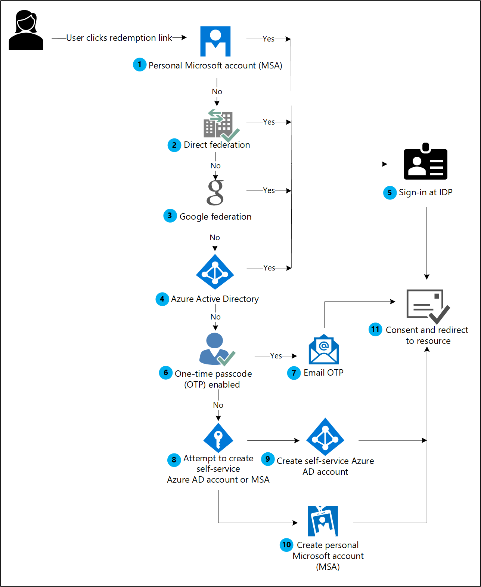
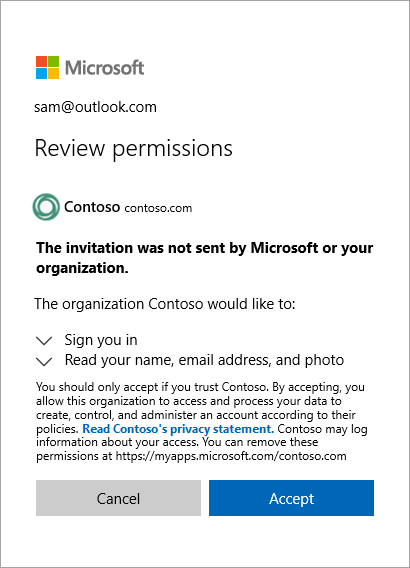

---

title: Invitation redemption in B2B collaboration - Azure AD
description: Describes the Azure AD B2B collaboration invitation redemption experience for end users, including the agreement to privacy terms.

services: active-directory
ms.service: active-directory
ms.subservice: B2B
ms.topic: conceptual
ms.date: 05/11/2020

ms.author: mimart
author: msmimart
manager: celestedg
ms.reviewer: elisol

ms.collection: M365-identity-device-management
---

# Azure Active Directory B2B collaboration invitation redemption

This article describes the ways guest users can access your resources and the consent process they'll encounter. If you send an invitation email to the guest, the invitation includes a link the guest can redeem to get access to your app or portal. The invitation email is just one of the ways guests can get access to your resources. As an alternative, you can add guests to your directory and give them a direct link to the portal or app you want to share. Regardless of the method they use, guests are guided through a first-time consent process. This process ensures that your guests agree to privacy terms and accept any [terms of use](https://docs.microsoft.com/azure/active-directory/governance/active-directory-tou) you've set up.

When you add a guest user to your directory, the guest user account has a consent status (viewable in PowerShell) that’s initially set to **PendingAcceptance**. This setting remains until the guest accepts your invitation and agrees to your privacy policy and terms of use. After that, the consent status changes to **Accepted**, and the consent pages are no longer presented to the guest.

   > [!IMPORTANT]
   > **Starting March 31, 2021**, Microsoft will no longer support the redemption of invitations by creating unmanaged Azure AD accounts and tenants for B2B collaboration scenarios. In preparation, we encourage customers to opt into [email one-time passcode authentication](one-time-passcode.md). We welcome your feedback on this public preview feature and are excited to create even more ways to collaborate.

## Redemption through the invitation email

When you add a guest user to your directory by [using the Azure portal](https://docs.microsoft.com/azure/active-directory/b2b/b2b-quickstart-add-guest-users-portal), an invitation email is sent to the guest in the process. You can also choose to send invitation emails when you’re [using PowerShell](https://docs.microsoft.com/azure/active-directory/b2b/b2b-quickstart-invite-powershell) to add guest users to your directory. Here’s a description of the guest’s experience when they redeem the link in the email.

1. The guest receives an [invitation email](https://docs.microsoft.com/azure/active-directory/b2b/invitation-email-elements) that's sent from **Microsoft Invitations**.
2. The guest selects **Accept invitation** in the email.
3. The guest will use their own credentials to sign in to your directory. If the guest does not have an account that can be federated to your directory and the [email one-time passcode (OTP)](https://docs.microsoft.com/azure/active-directory/b2b/one-time-passcode) feature is not enabled; the guest is prompted to create a personal [MSA](https://support.microsoft.com/help/4026324/microsoft-account-how-to-create) or an [Azure AD self-service account](https://docs.microsoft.com/azure/active-directory/users-groups-roles/directory-self-service-signup). Refer to the [invitation redemption flow](#invitation-redemption-flow) for details.
4. The guest is guided through the [consent experience](#consent-experience-for-the-guest) described below.

## Redemption through a direct link

As an alternative to the invitation email, you can give a guest a direct link to your app or portal. You first need to add the guest user to your directory via the [Azure portal](https://docs.microsoft.com/azure/active-directory/b2b/b2b-quickstart-add-guest-users-portal) or [PowerShell](https://docs.microsoft.com/azure/active-directory/b2b/b2b-quickstart-invite-powershell). Then you can use any of the [customizable ways to deploy applications to users](https://docs.microsoft.com/azure/active-directory/manage-apps/end-user-experiences), including direct sign-on links. When a guest uses a direct link instead of the invitation email, they’ll still be guided through the first-time consent experience.

> [!IMPORTANT]
> The direct link must be tenant-specific. In other words, it must include a tenant ID or verified domain so the guest can be authenticated in your tenant, where the shared app is located. A common URL like https://myapps.microsoft.com won’t work for a guest because it will redirect to their home tenant for authentication. Here are some examples of direct links with tenant context:
 > - Apps access panel: `https://myapps.microsoft.com/?tenantid=<tenant id>`
 > - Apps access panel for a verified domain: `https://myapps.microsoft.com/<;verified domain>`
 > - Azure portal: `https://portal.azure.com/<tenant id>`
 > - Individual app: see how to use a [direct sign-on link](../manage-apps/end-user-experiences.md#direct-sign-on-links)

There are some cases where the invitation email is recommended over a direct link. If these special cases are important to your organization, we recommend that you invite users by using methods that still send the invitation email:
 - The user doesn’t have an Azure AD account, an MSA, or an email account in a federated organization. Unless you're using the one-time passcode feature, the guest needs to redeem the invitation email to be guided through the steps for creating an MSA.
 - Sometimes the invited user object may not have an email address because of a conflict with a contact object (for example, an Outlook contact object). In this case, the user must click the redemption URL in the invitation email.
 - The user may sign in with an alias of the email address that was invited. (An alias is an additional email address associated with an email account.) In this case, the user must click the redemption URL in the invitation email.

## Invitation redemption flow

When a user clicks the **Accept invitation** link in an [invitation email](invitation-email-elements.md), Azure AD automatically redeems the invitation based on the redemption flow as shown below:

**If the user’s User principle name (UPN) matches with both an existing Azure AD and personal MSA account, the user will be prompted to choose which account they want to redeem with.*

1. Azure AD performs user-based discovery to determine if the user exists in an [existing Azure AD tenant](https://docs.microsoft.com/azure/active-directory/b2b/what-is-b2b#easily-add-guest-users-in-the-azure-ad-portal).

2. If an admin has enabled [direct federation](https://docs.microsoft.com/azure/active-directory/b2b/direct-federation), Azure AD checks if the user’s domain suffix matches the domain of a configured SAML/WS-Fed identity provider and redirects the user to the pre-configured identity provider.

3. If an admin has enabled [Google federation](https://docs.microsoft.com/azure/active-directory/b2b/google-federation), Azure AD checks if the user’s domain suffix is gmail.com or googlemail.com and redirects the user to Google.

4. The redemption process checks if the user has an existing personal [Microsoft account (MSA)](https://support.microsoft.com/help/4026324/microsoft-account-how-to-create).

5. Once the user’s **home directory** is identified, the user is sent to the corresponding identity provider to sign in.  

6. If steps 1 to 4 fail to find a home directory for the invited user, then Azure AD determines whether the inviting tenant has enabled the [email one-time passcode (OTP)](https://docs.microsoft.com/azure/active-directory/b2b/one-time-passcode) feature for guests.

7. If [email one-time passcode for guests is enabled](https://docs.microsoft.com/azure/active-directory/b2b/one-time-passcode#when-does-a-guest-user-get-a-one-time-passcode), a passcode is sent to the user through the invited email. The user will retrieve and enter this passcode in the Azure AD sign-in page.

8. If email one-time passcode for guests is disabled, Azure AD checks the domain suffix to determine if it belongs to a consumer account. If so, the user is prompted to create a personal [Microsoft account](https://support.microsoft.com/help/4026324/microsoft-account-how-to-create). If not, the user is prompted to create an [Azure AD self-service account](https://docs.microsoft.com/azure/active-directory/users-groups-roles/directory-self-service-signup).

9. Azure AD attempts to create an [Azure AD self-service account](https://docs.microsoft.com/azure/active-directory/users-groups-roles/directory-self-service-signup) by verifying access to the email. Verifying the account is done by sending a code to the email, and having the user retrieve and submit it to Azure AD. However, if the invited user’s tenant is federated or if the AllowEmailVerifiedUsers field is set to false in the invited user’s tenant, the user is unable to complete the redemption and the flow results in an error. For more information, see [Troubleshooting Azure Active Directory B2B collaboration](https://docs.microsoft.com/azure/active-directory/b2b/troubleshoot#the-user-that-i-invited-is-receiving-an-error-during-redemption).

10. The user is prompted to create a personal [Microsoft account (MSA)](https://support.microsoft.com/help/4026324/microsoft-account-how-to-create).

11. After authenticating to the right identity provider, the user is redirected to Azure AD to complete the [consent experience](https://docs.microsoft.com/azure/active-directory/b2b/redemption-experience#consent-experience-for-the-guest).  

For just-in-time (JIT) redemptions, where redemption is through a tenanted application link, steps 8 through 10 are not available. If a user reaches step 6 and the Email one-time passcode feature is not enabled, the user receives an error message and is unable to redeem the invitation. To prevent this error, admins should either [enable email one-time passcode](https://docs.microsoft.com/azure/active-directory/b2b/one-time-passcode#when-does-a-guest-user-get-a-one-time-passcode) or ensure the user clicks an invitation link.

## Consent experience for the guest

When a guest signs in to access resources in a partner organization for the first time, they're guided through the following pages. 

1. The guest reviews the **Review permissions** page describing the inviting organization's privacy statement. A user must **Accept** the use of their information in accordance to the inviting organization's privacy policies to continue.

    

   > [!NOTE]
   > For information about how you as a tenant administrator can link to your organization's privacy statement, see [How-to: Add your organization's privacy info in Azure Active Directory](https://aka.ms/adprivacystatement).

2. If terms of use are configured, the guest opens and reviews the terms of use, and then selects **Accept**. 

    

   You can configure [terms of use](../governance/active-directory-tou.md) in **External Identities** > **Terms of use**.

3. Unless otherwise specified, the guest is redirected to the Apps access panel, which lists the applications the guest can access.

    

In your directory, the guest's **Invitation accepted** value changes to **Yes**. If an MSA was created, the guest’s **Source** shows **Microsoft Account**. For more information about guest user account properties, see [Properties of an Azure AD B2B collaboration user](user-properties.md). 

## Next steps

- [What is Azure AD B2B collaboration?](what-is-b2b.md)
- [Add Azure Active Directory B2B collaboration users in the Azure portal](add-users-administrator.md)
- [How do information workers add B2B collaboration users to Azure Active Directory?](add-users-information-worker.md)
- [Add Azure Active Directory B2B collaboration users by using PowerShell](customize-invitation-api.md#powershell)
- [Leave an organization as a guest user](leave-the-organization.md)
