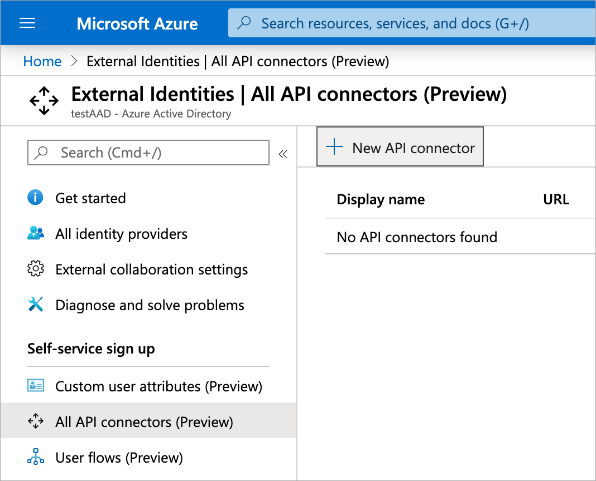
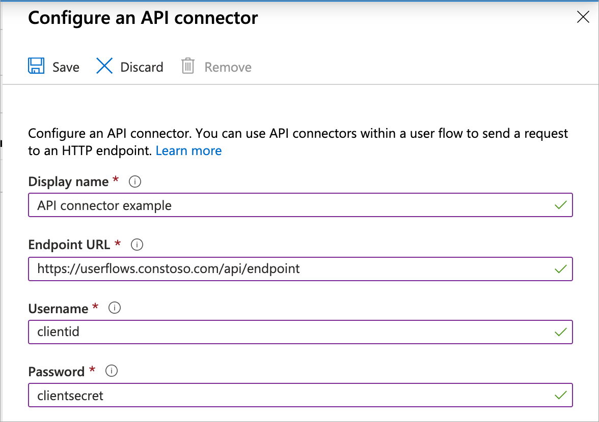
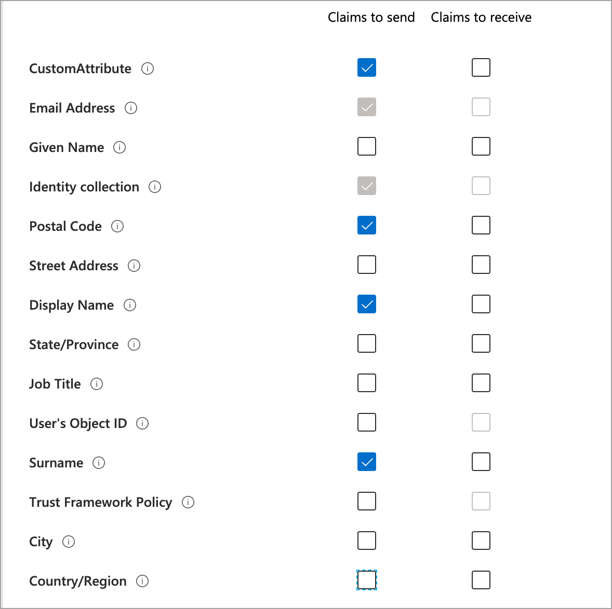
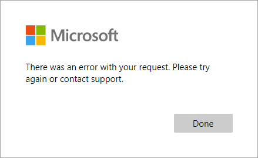
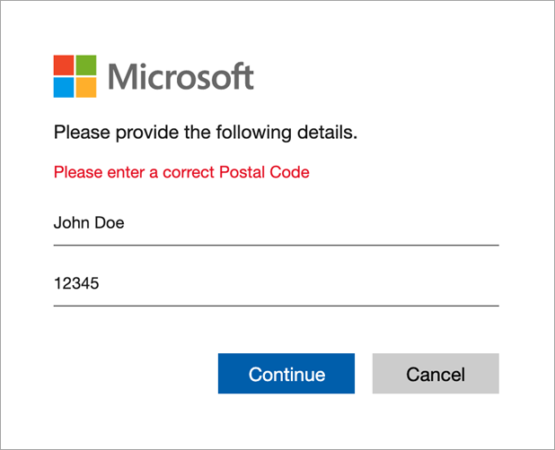

# Add an API connector to a user flow

To use an [API connector](api-connectors-overview.md), you first create the API connector and then enable it in a user flow.

## Create an API connector

1. Sign in to the [Azure portal](https://portal.azure.com/) as an Azure AD administrator.
2. Under **Azure services**, select **Azure Active Directory**.
3. In the left menu, select **External Identities**.
4. Select **All API connectors (Preview)**, and then select **New API connector**.

    

5. Provide a display name for the call. For example, **Check approval status**.
6. Provide the **Endpoint URL** for the API call.
7. Provide the authentication information for the API.
    - Only Basic Authentication is currently supported. If you wish to use an API without Basic Authentication for development purposes, simply enter a dummy **Username** and **Password** that your API can ignore. For use with an Azure Function with an API key, you can include the code as a query parameter in the **Endpoint URL** ( for example, https[]()://contoso.azurewebsites.net/api/endpoint<b>?code=0123456789</b>).

   

8. Select the claims you want to send to the API.
9. Select any claims you plan to receive back from the API.
 
    

10. Select **Save**.
 
## Enable the API connector in a user flow

Follow these steps to add an API connector to a self-service sign-up user flow.

1. Sign in to the [Azure portal](https://portal.azure.com/) as an Azure AD administrator.
2. Under **Azure services**, select **Azure Active Directory**.
3. In the left menu, select **External Identities**.
4. Select **User flows (Preview)**, and then select the user flow you want to add the API connector to.
5. Select **API connectors**, and then select the API endpoints you want to invoke at the following steps in the user flow:
   - **After signing in with an identity provider**
   - **Before creating the user**

   

6. Select **Save**.

Learn about [where you can enable an API connector in a user flow](api-connectors-overview.md#where-you-can-enable-an-api-connector-in-a-user-flow).

## Request sent to the API
An API connector materializes as an HTTP POST request, sending selected claims as key-value pairs in a JSON body. The response should also have the HTTP header `Content-Type: application/json`. Attributes are serialized similarly to Microsoft Graph user attributes. <!--# TODO: Add link to MS Graph or create separate reference.-->

### Example request
```http
POST <API-endpoint>
Content-type: application/json

{
 "email_address": "johnsmith@fabrikam.onmicrosoft.com",
 "identities": [ //Sent for Google and Facebook identity providers
     {
     "signInType":"federated",
     "issuer":"facebook.com",
     "issuerAssignedId":"0123456789"
     }
 ],
 "displayName": "John Smith",
 "postalCode": "33971",
 "extension_<aad-extensions-app-id>_CustomAttribute1": "custom attribute value",
 "extension_<aad-extensions-app-id>_CustomAttribute2": "custom attribute value",
 "ui_locales":"en-US"
}
```

The **UI Locales ('ui_locales')** claim is sent by default in all requests. It provides a user's locale(s) and can be used by the API to return internationalized responses. It doesn't appear in the API configuration pane.

If a claim to send does not have a value at the time the API endpoint is called, the claim will not be sent to the API.

Custom attributes can be created for the user using the **extension_\<aad-extensions-app-id>_\<AttributeName>** format. Your API should expect to receive claims in this same serialized format. Your API can return claims in that same format but without the `<aad-extensions-app-id>`. <!--TODO: update once fix is rolled out--> For more information about custom attributes, see [define custom attributes for self-service sign-up flows](user-flow-add-custom-attributes.md).

> [!TIP]
> [**Identities ('identities')**](https://docs.microsoft.com/graph/api/resources/objectidentity?view=graph-rest-1.0) and the **Email Address ('email_address')** claims can be used to identify a user before they have an account in your tenant. The  'identities' claim is sent when a user authenticates with a Google or Facebook and 'email_address' is always sent.


## Expected response types from the web API

When the web API receives an HTTP request from Azure AD during a user flow, it can return these responses:

- [Continuation response](#continuation-response)
- [Blocking response](#blocking-response)
- [Validation-error response](#validation-error-response)

### Continuation response

A continuation response indicates that the user flow should continue to the next step. In a continuation response, the API can return claims.

If a claim is returned by the API and selected as a **Claim to receive**, the claim does the following:

- Pre-fills input fields in the attribute collection page if the API connector is invoked before the page is presented.
- Overrides any value that has already been assigned to the claim.
- Assigns a value to the claim if it was previously null.

#### Example of a continuation response
```http
HTTP/1.1 200 OK
Content-type: application/json

{
    "version": "1.0.0", 
    "action": "Continue",  
    "postalCode": "12349", // return claim 
    "extension_CustomAttribute": "value" // return claim 
}
```

| Parameter  | Type  | Required | Description |
|---|---|---|---|
| version | String | Yes | The version of the API. |
| action  | String | Yes | Value must be `Continue`. |
| \<builtInUserAttribute> | \<attribute-type> | No  | Values can be stored in the directory if they selected as a **Claim to receive** in the API connector configuration and **User attributes** for a user flow. Values can be returned in the token if selected as an **Application claim**. |
| \<extension_CustomAttribute> | \<attribute-type> | No  | The return claim does *not* have `_<aad-extensions-app-id>_`. Values are be stored in the directory if they selected as a **Claim to receive** in the API connector configuration and **User attribute** for a user flow. Custom attributes cannot be sent back in the token. |

### Blocking Response

A blocking response exits the user flow. It can be purposely issued by the API to stop the continuation of the user flow by displaying a block page to the user. The block page displays the `userMessage` provided by the API. 

The following is an example of the blocking response:

```http
HTTP/1.1 200 OK
Content-type: application/json

{
    "version": "1.0.0",
    "action": "ShowBlockPage", 
    "userMessage": "There was a problem with your request. You are not able to sign up at this time.",
    "code": "CONTOSO-BLOCK-00"
}

```

| Parameter  | Type  | Required | Description |
|---|---|---|---|
| version         | String           | Yes      | The version of the API.    |
| action          | String           | Yes      | Value must be `ShowBlockPage`  |
| userMessage     | String           | Yes      | Message to display to the user.    |
| code            | String           | No       | Error code. Can be used for debugging purposes. Not displayed to the user.    |

#### End user experience with a blocking response



### Validation-error response

An API call invoked after an attribute collection page may return a validation-error response. When doing so, the user flow stays on the attribute collection page and the `userMessage` is displayed to the user. The user can then edit and resubmit the form. This type of response can be used for input validation.

#### Example of a validation-error response

```http
HTTP/1.1 400 Bad Request
Content-type: application/json

{
    "version": "1.0.0", 
    "status": 400,
    "action": "ValidationError",  
    "userMessage": "Please enter a valid Postal Code.",
    "code": "CONTOSO-VALIDATION-00"
}
```

| Parameter  | Type  | Required | Description |
|---|---|---|---|
| version         | String           | Yes      | The version of the API.   |
| action          | String           | Yes      | Value must be `ValidationError`.   |
| status          | Integer          | Yes      | Must be value `400` for a ValidationError response.  |
| userMessage     | String           | Yes      | Message to display to the user.   |
| code            | String           | No       | Error code. Can be used for debugging purposes. Not displayed to the user.    |

#### End user experience with a validation-error response




## Next steps
- Learn [how your API should respond](self-service-sign-up-add-api-connector.md#expected-response-types-from-the-web-api)
- Learn [where you can enable an API connector](api-connectors-overview.md#where-you-can-enable-an-api-connector-in-a-user-flow)
- Learn how to [add a custom approval workflow to self-service sign-up](self-service-sign-up-add-approvals.md)
<!-- - Learn how to [use API connectors for identity proofing](code-samples-self-service-sign-up.md#identity-proofing) -->