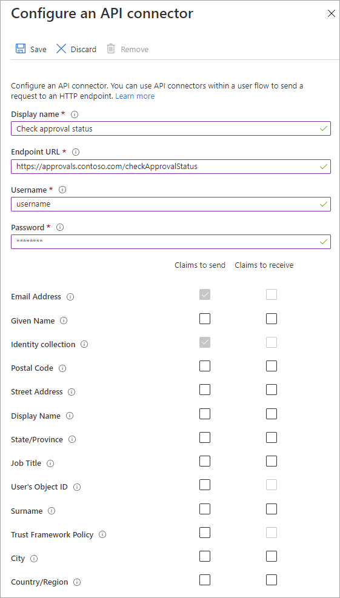
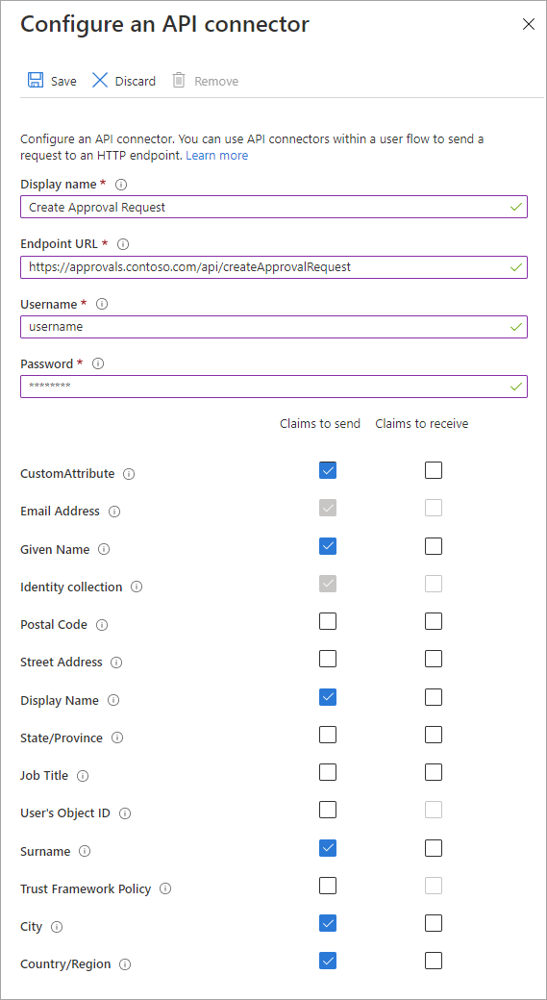
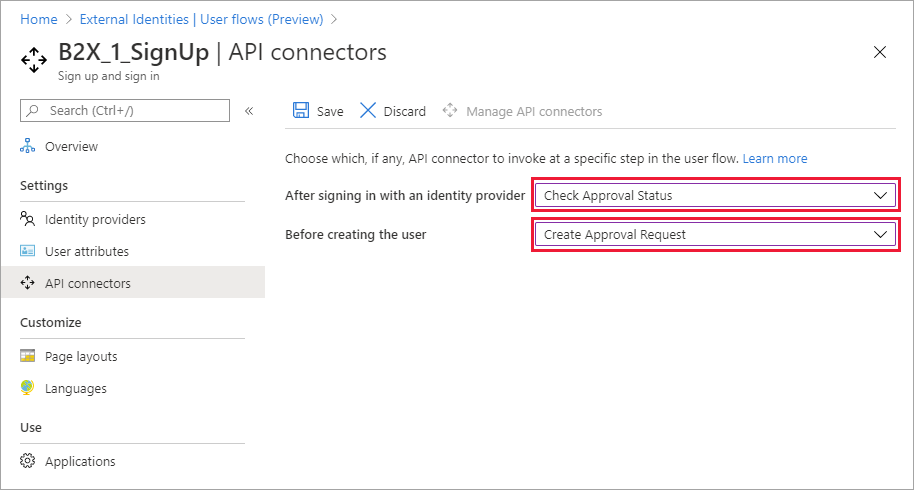
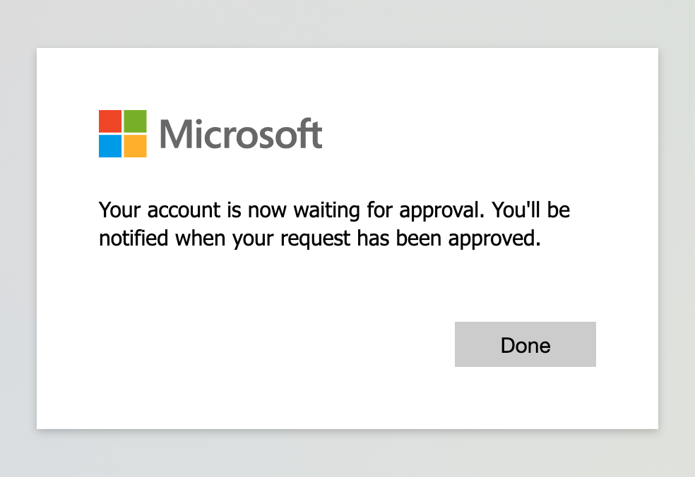

 
# Add a custom approval workflow to self-service sign-up

With [API connectors](api-connectors-overview.md), you can integrate with your own custom approval workflows with self-service sign-up so you can manage which guest user accounts are created in your tenant.

This article gives an example of how to integrate with an approval system. In this example, the self-service sign-up user flow collects user data during the sign-up process and passes it to your approval system. Then, the approval system can:

- Automatically approve the user and allow Azure AD to create the user account.
- Trigger a manual review. If the request is approved, the approval system uses Microsoft Graph to provision the user account. The approval system can also notify the user that their account has been created.

## Register an application for your approval system

You need to register your approval system as an application in your Azure AD tenant so it can authenticate with Azure AD and have permission to create users. Learn more about [authentication and authorization basics for Microsoft Graph](https://docs.microsoft.com/graph/auth/auth-concepts).

1. Sign in to the [Azure portal](https://portal.azure.com) as an Azure AD administrator.
2. Under **Azure services**, select **Azure Active Directory**.
3. In the left menu, select **App registrations**, and then select **New registration**.
4. Enter a **Name** for the application, for example, *Sign-up Approvals*.

   <!--  -->

5. Select **Register**. You can leave other fields at their defaults.

   

6. Under **Manage** in the left menu, select **API permissions**, and then select **Add a permission**.
7. On the **Request API permissions** page, select **Microsoft Graph**, and then select **Application permissions**.
8. Under **Select permissions**, expand **User**, and then select the **User.ReadWrite.All** check box. This permission allows the approval system to create the user upon approval. Then select **Add permissions**.

    

9. On the **API permissions** page, select **Grant admin consent for (your tenant name)**, and then select **Yes**.
10. Under **Manage** in the left menu, select **Certificates & secrets**, and then select **New client secret**.
11. Enter a **Description** for the secret, for example *Approvals client secret*, and select the duration for when the client secret **Expires**. Then select **Add**.
12. Copy the value of the client secret.

    

13. Configure your approval system to use the **Application ID** as the client ID and the **client secret** you generated to authenticate with Azure AD.

## Create the API connectors

Next you'll [create the API connectors](self-service-sign-up-add-api-connector.md#create-an-api-connector) for your self-service sign-up user flow. Your approval system API needs two connectors and corresponding endpoints, like the examples shown below. These API connectors do the following:

- **Check approval status**. Send a call to the approval system immediately after a user signs-in with an identity provider to check if the user has an existing approval request or has already been denied. If your approval system only does automatic approval decisions, this API connector may not be needed. The following is an example of a "Check approval status" API connector.

   

- **Request approval** - Send a call to the approval system after a user completes the attribute collection page, but before the user account is created, to request approval. The approval request can be automatically granted or manually reviewed. The following is an example of a "Request approval" API connector. Select any **Claims to send** that the approval system needs to make an approval decision.

   

To create these connectors, follow the steps in [create an API connector](self-service-sign-up-add-api-connector.md#create-an-api-connector).

## Enable the API connectors in a user flow

Now you'll add the API connectors to a self-service sign-up user flow with these steps:

1. Sign in to the [Azure portal](https://portal.azure.com/) as an Azure AD administrator.
2. Under **Azure services**, select **Azure Active Directory**.
3. In the left menu, select **External Identities**.
4. Select **User flows (Preview)**, and then select the user flow you want to enable the API connector for.
5. Select **API connectors**, and then select the API endpoints you want to invoke at the following steps in the user flow:
   - **After signing in with an identity provider**: Select your approval status API connector, for example *Check approval status*.
   - **Before creating the user**: Select your approval request API connector, for example *Request approval*.

   

6. Select **Save**.

## Control the sign-up flow with API responses

Your approval system can use the [API response types](self-service-sign-up-add-api-connector.md#expected-response-types-from-the-web-api) from the two API endpoints to control the sign up flow.

### Request and responses for the "Check approval status" API connector

The following is an example of the request received by the API from the "Check approval status" API connector:

```http
POST <Approvals-API-endpoint>
Content-type: application/json

{
 "email_address": "johnsmith@outlook.com",
 "identities": [
     {
     "signInType":"federated",
     "issuer":"facebook.com",
     "issuerAssignedId":"0123456789"
     }
 ],
 "ui_locales":"en-US"
}
```

#### Continuation response for "Check approval status"

The **Check approval status** API endpoint should return a continuation response if:

- The user has not previously requested an approval.

The following is an example of the continuation response:

```http
HTTP/1.1 200 OK
Content-type: application/json

{
    "version": "1.0.0",
    "action": "Continue"
}
```

#### Blocking response for "Check approval status"

The **Check approval status** API endpoint should return a blocking response if:

- User approval is pending.
- The user was denied and shouldn't be allowed to request approval again.

The following are examples of blocking responses:

```http
HTTP/1.1 200 OK
Content-type: application/json

{
    "version": "1.0.0",
    "action": "ShowBlockPage",
    "userMessage": "Your access request is already processing. You'll be notified when your request has been approved.",
    "code": "CONTOSO-APPROVAL-PENDING"
}
```

```http
HTTP/1.1 200 OK
Content-type: application/json

{
    "version": "1.0.0",
    "action": "ShowBlockPage",
    "userMessage": "Your sign up request has been denied. Please contact an administrator if you believe this is an error",
    "code": "CONTOSO-APPROVAL-DENIED"
}
```

### Request and responses for the "Request approval" API connector

The following is an example of an HTTP request received by the API from the "Request approval" API connector:

```http
POST <Approvals-API-endpoint>
Content-type: application/json

{
 "email_address": "johnsmith@outlook.com",
 "identities": [
     {
     "signInType":"federated",
     "issuer":"facebook.com",
     "issuerAssignedId":"0123456789"
     }
 ],
 "displayName": "John Smith",
 "city": "Redmond",
 "extension_<aad-extensions-app-id>_CustomAttribute": "custom attribute value",
 "ui_locales":"en-US"
}
```

#### Continuation response for "Request approval"

The **Request approval** API endpoint should return a continuation response if:

- The user can be ***automatically approved***.

The following is an example of the continuation response:

```http
HTTP/1.1 200 OK
Content-type: application/json

{
    "version": "1.0.0",
    "action": "Continue"
}
```

> [!IMPORTANT]
> If a continuation response is received, Azure AD creates a user account and directs the user to the application.

#### Blocking Response for "Request approval"

The **Request approval** API endpoint should return a blocking response if:

- A user approval request was created and is now pending.
- A user approval request was automatically denied.

The following are examples of blocking responses:

```http
HTTP/1.1 200 OK
Content-type: application/json

{
    "version": "1.0.0",
    "action": "ShowBlockPage",
    "userMessage": "Your account is now waiting for approval. You'll be notified when your request has been approved.",
    "code": "CONTOSO-APPROVAL-REQUESTED"
}
```

```http
HTTP/1.1 200 OK
Content-type: application/json

{
    "version": "1.0.0",
    "action": "ShowBlockPage",
    "userMessage": "Your sign up request has been denied. Please contact an administrator if you believe this is an error",
    "code": "CONTOSO-APPROVAL-AUTO-DENIED"
}
```

The `userMessage` in the response is displayed to the user, for example:



## User account creation after manual approval

After obtaining manual approval, the custom approval system creates a [user](https://docs.microsoft.com/graph/azuread-users-concept-overview) account by using  [Microsoft Graph](https://docs.microsoft.com/graph/use-the-api). The way your approval system provisions the user account depends on the identity provider that was used by the user.

### For a federated Google or Facebook user

> [!IMPORTANT]
> The approval system should explicitly check that `identities`, `identities[0]` and `identities[0].issuer` are present and that `identities[0].issuer` equals 'facebook' or 'google' to use this method.

If your user signed in with a Google or Facebook account, you can use the [User creation API](https://docs.microsoft.com/graph/api/user-post-users?view=graph-rest-1.0&tabs=http).

1. The approval system uses receives the HTTP request from the user flow.

```http
POST <Approvals-API-endpoint>
Content-type: application/json

{
 "email_address": "johnsmith@outlook.com",
 "identities": [
     {
     "signInType":"federated",
     "issuer":"facebook.com",
     "issuerAssignedId":"0123456789"
     }
 ],
 "displayName": "John Smith",
 "city": "Redmond",
 "extension_<aad-extensions-app-id>_CustomAttribute": "custom attribute value",
 "ui_locales":"en-US"
}
```

2. The approval system uses Microsoft Graph to create a user account.

```http
POST https://graph.microsoft.com/v1.0/users
Content-type: application/json

{
 "userPrincipalName": "johnsmith_outlook.com#EXT@contoso.onmicrosoft.com",
 "accountEnabled": true,
 "mail": "johnsmith@outlook.com",
 "userType": "Guest",
 "identities": [
     {
     "signInType":"federated",
     "issuer":"facebook.com",
     "issuerAssignedId":"0123456789"
     }
 ],
 "displayName": "John Smith",
 "city": "Redmond",
 "extension_<aad-extensions-app-id>_CustomAttribute": "custom attribute value"
}
```

| Parameter  | Required | Description |
|---|---|---|
| userPrincipalName | Yes | Can be generated by taking the `email_address` claim sent to the API, replacing the `@`character with `_`, and pre-pending it to `#EXT@<tenant-name>.onmicrosoft.com`. |
| accountEnabled  | Yes  | Must be set to `true`.  |
| mail  | Yes | Equivalent to the `email_address` claim sent to the API. |
| userType | Yes | Must be `Guest`. Designates this user as a guest user. |
| identities  | Yes  | The federated identity information. |
| \<otherBuiltInAttribute>  | No  | Other built-in attributes like `displayName`, `city`, and others. Parameter names are the same as the parameters sent by the API connector.|
| \<extension_\<aad-extensions-app-id>\_CustomAttribute> | No | Custom attributes about the user. Parameter names are the same as the parameters sent by the API connector. |

### For a federated Azure Active Directory user

If a user signs in with a federated Azure Active Directory account,  you must use the [invitation API](https://docs.microsoft.com/graph/api/invitation-post?view=graph-rest-1.0) to create the user and then optionally the [user update API](https://docs.microsoft.com/graph/api/user-update?view=graph-rest-1.0) to assign more attributes to the user.

1. The approval system receives the HTTP request from the user flow.

```http
POST <Approvals-API-endpoint>
Content-type: application/json

{
 "email_address": "johnsmith@fabrikam.onmicrosoft.com",
 "displayName": "John Smith",
 "city": "Redmond",
 "extension_<aad-extensions-app-id>_CustomAttribute": "custom attribute value",
 "ui_locales":"en-US"
}
```

2. The approval system creates the invitation using the `email_address` provided by the API connector.

```http
POST https://graph.microsoft.com/v1.0/invitations 
Content-type: application/json

{
    "invitedUserEmailAddress":"johnsmith@fabrikam.onmicrosoft.com", 
    "inviteRedirectUrl" : "https://myapp.com"
}
```

The following is an example of the response:

```http
HTTP/1.1 201 OK
Content-type: application/json

{
    ...
    "invitedUser": {
        "id": "<generated-user-guid>"
    }
}
```

3. The approval system uses the invited user's ID to update the user's account with collected user attributes (optional).

```http
PATCH https://graph.microsoft.com/v1.0/users/<generated-user-guid>
Content-type: application/json

{
    "displayName": "John Smith",
    "city": "Redmond",
    "extension_<aad-extensions-app-id>_AttributeName": "custom attribute value"
}
```

<!-- ## Next steps -->
<!-- - See an example approval system with the [Woodgrove self-service sign-up for guest users sample](code-samples-self-service-sign-up.md#custom-approval-system).  -->
<!--TODO: link to sample-->

