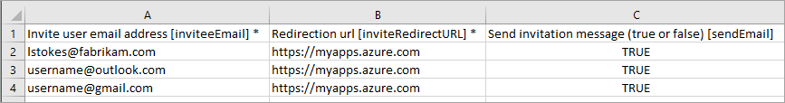

---

title: Tutorial to bulk invite B2B collaboration users - Azure Active Directory | Microsoft Docs
description: In this tutorial, you learn how to use PowerShell and a CSV file to send bulk invitations to external Azure AD B2B collaboration users.

services: active-directory
ms.service: active-directory
ms.subservice: B2B
ms.topic: tutorial
ms.date: 06/28/2019

ms.author: mimart
author: msmimart
manager: celestedg
ms.reviewer: mal

#customer intent: As a tenant administrator, I want to send B2B invitations to multiple external users at the same time so that I can avoid having to send individual invitations to each user.

ms.collection: M365-identity-device-management
---

# Tutorial: Bulk invite Azure AD B2B collaboration users

If you use Azure Active Directory (Azure AD) B2B collaboration to work with external partners, you can invite multiple guest users to your organization at the same time. In this tutorial, you learn how to use the Azure portal to send bulk invitations to external users. Specifically, you do the following:

> [!div class="checklist"]
> * Use **Bulk invite** to prepare a comma-separated value (.csv) file with the user information and invitation preferences
> * Upload the .csv file to Azure AD
> * Verify the users were added to the directory

If you don’t have an Azure subscription, create a [free account](https://azure.microsoft.com/free/?WT.mc_id=A261C142F) before you begin. 

## Prerequisites

You need two or more test email accounts that you can send the invitations to. The accounts must be from outside your organization. You can use any type of account, including social accounts such as gmail.com or outlook.com addresses.

## Invite guest users in bulk

1.	Sign in to the Azure portal with an account that is a User administrator in the organization.
2.	In the navigation pane, select **Azure Active Directory**.
3.	Under **Manage**, select **Users** > **Bulk invite**.
4.	On the **Bulk invite users** page, select **Download** to get a valid .csv file with invitation properties. Save the file in the default location (**C:\Users\**<username>**\UserInviteTemplate.csv**).
5.	Open the .csv file and add a line for each guest user.  Save the file.
   
    

6. In the Azure portal on the **Bulk invite users** page, under **Upload your csv file**, browse to the file. 
7.	When the file contents are validated, you’ll see **File uploaded successfully**. If there are errors, you must fix them before you can submit the job.
8.	When your file passes validation, select **Submit** to start the Azure batch job that adds the invitations. Look for the batch create notification to see the job status.


## Verify guest users in the directory

Check to see that the guest users you added exist in the directory either in the Azure portal or by using PowerShell. 

### View guest users in the Azure portal

1.	Sign in to the Azure portal with an account that is a User administrator in the organization.
2.	In the navigation pane, select **Azure Active Directory**.
3.	Under **Manage**, select **Users**.
4.	Under **Show**, select **Guest users only** and verify the users you added are listed.

### View guest users with PowerShell

Run the following command:
```powershell
 Get-AzureADUser -Filter "UserType eq 'Guest'"
```
You should see the users that you invited listed, with a user principal name (UPN) in the format *emailaddress*#EXT#\@*domain*. For example, *lstokes_fabrikam.com#EXT#\@contoso.onmicrosoft.com*, where contoso.onmicrosoft.com is the organization from which you sent the invitations.

## Clean up resources

When no longer needed, you can delete the test user accounts in the directory in the Azure portal on the Users page by selecting the checkbox next to the guest user and then selecting **Delete**. 

Or you can run the following PowerShell command to delete a user account:

```powershell
 Remove-AzureADUser -ObjectId "<UPN>"
```
For example: `Remove-AzureADUser -ObjectId "lstokes_fabrikam.com#EXT#@contoso.onmicrosoft.com"`


## Next steps
In this tutorial, you sent bulk invitations to guest users outside of your organization. Next, learn how the invitation redemption process works.

> [!div class="nextstepaction"]
> [Learn about the Azure AD B2B collaboration invitation redemption process](redemption-experience.md)

