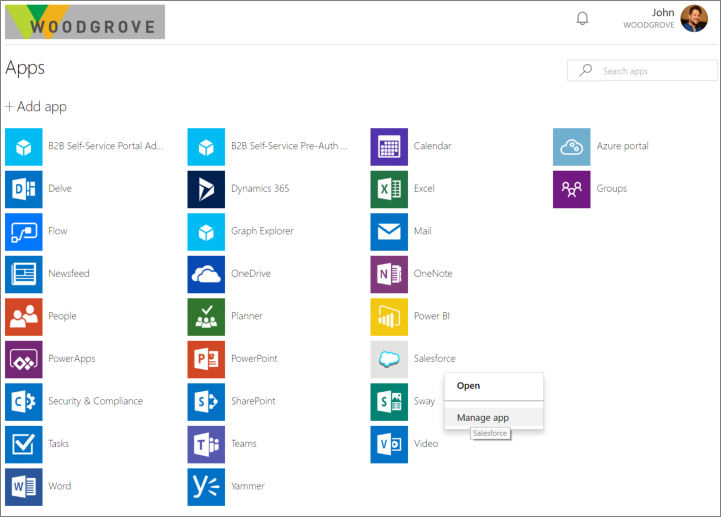

# What is Azure AD B2B collaboration?

Azure Active Directory (Azure AD) business-to-business (B2B) collaboration capabilities enable any organization using Azure AD to work safely and securely with users from any other organization, small or large. Those organizations can be with or without Azure AD, and don't even need to have an IT department.

Organizations using Azure AD can provide access to documents, resources, and applications to their partners, while maintaining complete control over their own corporate data. Developers can use the Azure AD business-to-business APIs to write applications that bring two organizations together in more securely. Also, it's easy for end users to navigate.

The following video provides a useful overview.
>[!VIDEO https://www.youtube.com/embed/AhwrweCBdsc]

## Key benefits of Azure AD B2B collaboration

### Work with any user from any partner

- Partners use their own credentials
- No requirement for partners to use Azure AD
- No external directories or complex set-up required

### Simple and secure collaboration

- Provide access to any corporate app or data, while applying sophisticated, Azure AD-powered authorization policies
- Easy for users
- Enterprise-grade security for apps and data

### No management overhead

- No external account or password management
- No sync or manual account lifecycle management
- No external administrative overhead

## Easily add B2B collaboration users

As an administrator, you can easily add B2B collaboration (guest) users to your organization in the [Azure portal](https://portal.azure.com).

### Enable your collaborators to bring their own identity

B2B collaborators can sign in with an identity of their choice. If the user doesn’t have a Microsoft account or an Azure AD account – one is created for them seamlessly at the time for offer redemption.

### Delegate to application and group owners

As an application or group owner, you can add B2B users directly to any application that you care about, whether it is a Microsoft application or not. Administrators can delegate permission to add B2B users to non-administrators. Non-administrators can use the [Azure AD Application Access Panel](https://myapps.microsoft.com) to add B2B collaboration users to applications or groups.

### Authorization policies protect your corporate content

Conditional access policies, such as multi-factor authentication, can be enforced:
- At the tenant level
- At the application level
- For specific users to protect corporate apps and data

### Use APIs and sample code to easily build applications to onboard

Bring your external partners on board in ways customized to your organization’s needs.

Use the [B2B collaboration invitation APIs](https://developer.microsoft.com/graph/docs/api-reference/v1.0/resources/invitation) to customize your onboarding experiences, including creating self-service sign-up portals. We provide sample code for a self-service portal [on Github](https://github.com/Azure/active-directory-dotnet-graphapi-b2bportal-web).

With Azure AD B2B collaboration, you can get the full power of Azure AD to protect your partner relationships in a way that end users find easy and intuitive.

## Next steps

- [How do Azure Active Directory admins add B2B collaboration users?](add-users-administrator.md)
- [How do information workers add B2B collaboration users?](add-users-information-worker.md)
- [B2B collaboration invitation redemption](redemption-experience.md)
- [Azure AD B2B collaboration licensing](licensing-guidance.md)
- And, as always, connect with the product team for any feedback, discussions, and suggestions through our [Microsoft Tech Community](https://techcommunity.microsoft.com/t5/Azure-Active-Directory-B2B/bd-p/AzureAD_B2b).