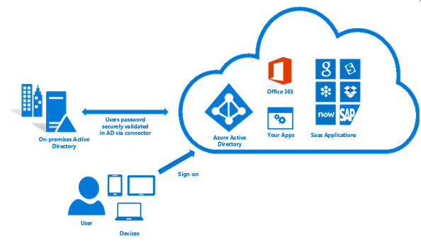
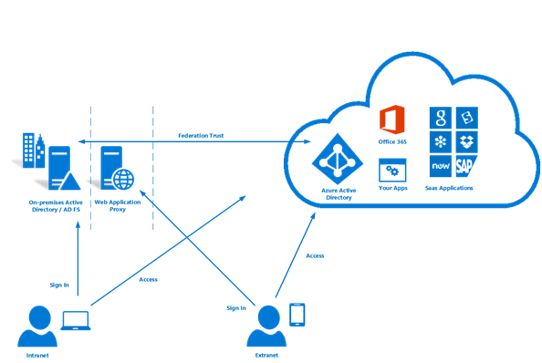

# Microsoft hybrid identity solutions

[Microsoft Azure Active Directory (Azure AD)](https://docs.microsoft.com/azure/active-directory/active-directory-whatis) hybrid identity solutions enable you to synchronize on-premises directory objects with Azure AD while still managing your users on-premises. The first decision to make when planning to synchronize your on-premises Windows Server Active Directory with Azure AD is whether you want to use synchronized identity or federated identity. Synchronized identities, and optionally password hashes, enable your users to use the same password to access both on-premises and cloud-based organizational resources. For more advanced scenario requirements, such as single-sign-on (SSO) or on-premises MFA, you need to deploy Active Directory Federation Services (AD FS) to federate identities. 

There are several options available for configuring hybrid identity. This article provides information to help you choose the best one for your organization based on ease of deployment and your specific identity and access management needs. As you consider which identity model best fits your organization’s needs, you also need to think about time, existing infrastructure, complexity, and cost. These factors are different for every organization, and might change over time. However, if your requirements do change, you also have the flexibility to switch to a different identity model.

> [!TIP]
> These solutions are all delivered by [Azure AD Connect](https://docs.microsoft.com/azure/active-directory/connect/active-directory-aadconnect).
>

## Synchronized identity 

Synchronized identity is the simplest way to synchronize on-premises directory objects (users and groups) with Azure AD. 

While synchronized identity  is the easiest and quickest method, your users still need to maintain a separate password for cloud-based resources. To avoid this, you can also (optionally) [synchronize a hash of user passwords](https://docs.microsoft.com/azure/active-directory/connect/active-directory-aadconnectsync-implement-password-synchronization#what-is-password-synchronization) to your Azure AD directory. Synchronizing password hashes enables users to log in to cloud-based organizational resources with the same user name and password that they use on-premises. Azure AD Connect periodically checks your on-premises directory for changes and keeps your Azure AD directory synchronized. When a user attribute or password is changed on-premises Active Directory, it is automatically updated in Azure AD. 

For most organizations who only need to enable their users to sign in to Office 365, SaaS applications, and other Azure AD-based resources, the default password synchronization option is recommended. If that doesn’t work for you, you'll need to decide between pass-through authentication and AD FS.

> [!TIP]
> User passwords are stored in on-premises Windows Server Active Directory in the form of a hash value that represents the actual user password. A hash value is a result of a one-way mathematical function (the hashing algorithm). There is no method to revert the result of a one-way function to the plain text version of a password. You cannot use a password hash to sign in to your on-premises network. When you opt to synchronize passwords, Azure AD Connect extracts password hashes from the on-premises Active Directory and applies extra security processing to the password hash before it is synchronized to Azure AD. Password synchronization can also be used together with password write-back to enable self-service password reset in Azure AD. In addition, you can enable single sign-on (SSO) for users on domain-joined computers that are connected to the corporate network. With single sign-on, enabled users only need to enter a username to securely access cloud resources. 
>

## Pass-through authentication

[Azure AD pass-through authentication](https://docs.microsoft.com/azure/active-directory/connect/active-directory-aadconnect-pass-through-authentication) provides a simple password validation solution for Azure AD-based services using your on-premises Active Directory. If security and compliance policies for your organization do not permit sending users' passwords, even in a hashed form, and you only need to support desktop SSO for domain joined devices, it is recommended that you evaluate using pass-through authentication. Pass-through authentication does not require any deployment in the DMZ, which simplifies the deployment infrastructure when compared with AD FS. When users sign in using Azure AD, this authentication method validates users' passwords directly against your on-premises Active Directory.

With pass-through authentication, there's no need for a complex network infrastructure, and you don't need to store on-premises passwords in the cloud. Combined with single sign-on, pass-through authentication provides a truly integrated experience when signing in to Azure AD or other cloud services.

Pass-through authentication is configured with Azure AD Connect, which uses a simple on-premises agent that listens for password validation requests. The agent can be easily deployed to multiple machines to provide high availability and load balancing. Since all communications are outbound only, there is no requirement for the connector to be installed in a DMZ. The server computer requirements for the connector are as follows:

- Windows Server 2012 R2 or higher
- Joined to a domain in the forest through which users are validated

## Federated identity (AD FS)

For more control over how users access Office 365 and other cloud services, you can set up directory synchronization with single sign-on (SSO) using [Active Directory Federation Services (AD FS)](https://docs.microsoft.com/windows-server/identity/ad-fs/overview/whats-new-active-directory-federation-services-windows-server). Federating your user's sign-ins with AD FS delegates authentication to an on-premises server that validates user credentials. In this model, on-premises Active Directory credentials are never passed to Azure AD.

Also called identity federation, this sign-in method ensures that all user authentication is controlled on-premises and allows administrators to implement more rigorous levels of access control. Identity federation with AD FS is the most complicated option and requires deploying additional servers in your on-premises environment. Identity federation also commits you to providing 24x7 support for your Active Directory and AD FS infrastructure. This high level of support is necessary because if your on-premises Internet access, domain controller, or AD FS servers are unavailable, users can't sign in to cloud services.

> [!TIP]
> If you decide to use Federation with Active Directory Federation Services (AD FS), you can optionally set up password synchronization as a backup in case your AD FS infrastructure fails.
>

## Common scenarios and recommendations

Here are some common hybrid identity and access management scenarios with recommendations as to which hybrid identity option (or options) might be appropriate for each.

|I need to:|PWS and SSO1| PTA and SSO2 | AD FS3|
|-----|-----|-----|-----|
|Sync new user, contact, and group accounts created in my on-premises Active Directory to the cloud automatically.||  ||
|Set up my tenant for Office 365 hybrid scenarios||  ||
|Enable my users to sign in and access cloud services using their on-premises password||  ||
|Implement single sign-on using corporate credentials||  ||
|Ensure no password hashes are stored in the cloud| |||
|Enable on-premises multi-factor authentication solutions| | ||
|Support smartcard authentication for my users4| | ||
|Display password expiry notifications in the Office Portal and on the Windows 10 desktop| | ||

> 1 Password synchronization with single sign-on.
>
> 2 Pass-through authentication and single sign-on. 
>
> 3 Federated single sign-on with AD FS.
>
> 4 AD FS can be integrated with your enterprise PKI to allow sign-in using certificates. These certificates can be soft-certificates deployed via trusted provisioning channels such as MDM or GPO or smartcard certificates (including PIV/CAC cards) or Hello for Business (cert-trust). For more information about smartcard authentication support, see [this blog](https://blogs.msdn.microsoft.com/samueld/2016/07/19/adfs-certauth-aad-o365/).
>

## Next steps

[Learn more in an Azure Proof of Concept environment](https://aka.ms/aad-poc)
[Install Azure AD Connect](http://go.microsoft.com/fwlink/?LinkId=615771)
[Monitor hybrid identity synchronization](https://docs.microsoft.com/azure/active-directory/connect-health/active-directory-aadconnect-health)
