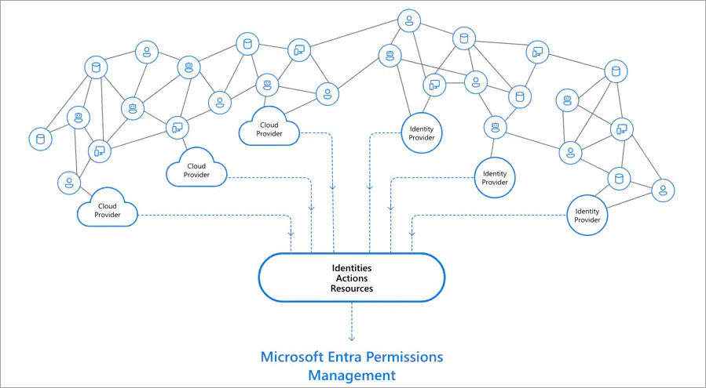
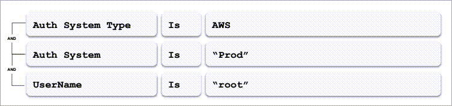
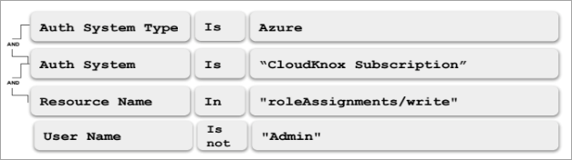
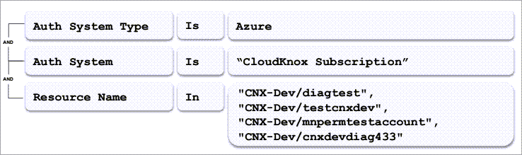
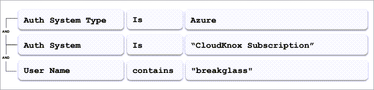

# Trial user guide: Microsoft Entra Permissions Management

Welcome to the Microsoft Entra Permissions Management trial user guide!

This user guide is a simple guide to help you make the most of your free trial, including the Permissions Management Cloud Infrastructure Assessment to help you identify and remediate the most critical permission risks across your multicloud infrastructure. Using the suggested steps in this user guide from the Microsoft Identity team, you'll learn how Permissions Management can assist you to protect all your users and data.

## What is Permissions Management? 

Permissions Management is a cloud infrastructure entitlement management (CIEM) solution that provides comprehensive visibility into permissions assigned to all identities including both workload and user identities, actions, and resources across multicloud infrastructures in Microsoft Azure, Amazon Web Services (AWS), and Google Cloud Platform (GCP). Permissions Management detects, automatically right-sizes, and continuously monitors unused and excessive permissions.

Permissions Management helps your organization tackle cloud permissions by enabling the capabilities to continuously discover, remediate and monitor the activity of every unique user and workload identity operating in the cloud, alerting security and infrastructure teams to areas of unexpected or excessive risk.

-   Get granular cross-cloud visibility - Get a comprehensive view of every action performed by any identity on any resource.
-   Uncover permission risk - Assess permission risk by evaluating the gap between permissions granted and permissions used.
-   Enforce least privilege - Right-size permissions based on usage and activity and enforce permissions on-demand at cloud scale.
-   Monitor and detect anomalies - Detect anomalous permission usage and generate detailed forensic reports.

## Step 1: Set-up Permissions Management

Before you enable Permissions Management in your organization:
-  You must have a Microsoft Entra tenant. If you don't already have one, [create a free account](https://azure.microsoft.com/free/).
-  You must be eligible for or have an active assignment to the global administrator role as a user in that tenant.

If the above points are met, continue with the following steps:

1.  [Enabling Permissions Management on your Microsoft Entra tenant](../cloud-infrastructure-entitlement-management/onboard-enable-tenant.md#how-to-enable-permissions-management-on-your-azure-ad-tenant)
2.  Use the **Data Collectors** dashboard in Permissions Management to configure data collection settings for your authorization system. [Configure data collection settings](../cloud-infrastructure-entitlement-management/onboard-enable-tenant.md#configure-data-collection-settings).

    Note that for each cloud platform, you will have 3 options for onboarding:

    **Option 1 (Recommended): Automatically manage** – this option allows subscriptions to be automatically detected and monitored without additional configuration.

    **Option 2**: **Enter authorization systems** - you have the ability to specify only certain subscriptions to manage and monitor with MEPM (up to 100 per collector).

    **Option 3**: **Select authorization systems** - this option detects all subscriptions that are accessible by the Cloud Infrastructure Entitlement Management application.

    For information on how to onboard an AWS account, Azure subscription, or GCP project into Permissions Management, select one of the following articles and follow the instructions:
    -   [Onboard an AWS account](../cloud-infrastructure-entitlement-management/onboard-aws.md)
    -   [Onboard a Microsoft Azure subscription](../cloud-infrastructure-entitlement-management/onboard-azure.md)
    -   [Onboard a GCP project](../cloud-infrastructure-entitlement-management/onboard-gcp.md)
3.  [Enable or disable the controller after onboarding is complete](../cloud-infrastructure-entitlement-management/onboard-enable-controller-after-onboarding.md)
4.  [Add an account/subscription/project after onboarding is complete](../cloud-infrastructure-entitlement-management/onboard-add-account-after-onboarding.md)

     **Actions to try:**             
                                                                 
    - [View roles/policies and requests for permission](../cloud-infrastructure-entitlement-management/ui-remediation.md#view-and-create-rolespolicies)
    - [View information about roles/ policies](../cloud-infrastructure-entitlement-management/ui-remediation.md#view-and-create-rolespolicies)
    - [View information about active and completed tasks](../cloud-infrastructure-entitlement-management/ui-tasks.md)
    - [Create a role/policy](../cloud-infrastructure-entitlement-management/how-to-create-role-policy.md)
    - [Clone a role/policy](../cloud-infrastructure-entitlement-management/how-to-clone-role-policy.md)
    - [Modify a role/policy](../cloud-infrastructure-entitlement-management/how-to-modify-role-policy.md)
    - [Delete a role/policy](../cloud-infrastructure-entitlement-management/how-to-delete-role-policy.md)
    - [Attach and detach policies for Amazon Web Services (AWS) identities](../cloud-infrastructure-entitlement-management/how-to-attach-detach-permissions.md)
    - [Add and remove roles and tasks for Microsoft Azure and Google Cloud Platform (GCP) identities](../cloud-infrastructure-entitlement-management/how-to-add-remove-role-task.md)
    - [Revoke access to high-risk and unused tasks or assign read-only status for Microsoft Azure and Google Cloud Platform (GCP) identities](../cloud-infrastructure-entitlement-management/how-to-revoke-task-readonly-status.md)
    - [Create or approve a request for permissions](../cloud-infrastructure-entitlement-management/how-to-create-approve-privilege-request.md) Request permissions on-demand for one-time use or on a schedule. These permissions will automatically be revoked at the end of the requested period.

## Step 2: Discover & assess

Improve your security posture by getting comprehensive and granular visibility to enforce the principle of least privilege access across your entire multicloud environment. The Permissions Management dashboard gives you an overview of your permission profile and locates where the riskiest identities and resources are across your digital estate. 

The dashboard leverages the Permission Creep Index, which is a single and unified metric, ranging from 0 to 100, that calculates the gap between permissions granted and permissions used over a specific period. The higher the gap, the higher the index and the larger the potential attack surface. The Permission Creep Index only considers high-risk actions, meaning any action that can cause data leakage, service disruption degradation, or security posture change. Permissions Management creates unique activity profiles for each identity and resource which are used as a baseline to detect anomalous behaviors.

1.  [View risk metrics in your authorization system](../cloud-infrastructure-entitlement-management/ui-dashboard.md#view-metrics-related-to-avoidable-risk) in the Permissions Management Dashboard. This information is available for Amazon Web Services (AWS), Microsoft Azure, and Google Cloud Platform (GCP).
    1.  View metrics related to avoidable risk - these metrics allow the Permission Management administrator to identify areas where they can reduce risks related to the principle of least permissions. Information includes [the Permissions Creep Index (PCI)](../cloud-infrastructure-entitlement-management/ui-dashboard.md#the-pci-heat-map) and [Analytics Dashboard](../cloud-infrastructure-entitlement-management/usage-analytics-home.md).

     
    1. Understand the [components of the Permissions Management Dashboard.](../cloud-infrastructure-entitlement-management/ui-dashboard.md#components-of-the-permissions-management-dashboard)
    
2.  View data about the activity in your authorization system

    1.  [View user data on the PCI heat map](../cloud-infrastructure-entitlement-management/product-dashboard.md#view-user-data-on-the-pci-heat-map).
    > [!NOTE]
    > The higher the PCI, the higher the risk. 
    
    2.  [View information about users, roles, resources, and PCI trends](../cloud-infrastructure-entitlement-management/product-dashboard.md#view-information-about-users-roles-resources-and-pci-trends)
    3.  [View identity findings](../cloud-infrastructure-entitlement-management/product-dashboard.md#view-identity-findings)
    4.  [View resource findings](../cloud-infrastructure-entitlement-management/product-dashboard.md#view-resource-findings)
3.  [Configure your settings for data collection](../cloud-infrastructure-entitlement-management/product-data-sources.md) - use the **Data Collectors** dashboard in Permissions Management to view and configure settings for collecting data from your authorization systems.
4.  [View organizational and personal information](../cloud-infrastructure-entitlement-management/product-account-settings.md) - the **Account settings** dashboard in Permissions Management allows you to view personal information, passwords, and account preferences.
5.  [Select group-based permissions settings](../cloud-infrastructure-entitlement-management/how-to-create-group-based-permissions.md)
6.  [View information about identities, resources and tasks](../cloud-infrastructure-entitlement-management/usage-analytics-home.md) - the **Analytics** dashboard displays detailed information about:
    1.  **Users**: Tracks assigned permissions and usage by users. For more information, see View analytic information about users.
    2.  **Groups**: Tracks assigned permissions and usage of the group and the group members. For more information, see View analytic information about groups
    3.  **Active Resources**: Tracks resources that have been used in the last 90 days. For more information, see View analytic information about active resources
    4.  **Active Tasks**: Tracks tasks that have been performed in the last 90 days. For more information, see View analytic information about active tasks
    5.  **Access Keys**: Tracks the permission usage of access keys for a given user. For more information, see View analytic information about access keys
    6.  **Serverless Functions**: Tracks assigned permissions and usage of the serverless functions for AWS only. For more information, see View analytic information about serverless functions

        System administrators can use this information to make decisions about granting permissions and reducing risk on unused permissions.

## Step 3: Remediate & manage

Right-size excessive and/or unused permissions in only a few clicks. Avoid any errors caused by manual processes and implement automatic remediation on all unused permissions for a predetermined set of identities and on a regular basis. You can also grant new permissions on-demand for just-in-time access to specific cloud resources.

There are two facets to removing unused permissions: least privilege policy creation (remediation) and permissions-on-demand. With remediation, an administrator can create policies that remove unused permissions (also known as right-sizing permissions) to achieve least privilege across their multicloud environment.

-  [Manage roles/policies and permissions requests using the Remediation dashboard](../cloud-infrastructure-entitlement-management/ui-remediation.md).

    The dashboard includes six subtabs:

    -   **Roles/Policies**: Use this subtab to perform Create Read Update Delete (CRUD) operations on roles/policies.
    -  **Role/Policy Name** – Displays the name of the role or the AWS policy
        -   Note: An exclamation point (!) circled in red means the role or AWS policy has not been used.
        -   Role Type – Displays the type of role or AWS policy
    -   **Permissions**: Use this subtab to perform Read Update Delete (RUD) on granted permissions.
    -   **Role/Policy Template**: Use this subtab to create a template for roles/policies template.
    -   **Requests**: Use this subtab to view approved, pending, and processed Permission on Demand (POD) requests.
    -   **My Requests**: Use this tab to manage lifecycle of the POD request either created by you or needs your approval.
    -   **Settings**: Use this subtab to select **Request Role/Policy Filters**, **Request Settings**, and **Auto-Approve** settings.

**Best Practices for Remediation:**

-   **Creating activity-based roles/policies:** High-risk identities will be monitored and right-sized based on their historical activity. Unnecessary risk to leave unused high-risk permissions assigned to identities.
-   **Removing direct role assignments:** EPM will generate reports based on role assignments. In cases where high-risk roles are directly assigned, the Remediation permissions tab can query those identities and remove direct role assignments.
-   **Assigning read-only permissions:** Identities that are inactive or have high-risk permissions to production environments can be assigned read-only status. Access to production environments can be governed via Permissions On-demand.

**Best Practices for Permissions On-demand:**

-   **Requesting Delete Permissions:** No user will have delete permissions unless they request them and are approved.
-   **Requesting Privileged Access:** High-privileged access is only granted through just-enough permissions and just-in-time access.
-   **Requesting Periodic Access:** Schedule reoccurring daily, weekly, or monthly permissions that are time-bound and revoked at the end of period.
-  Manage users, roles and their access levels with the User management dashboard.

    **Actions to try:**

    - [Manage users](../cloud-infrastructure-entitlement-management/ui-user-management.md#manage-users)
    - [Manage groups](../cloud-infrastructure-entitlement-management/ui-user-management.md#manage-groups)
    - [Select group-based permissions settings](../cloud-infrastructure-entitlement-management/how-to-create-group-based-permissions.md)

## Step 4: Monitor & alert

Prevent data breaches caused by misuse and malicious exploitation of permissions with anomaly and outlier detection that alerts on any suspicious activity. Permissions Management continuously updates your Permission Creep Index and flags any incident, then immediately informs you with alerts via email. To further support rapid investigation and remediation, you can generate context-rich forensic reports around identities, actions, and resources.

-  Use queries to view information about user access with the **Audit** dashboard in Permissions Management. You can get an overview of queries a Permissions Management user has created to review how users access their authorization systems and accounts. The following options display at the top of the **Audit** dashboard:
-   A tab for each existing query. Select the tab to see details about the query.
-   **New Query**: Select the tab to create a new query.
-   **New tab (+)**: Select the tab to add a **New Query** tab.
-   **Saved Queries**: Select to view a list of saved queries.

    **Actions to try:** 
 
    - [Use a query to view information](../cloud-infrastructure-entitlement-management/ui-audit-trail.md)   
    - [Create a custom query](../cloud-infrastructure-entitlement-management/how-to-create-custom-queries.md)  
    - [Generate an on-demand report from a query](../cloud-infrastructure-entitlement-management/how-to-audit-trail-results.md)   
    - [Filter and query user activity](../cloud-infrastructure-entitlement-management/product-audit-trail.md)

Use the **Activity triggers** dashboard to view information and set alerts and triggers. 

- Set activity alerts and triggers

    Our customizable machine learning-powered anomaly and outlier detection alerts will notify you of any suspicious activity such as deviations in usage profiles or abnormal access times. Alerts can be used to alert on permissions usage, access to resources, indicators of compromise, insider threats, or to track previous incidents.

    **Actions to try**

    - [View information about alerts and alert triggers](../cloud-infrastructure-entitlement-management/ui-triggers.md)
    - [Create and view activity alerts and alert triggers](../cloud-infrastructure-entitlement-management/how-to-create-alert-trigger.md)
    - [Create and view rule-based anomaly alerts and anomaly triggers](../cloud-infrastructure-entitlement-management/product-rule-based-anomalies.md)
    - [Create and view statistical anomalies and anomaly triggers](../cloud-infrastructure-entitlement-management/product-statistical-anomalies.md)
    - [Create and view permission analytics triggers](../cloud-infrastructure-entitlement-management/product-permission-analytics.md)

**Best Practices for Custom Alerts:**

-   Permission assignments done outside of approved administrators
    -   Examples:

        Example: Any activity done by root:

        

        Alert for monitoring any direct Azure role assignment

        

-   Access to critical sensitive resources

    Example: Alert for monitoring any action on Azure resources

    

-   Use of break glass accounts like root in AWS, Global Administrator in Microsoft Entra ID accessing subscriptions, etc.

    Example: BreakGlass users should be used for emergency access only.

    

-  Create and view reports

    To support rapid remediation, you can set up security reports to be delivered at custom intervals. Permissions Management has various types of system report types available that capture specific sets of data by cloud infrastructure (AWS, Azure, GCP), by account/subscription/project, and more. Reports are fully customizable and can be delivered via email at pre-configured intervals.

    These reports enable you to:

    -   Make timely decisions.
    -   Analyze trends and system/user performance.
    -   Identify trends in data and high-risk areas so that management can address issues more quickly and improve their efficiency.
    -   Automate data analytics in an actionable way.
    -   Ensure compliance with audit requirements for periodic reviews of **who has access to what,**
    -   Look at views into **Separation of Duties** for security hygiene to determine who has admin permissions.
    -   See data for **identity governance** to ensure inactive users are decommissioned because they left the company or to remove vendor accounts that have been left behind, old consultant accounts, or users who as parts of the Joiner/Mover/Leaver process have moved onto another role and are no longer using their access. Consider this a fail-safe to ensure dormant accounts are removed.
    -   Identify over-permissioned access to later use the Remediation to pursue **Zero Trust and least privileges.**

    **Example of Permissions Management Analytics Report**

    > [!div class="mx-imgBorder"] 
    > :::image type="content" source="media/permissions-management-trial-user-guide/permissions-management-report-example.png" alt-text="Example of Permissions Management Analytics Report." lightbox="media/permissions-management-trial-user-guide/permissions-management-report-example.png":::                          
               
    **Actions to try**    
    - [View system reports in the Reports dashboard](../cloud-infrastructure-entitlement-management/product-reports.md)  
    - [View a list and description of system reports](../cloud-infrastructure-entitlement-management/all-reports.md)  
    - [Generate and view a system report](../cloud-infrastructure-entitlement-management/report-view-system-report.md)  
    - [Create, view, and share a custom report](../cloud-infrastructure-entitlement-management/report-create-custom-report.md)  
    - [Generate and download the Permissions analytics report](../cloud-infrastructure-entitlement-management/product-permissions-analytics-reports.md)

**Key Reports to Monitor:**

-   **Permissions Analytics Report:** lists the key permission risks including Super identities, Inactive identities, Over-provisioned active identities, and more
-   **Group entitlements and Usage reports:** Provides guidance on cleaning up directly assigned permissions
-   **Access Key Entitlements and Usage reports**: Identifies high risk service principals with old secrets that haven’t been rotated every 90 days (best practice) or decommissioned due to lack of use (as recommended by the Cloud Security Alliance).

## Next steps

For more information about Permissions Management, see:

**Microsoft Learn**: [Permissions management](../cloud-infrastructure-entitlement-management/index.yml).

**Datasheet:** <https://aka.ms/PermissionsManagementDataSheet>

**Solution Brief:** <https://aka.ms/PermissionsManagementSolutionBrief>

**White Paper:** <https://aka.ms/CIEMWhitePaper>

**Infographic:** <https://aka.ms/PermissionRisksInfographic>

**Security paper:** [2021 State of Cloud Permissions Risks](https://scistorageprod.azureedge.net/assets/2021%20State%20of%20Cloud%20Permission%20Risks.pdf?sv=2019-07-07&sr=b&sig=Sb17HibpUtJm2hYlp6GYlNngGiSY5GcIs8IfpKbRlWk%3D&se=2022-05-27T20%3A37%3A22Z&sp=r)

**Permissions Management Glossary:** <https://aka.ms/PermissionsManagementGlossary>
