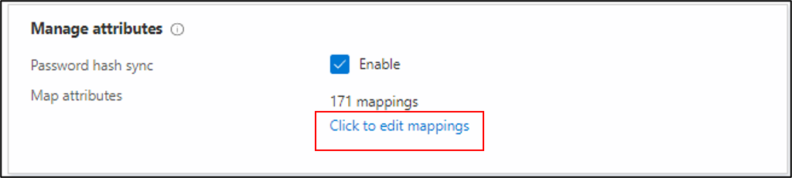

# Azure AD Connect cloud provisioning attibute mapping

Azure AD Connect cloud provisioning has introduced a new feature, that will allow you easily map attributes between your on-premises user/group objects and the objects in Azure AD.  This feature has been added to the cloud provisioning configuration.

You can customize the default attribute-mappings according to your business needs. So, you can change or delete existing attribute-mappings, or create new attribute-mappings.  For a list of attributes that are synchronized see [attributes that are synchronized](../hybrid/reference-connect-sync-attributes-synchronized.md?context=azure%2factive-directory%2fcloud-provisioning%2fcontext%2fcp-context/hybrid/reference-connect-sync-attributes-synchronized.md).

## Understanding attribute-mapping types
With attribute-mappings, you control how attributes are populated in Azure AD.
There are four different mapping types supported:

- **Direct** – the target attribute is populated with the value of an attribute of the linked object in AD.
- **Constant** – the target attribute is populated with a specific string you specified.
- **Expression** - the target attribute is populated based on the result of a script-like expression.
  For more information, see [Writing Expressions for Attribute-Mappings](reference-expressions.md).
- **None** - the target attribute is left unmodified. However, if the target attribute is ever empty, it's populated with the Default value that you specify.

Along with these four basic types, custom attribute-mappings support the concept of an optional **default** value assignment. The default value assignment ensures that a target attribute is populated with a value if there's not a value in Azure AD or on the target object. The most common configuration is to leave this blank.

## Understanding attribute-mapping properties

In the previous section, you were already introduced to the attribute-mapping type property.
Along with this property, attribute-mappings also support the following attributes:

- **Source attribute** - The user attribute from the source system (example: Active Directory).
- **Target attribute** – The user attribute in the target system (example: Azure Active Directory).
- **Default value if null (optional)** - The value that will be passed to the target system if the source attribute is null. This value will only be provisioned when a user is created. The "default value when null" will not be provisioned when updating an existing user.  
- **Apply this mapping**
  - **Always** – Apply this mapping on both user creation and update actions.
  - **Only during creation** - Apply this mapping only on user creation actions.

> [!NOTE]
> This document describes how to use the Azure portal to map attributes.  For information on using Graph see [Transformations](how-to-transformation.md)

## Using attribute mapping
To use the new feature, follow the steps below.

 1.  In the Azure portal, select **Azure Active Directory**.
 2.  Select **Azure AD Connect**.
 3.  Select **Manage provisioning**.

   
 
 4. Under **Configuration**, select your configuration.
 5. Select **Click to edit mappings**.  This will open the attribute mapping screen.

 
 6.  Click **Add Attribute**.

 
 
 7. Select the **Mapping type**.  In this example we use Expression.
 8.  Enter the expression in the box.  For this example we are using: `Replace([mail], "@contoso.com", , ,"", ,).`
 9.  Enter the target attribute.  In this example we use ExtensionAttribute15.
 10. Select when to apply this and then click **Apply**
   
   
 11. Back on the attribute mapping screen you should see your new attribute mapping.  
 12. Click **Save Schema**.

 

## Test your attribute mapping
To test your attribute mapping, you can use [on-demand provisioning](how-to-on-demand-provision.md).  From the 

1.  In the Azure portal, select **Azure Active Directory**.
2.  Select **Azure AD Connect**.
3.  Select **Manage provisioning**.
4. Under **Configuration**, select your configuration.
5. Under **Validate** click the **Provision a user** button. 
6. On the on-demand provisioning screen.  Enter the **distinguished name** of a user or group and click the **Provision** button.  
7. Once it completes, you should see a success screen and 4 green check boxes indicating it was successfully provisioned.  
  
1. Under **Perform Action** click **View details**.  On the right, you should see the new attribute syncrhonized and the expression applied.

  

## Next Steps

- [What is Azure AD Connect cloud provisioning?](what-is-cloud-provisioning.md)
- [Writing Expressions for Attribute-Mappings](reference-expressions.md)
- [Attributes that are synchronized](../hybrid/reference-connect-sync-attributes-synchronized.md?context=azure%2factive-directory%2fcloud-provisioning%2fcontext%2fcp-context/hybrid/reference-connect-sync-attributes-synchronized.md)