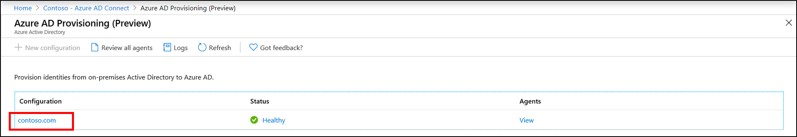
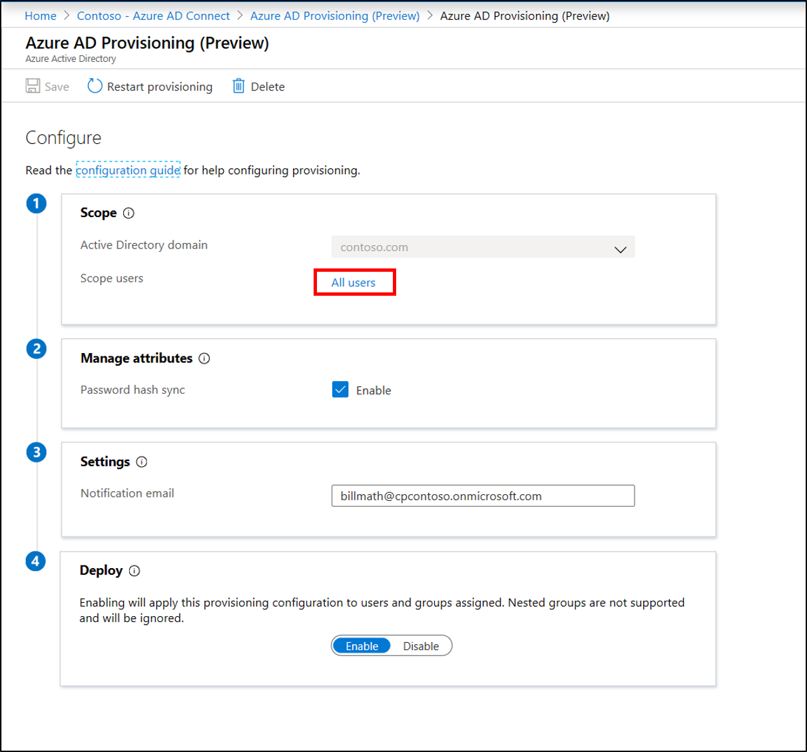
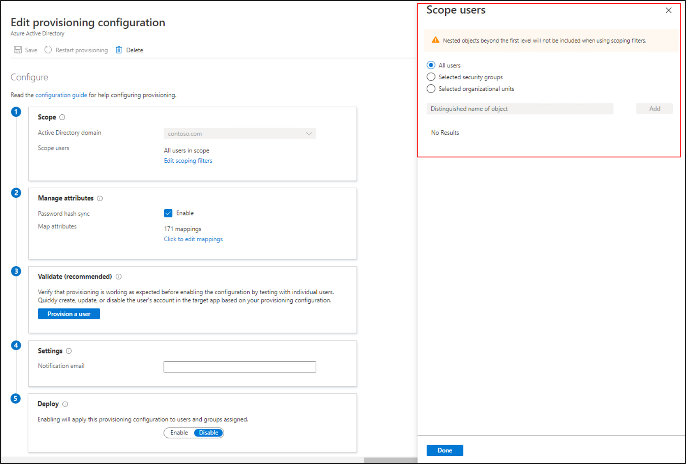

# Create a new configuration for Azure AD Connect cloud-based provisioning

After you've installed the agent, you need to sign in to the Azure portal and configure Azure Active Directory (Azure AD) Connect cloud provisioning. Follow these steps to enable the agent.

## Configure provisioning
To configure provisioning, follow these steps.

1.  In the Azure portal, select **Azure Active Directory**.
1.  Select **Azure AD Connect**.
1.  Select **Manage provisioning (Preview)**.

    

1.  Select **New configuration**.
1.  On the configuration screen, the on-premises domain is prepopulated.
1.  Enter a **Notification email**. This email will be notified when provisioning isn't healthy.
1.  Move the selector to **Enable**, and select **Save**.

    

## Scope provisioning to specific users and groups
You can scope the agent to synchronize specific users and groups by using on-premises Active Directory groups or organizational units. You can't configure groups and organizational units within a configuration. 

1.  In the Azure portal, select **Azure Active Directory**.
1.  Select **Azure AD Connect**.
1.  Select **Manage provisioning (Preview)**.
1.  Under **Configuration**, select your configuration.

    

1.  Under **Configure**, select **All users** to change the scope of the configuration rule.

    

1. On the right, you can change the scope to include only security groups. Enter the distinguished name of the group, and select **Add**.

    

1.  Or you can change the scope to include only specific organizational units. Select **Done** and **Save**.  
2.  Once you have changed the scope, you should [restart provisioning](#restart-provisioning) to initiate an immediate synchronization of the changes.

    

## Restart provisioning 
If you don't want to wait for the next scheduled run, trigger the provisioning run by using the **Restart provisioning** button. 
1.  In the Azure portal, select **Azure Active Directory**.
1.  Select **Azure AD Connect**.
1.  Select **Manage provisioning (Preview)**.
1.  Under **Configuration**, select your configuration.

    

1.  At the top, select **Restart provisioning**.

## Remove a configuration
To delete a configuration, follow these steps.

1.  In the Azure portal, select **Azure Active Directory**.
1.  Select **Azure AD Connect**.
1.  Select **Manage provisioning (Preview)**.
1.  Under **Configuration**, select your configuration.

    

1.  At the top of the configuration screen, select **Delete**.

    

>[!IMPORTANT]
>There's no confirmation prior to deleting a configuration. Make sure this is the action you want to take before you select **Delete**.

## Next steps 

- [What is provisioning?](what-is-provisioning.md)
- [What is Azure AD Connect cloud provisioning?](what-is-cloud-provisioning.md)
