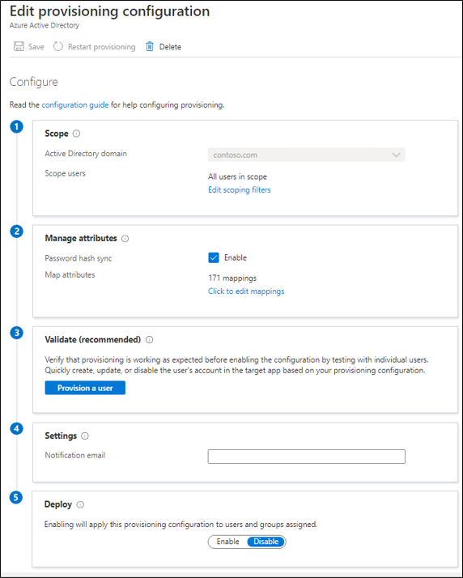

# Create a new configuration for Azure AD Connect cloud-based provisioning

After you've installed the agent, you need to sign in to the Azure portal and configure Azure Active Directory (Azure AD) Connect cloud provisioning. Follow these steps to enable the agent.

## Configure provisioning
To configure provisioning, follow these steps.

 1. In the Azure portal, select **Azure Active Directory**
 2. Select **Azure AD Connect**.
 3. Select **Manage provisioning**.

 
 
 4. Select **New configuration**.
 5. On the configuration screen, select your domain and whether to enable password hash sync.  Click **Create**.  
 
 

 6.  The Edit provisioning configuration screen will open.

   

 7. Enter a **Notification email**. This email will be notified when provisioning isn't healthy.
 8. Move the selector to Enable, and select Save.

## Scope provisioning to specific users and groups
You can scope the agent to synchronize specific users and groups by using on-premises Active Directory groups or organizational units. You can't configure groups and organizational units within a configuration. 

 1.  In the Azure portal, select **Azure Active Directory**.
 2. Select **Azure AD Connect**.
 3. Select **Manage provisioning (Preview)**.
 4. Under **Configuration**, select your configuration.

 
 
 5. Under **Configure**, select **Edit scoping filters** to change the scope of the configuration rule.
 
 7. On the right, you can change the scope.  Click **Done**  and **Save** when you have finished.
 8. Once you have changed the scope, you should [restart provisioning](#restart-provisioning) to initiate an immediate synchronization of the changes.

## Attribute mapping
Azure AD Connect cloud provisioning allows you to easily map attributes between your on-premises user/group objects and the objects in Azure AD.  You can customize the default attribute-mappings according to your business needs. So, you can change or delete existing attribute-mappings, or create new attribute-mappings.  For more information see [attribute mapping](how-to-attribute-mapping.md).

## On-demand provisioning
Azure AD Connect cloud provisioning allows you to test configuration changes, by applying these changes to a single user or group.  You can use this to validate and verify that the changes made to the configuration were applied properly and are being correctly synchronized to Azure AD.  For more information see [on-demand provisioning](how-to-on-demand-provision.md).

## Restart provisioning 
If you don't want to wait for the next scheduled run, trigger the provisioning run by using the **Restart provisioning** button. 
 1.  In the Azure portal, select **Azure Active Directory**.
 2. Select **Azure AD Connect**.
 3.  Select **Manage provisioning (Preview)**.
 4. Under **Configuration**, select your configuration.

   

 5. At the top, select **Restart provisioning**.

## Remove a configuration
To delete a configuration, follow these steps.

 1.  In the Azure portal, select **Azure Active Directory**.
 2. Select **Azure AD Connect**.
 3. Select **Manage provisioning (Preview)**.
 4. Under **Configuration**, select your configuration.
   
   

 5. At the top of the configuration screen, select **Delete**.

>[!IMPORTANT]
>There's no confirmation prior to deleting a configuration. Make sure this is the action you want to take before you select **Delete**.

## Next steps 

- [What is provisioning?](what-is-provisioning.md)
- [What is Azure AD Connect cloud provisioning?](what-is-cloud-provisioning.md)
