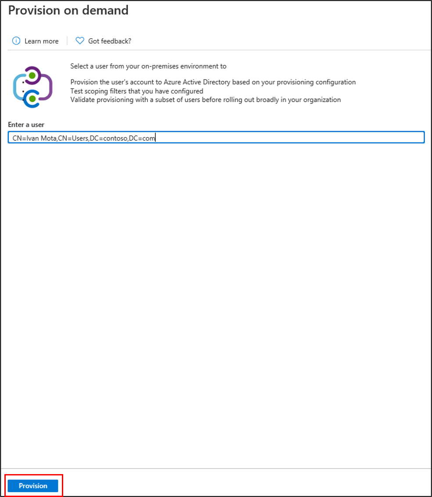
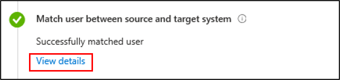
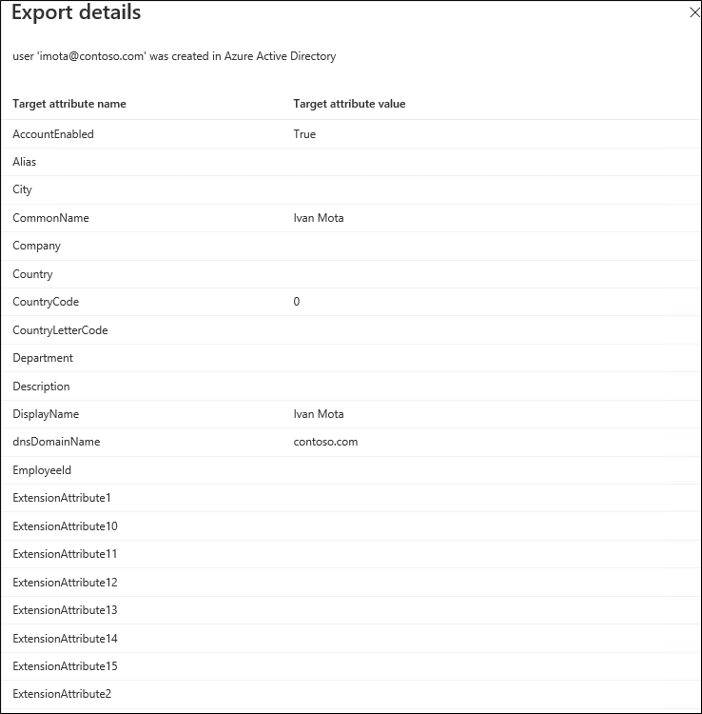

# Azure AD Connect cloud provisioning on-demand provisioning

Azure AD Connect cloud provisioning has introduced a new feature, that will allow you to test configuration changes, by applying these changes to a single user.  You can use this to validate and verify that the changes made to the configuration were applied properly and are being correctly synchronized to Azure AD.  

> [!IMPORTANT] 
> When you use on-demand provisioning, the scoping filters are not applied to the user you selected.  This means that you can use on-demand provisioning on users that are outside the OUs you have specified.

## Using on-demand provisioning
To use the new feature, follow the steps below.

1.  In the Azure portal, select **Azure Active Directory**.
2.  Select **Azure AD Connect**.
3.  Select **Manage provisioning**.

    
4. Under **Configuration**, select your configuration.
5. Under **Validate** click the **Provision a user** button. 

 

6. On the on-demand provisioning screen.  Enter the **distinguished name** of a user and click the **Provision** button.  
 
 
7. Once it completes, you should see a success screen and 4 green check boxes indicating it was successfully provisioned.  Any errors will appear to the left.

  

Now you can look at the user and determine if the changes you made in the configuration have been applied.  The remainder of this document will describe the individual sections that are displayed in the details of a successfully synchronized user.

## Import User details
This section provides information on the user that was imported from Active Directory.  This is what the user looks like before it is provisioned into Azure AD.  Click the **View details** link to display this information.

Using this information, you can see the various attributes, and their values, that were imported.  If you have created a custom attribute mapping, you will be able to see the value here.

## Determine if user is in scope details
This section provides information on whether the user that was imported to Azure AD is in scope.  Click the **View details** link to display this information.

Using this information, you can see additional information about the scope of your users.

## Match user between source and target system details
This section provides information on whether the user already exists in Azure AD and should a join occur instead of provisioning a new user.  Click the **View details** link to display this information.

Using this information, you can see whether a match was found or if a new user is going to be created.

The Matching details will show a message with one of the three following operations.  They are:
- Create - a user is created in Azure AD
- Update - a user is updated based on a change made in the configuration
- Delete - a user is removed from Azure AD.

Depending on the type of operation you have performed, the message will vary.

## Perform action details
This section provides information on the user that was provisioned or exported into Azure AD after the configuration is applied.  This is what the user  looks like once it is provisioned into Azure AD.  Click the **View details** link to display this information.

Using this information, you can see the values of the attributes after the configuration is applied.  Do they look similar to what was imported or are the different?  Does the configuration apply successful?  

This will process allow you to trace the attribute transformation as it moves through the cloud and into your Azure AD tenant.

## Next steps 

- [What is Azure AD Connect cloud provisioning?](what-is-cloud-provisioning.md)
- [How to install Azure AD Connect cloud provisioning](how-to-install.md)
 