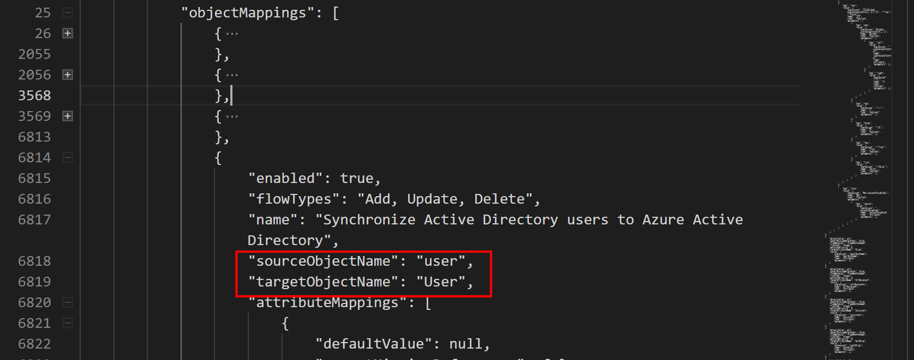
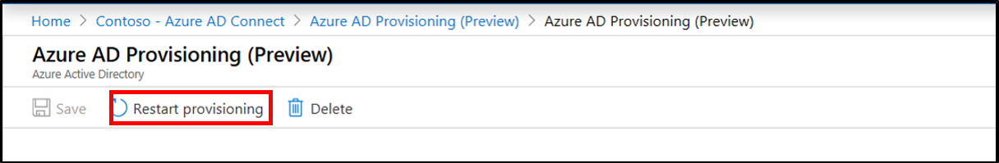

# Transformations

A transformation allows you to change the default behavior of how an attribute is synchronized with Azure AD using cloud provisioning.  

To do this task, you need to edit the schema and then resubmit it via a web request.

For more information on cloud provisioning attributes, see [Understanding the Azure AD Schema](concept-attributes.md).


## Retrieve the schema
To retrieve the schema, use the steps outlined in [Viewing the schema](concept-attributes.md#viewing-the-schema). 


## Custom attribute mapping
To add a custom attribute mapping, use the following procedure.

1. Copy the schema into a text or code editor such as [Visual Studio Code](https://code.visualstudio.com/).  
2. Locate the object that you wish to update in the schema
 </br>
3. Locate the code for **ExtensionAttribute3** under the user object.

    ```
                            {
                                "defaultValue": null,
                                "exportMissingReferences": false,
                                "flowBehavior": "FlowWhenChanged",
                                "flowType": "Always",
                                "matchingPriority": 0,
                                "targetAttributeName": "ExtensionAttribute3",
                                "source": {
                                    "expression": "Trim([extensionAttribute3])",
                                    "name": "Trim",
                                    "type": "Function",
                                    "parameters": [
                                        {
                                            "key": "source",
                                            "value": {
                                                "expression": "[extensionAttribute3]",
                                                "name": "extensionAttribute3",
                                                "type": "Attribute",
                                                "parameters": []
                                            }
                                        }
                                    ]
                                }
                            },
    ```
 4.  Edit the code so that the company attribute is mapped to ExtensionAttribute3.
    ```
                            {
                                "defaultValue": null,
                                "exportMissingReferences": false,
                                "flowBehavior": "FlowWhenChanged",
                                "flowType": "Always",
                                "matchingPriority": 0,
                                "targetAttributeName": "ExtensionAttribute3",
                                "source": {
                                    "expression": "Trim([company])",
                                    "name": "Trim",
                                    "type": "Function",
                                    "parameters": [
                                        {
                                            "key": "source",
                                            "value": {
                                                "expression": "[company]",
                                                "name": "company",
                                                "type": "Attribute",
                                                "parameters": []
                                            }
                                        }
                                    ]
                                }
                            },
    ```
 5. Copy the schema back into Graph Explorer, change the Request Type to PUT and **Run Query**.  
 </br>
 6.  Now, in the Azure portal, navigate to the cloud provisioning configuration and **Restart Provisioning**.
 </br>
 7.  After a little while, verify the attributes are being populated by running the following query in Graph Explorer: `https://graph.microsoft.com/beta/users/{Azure AD user UPN}`.
 8.  You should now see the value.
 </br>

## Custom attribute mapping with function
For more advanced mapping you can use functions that will allow you to manipulate the data and create values for attribute to suit your organizations needs.

To do this task, simply follow the steps above and then edit the function that is used to construct the final value.

For information on the syntax and examples of expressions, see [Writing Expressions for Attribute Mappings in Azure Active Directory](reference-expressions.md)


## Next steps 

- [What is provisioning?](what-is-provisioning.md)
- [What is Azure AD Connect cloud provisioning?](what-is-cloud-provisioning.md)
