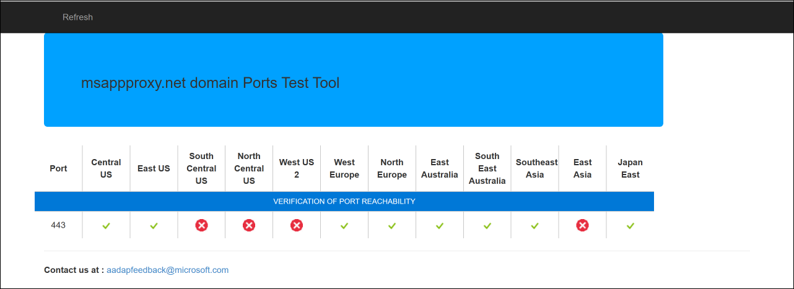
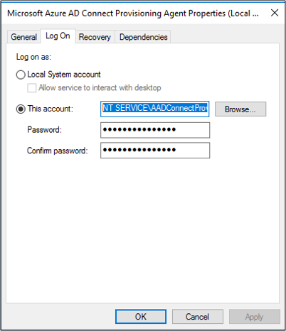
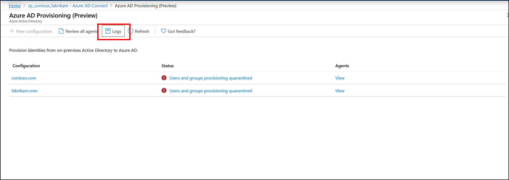
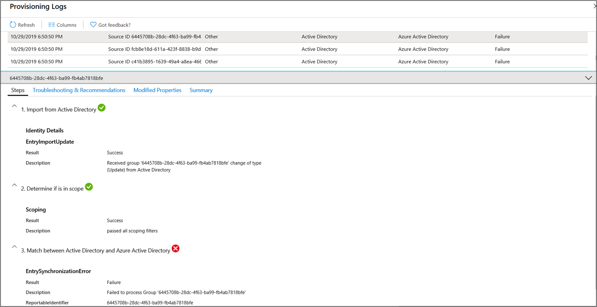
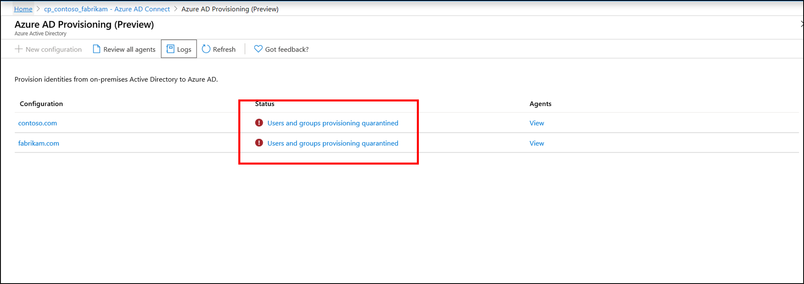
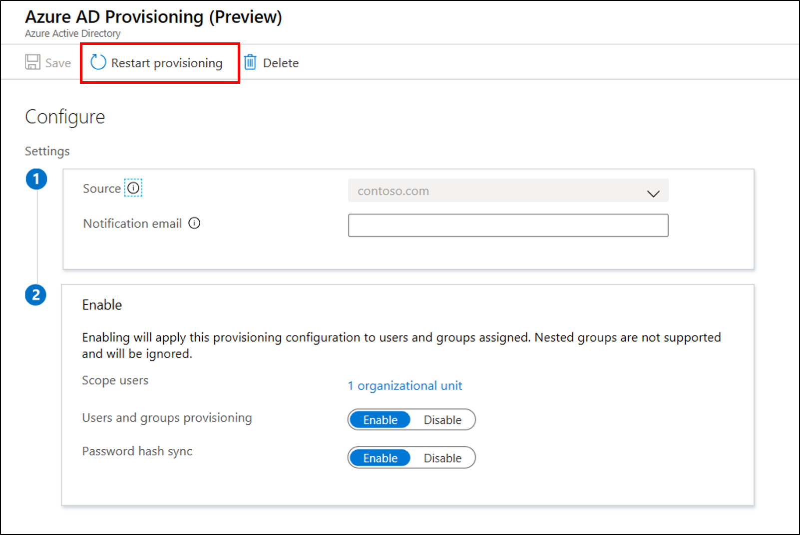

# Cloud provisioning troubleshooting

Cloud provisioning touches many different things and has many different dependencies. This broad scope can give rise to various problems. This article helps you troubleshoot these problems. It introduces the typical areas for you to focus on, how to gather additional information, and the various techniques you can use to track down problems.


## Common troubleshooting areas

|Name|Description|
|-----|-----|
|[Agent problems](#agent-problems)|Verify that the agent was installed correctly and that it communicates with Azure Active Directory (Azure AD).|
|[Object synchronization problems](#object-synchronization-problems)|Use provisioning logs to troubleshoot object synchronization problems.|
|[Provisioning quarantined problems](#provisioning-quarantined-problems)|Understand provisioning quarantine problems and how to fix them.|


## Agent problems
Some of the first things that you want to verify with the agent are:

-  Is it installed?
-  Is the agent running locally?
-  Is the agent in the portal?
-  Is the agent marked as healthy?

These items can be verified in the Azure portal and on the local server that's running the agent.

### Azure portal agent verification

To verify that the agent is seen by Azure and is healthy, follow these steps.

1. Sign in to the Azure portal.
1. On the left, select **Azure Active Directory** > **Azure AD Connect**. In the center, select **Manage provisioning (preview)**.
1. On the **Azure AD Provisioning (preview)** screen, select **Review all agents**.

   </br>
 
1. On the **On-premises provisioning agents** screen, you see the agents you've installed. Verify that the agent in question is there and is marked *Healthy*.

   </br>

### Verify the port

To verify that Azure is listening on port 443 and that your agent can communicate with it, use the following tool:

https://aadap-portcheck.connectorporttest.msappproxy.net/ 

This test verifies that your agents can communicate with Azure over port 443. Open a browser, and go to the previous URL from the server where the agent is installed.



### On the local server

To verify that the agent is running, follow these steps.

1. On the server with the agent installed, open **Services** by either navigating to it or by going to **Start** > **Run** > **Services.msc**.
1. Under **Services**, make sure **Microsoft Azure AD Connect Agent Updater** and **Microsoft Azure AD Connect Provisioning Agent** are there and their status is *Running*.

   

### Common agent installation problems

The following sections describe some common agent installation problems and typical resolutions.

#### Agent failed to start

You might receive an error message that states:

**Service 'Microsoft Azure AD Connect Provisioning Agent' failed to start. Verify that you have sufficient privileges to start the system services.** 

This problem is typically caused by a group policy that prevented permissions from being applied to the local NT Service log-on account created by the installer (NT SERVICE\AADConnectProvisioningAgent). These permissions are required to start the service.

To resolve this problem, follow these steps.

1. Sign in to the server with an administrator account.
1. Open **Services** by either navigating to it or by going to **Start** > **Run** > **Services.msc**.
1. Under **Services**, double-click **Microsoft Azure AD Connect Provisioning Agent**.
1. On the **Log On** tab, change **This account** to a domain admin. Then restart the service. 

   

#### Agent times out or certificate is invalid

You might get the following error message when you attempt to register the agent.


This problem is usually caused by the agent being unable to connect to the Hybrid Identity Service and requires you to configure an HTTP proxy. To resolve this problem, configure an outbound proxy. 

The provisioning agent supports use of an outbound proxy. You can configure it by editing the agent config file *C:\Program Files\Microsoft Azure AD Connect Provisioning Agent\AADConnectProvisioningAgent.exe.config*.
Add the following lines into it, toward the end of the file just before the closing `</configuration>` tag.
Replace the variables `[proxy-server]` and `[proxy-port]` with your proxy server name and port values.

```xml
    <system.net>
        <defaultProxy enabled="true" useDefaultCredentials="true">
            <proxy
                usesystemdefault="true"
                proxyaddress="http://[proxy-server]:[proxy-port]"
                bypassonlocal="true"
            />
        </defaultProxy>
    </system.net>
```

#### Agent registration fails with security error

You might get an error message when you install the cloud provisioning agent.

This problem is typically caused by the agent being unable to execute the PowerShell registration scripts due to local PowerShell execution policies.

To resolve this problem, change the PowerShell execution policies on the server. You need to have Machine and User policies set as *Undefined* or *RemoteSigned*. If they're set as *Unrestricted*, you'll see this error. For more information, see [PowerShell execution policies](https://docs.microsoft.com/powershell/module/microsoft.powershell.core/about/about_execution_policies?view=powershell-6). 

### Log files

By default, the agent emits minimal error messages and stack trace information. You can find these trace logs in the folder *C:\ProgramData\Microsoft\Azure AD Connect Provisioning Agent\Trace*.

To gather additional details for troubleshooting agent-related problems, follow these steps.

1. Stop the service **Microsoft Azure AD Connect Provisioning Agent**.
1. Create a copy of the original config file: *C:\Program Files\Microsoft Azure AD Connect Provisioning Agent\AADConnectProvisioningAgent.exe.config*.
1. Replace the existing `<system.diagnostics>` section with the following, and all trace messages will go to the file *ProvAgentTrace.log*.

   ```xml
     <system.diagnostics>
         <sources>
         <source name="AAD Connect Provisioning Agent">
             <listeners>
             <add name="console"/>
             <add name="etw"/>
             <add name="textWriterListener"/>
             </listeners>
         </source>
         </sources>
         <sharedListeners>
         <add name="console" type="System.Diagnostics.ConsoleTraceListener" initializeData="false"/>
         <add name="etw" type="System.Diagnostics.EventLogTraceListener" initializeData="Azure AD Connect Provisioning Agent">
             <filter type="System.Diagnostics.EventTypeFilter" initializeData="All"/>
         </add>
         <add name="textWriterListener" type="System.Diagnostics.TextWriterTraceListener" initializeData="C:/ProgramData/Microsoft/Azure AD Connect Provisioning Agent/Trace/ProvAgentTrace.log"/>
         </sharedListeners>
     </system.diagnostics>
    
   ```
1. Start the service **Microsoft Azure AD Connect Provisioning Agent**.
1. Use the following command to tail the file and debug problems. 
    ```
    Get-Content “C:/ProgramData/Microsoft/Azure AD Connect Provisioning Agent/Trace/ProvAgentTrace.log” -Wait
    ```
## Object synchronization problems

The following section contains information on troubleshooting object synchronization.

### Provisioning logs

In the Azure portal, provisioning logs can be used to help track down and troubleshoot object synchronization problems. To view the logs, select **Logs**.



Provisioning logs provide a wealth of information on the state of the objects being synchronized between your on-premises Active Directory environment and Azure.


You can use the drop-down boxes at the top of the page to filter the view to zero in on specific problems, such as dates. Double-click an individual event to see additional information.



This information provides detailed steps and where the synchronization problem is occurring. In this way, you can pinpoint the exact spot of the problem.


## Provisioning quarantined problems

Cloud provisioning monitors the health of your configuration and places unhealthy objects in a quarantine state. If most or all of the calls made against the target system consistently fail because of an error, for example, invalid admin credentials, the provisioning job is marked as in quarantine.



By selecting the status, you can see additional information about the quarantine. You can also obtain the error code and message.


### Resolve a quarantine

- Use the Azure portal to restart the provisioning job. On the agent configuration page, select **Restart provisioning**.

  

- Use Microsoft Graph to [restart the provisioning job](https://docs.microsoft.com/graph/api/synchronization-synchronizationjob-restart?view=graph-rest-beta&tabs=http). You'll have full control over what you restart. You can choose to clear:
  - Escrows, to restart the escrow counter that accrues toward quarantine status.
  - Quarantine, to remove the application from quarantine.
  - Watermarks. 
  
  Use the following request:
 
  `POST /servicePrincipals/{id}/synchronization/jobs/{jobId}/restart`

## Next steps 

- [What is provisioning?](what-is-provisioning.md)
- [What is Azure AD Connect cloud provisioning?](what-is-cloud-provisioning.md)


