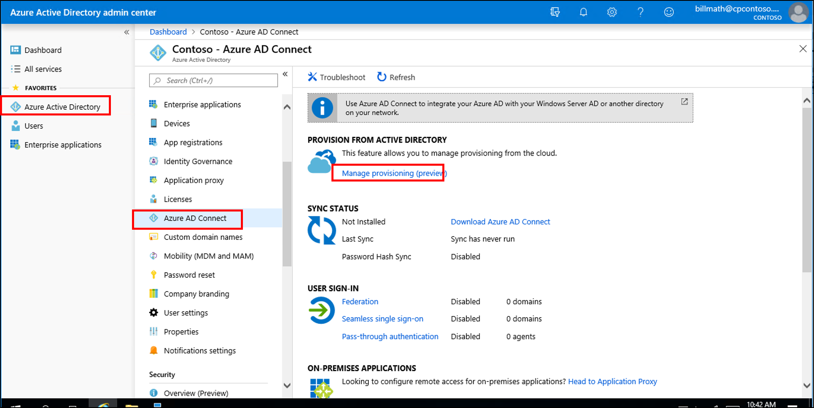
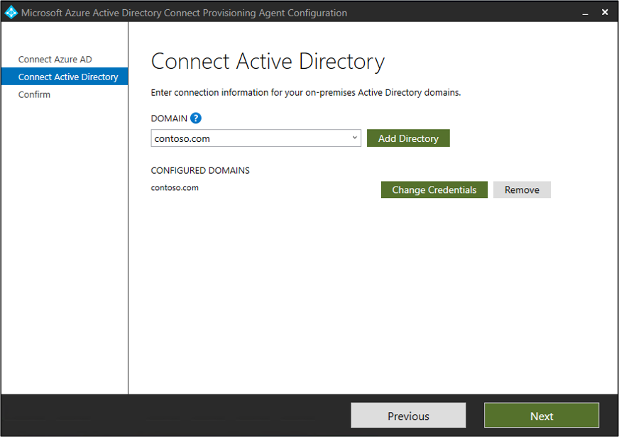
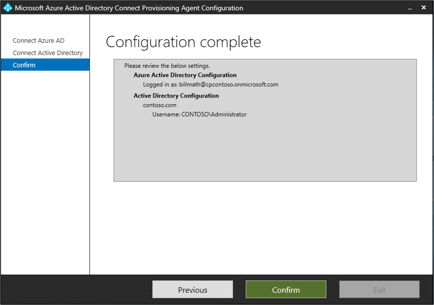
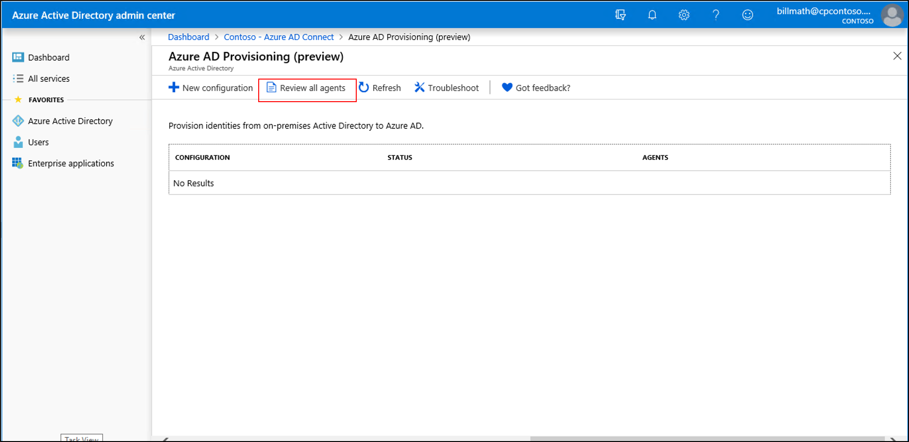
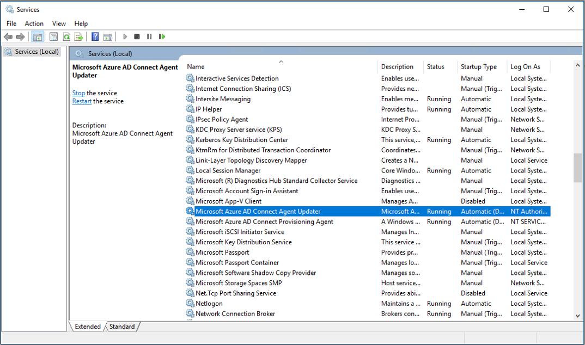
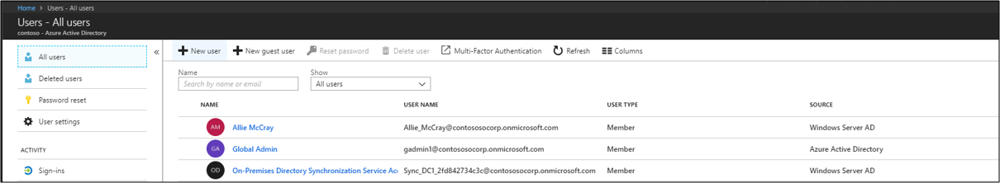

# Tutorial: Integrate a single forest with a single Azure AD tenant

This tutorial walks you through creating a hybrid identity environment using Azure Active Directory (Azure AD) Connect cloud provisioning.

You can use the environment you create in this tutorial for testing or for getting more familiar with cloud provisioning.

## Prerequisites
### In the Azure Active Directory admin center

1. Create a cloud-only global administrator account on your Azure AD tenant. This way, you can manage the configuration of your tenant should your on-premises services fail or become unavailable. Learn about [adding a cloud-only global administrator account](../active-directory-users-create-azure-portal.md). Completing this step is critical to ensure that you don't get locked out of your tenant.
2. Add one or more [custom domain names](../active-directory-domains-add-azure-portal.md) to your Azure AD tenant. Your users can sign in with one of these domain names.

### In your on-premises environment

1. Identify a domain-joined host server running Windows Server 2012 R2 or greater with minimum of 4 GB RAM and .NET 4.7.1+ runtime 

2. If there is a firewall between your servers and Azure AD, configure the following items:
   - Ensure that agents can make *outbound* requests to Azure AD over the following ports:

     | Port number | How it's used |
     | --- | --- |
     | **80** | Downloads the certificate revocation lists (CRLs) while validating the TLS/SSL certificate |
     | **443** | Handles all outbound communication with the service |
     | **8080** (optional) | Agents report their status every 10 minutes over port 8080, if port 443 is unavailable. This status is displayed on the Azure AD portal. |
     
     If your firewall enforces rules according to the originating users, open these ports for traffic from Windows services that run as a network service.
   - If your firewall or proxy allows you to specify safe suffixes, then add  connections t to **\*.msappproxy.net** and **\*.servicebus.windows.net**. If not, allow access to the [Azure datacenter IP ranges](https://www.microsoft.com/download/details.aspx?id=41653), which are updated weekly.
   - Your agents need access to **login.windows.net** and **login.microsoftonline.com** for initial registration. Open your firewall for those URLs as well.
   - For certificate validation, unblock the following URLs: **mscrl.microsoft.com:80**, **crl.microsoft.com:80**, **ocsp.msocsp.com:80**, and **www\.microsoft.com:80**. Since these URLs are used for certificate validation with other Microsoft products you may already have these URLs unblocked.

## Install the Azure AD Connect provisioning agent
1. Sign in to the domain joined server.  If you are using the  [Basic AD and Azure environment](tutorial-basic-ad-azure.md) tutorial, it would be DC1.
2. Sign in to the Azure portal using cloud-only global admin credentials.
3. On the left, select **Azure Active Directory**, click **Azure AD Connect**, and in the center select **Manage provisioning (preview)**.

   

4. Click **Download agent**.
5. Run the Azure AD Connect provisioning agent.
6. On the splash screen, **Accept** the licensing terms and click **Install**.

   

7. Once this operation completes, the configuration wizard will launch.  Sign in with your Azure AD global administrator account.  Note that if you have IE enhanced security enabled this will block the sign-in.  If this is the case, close the installation, disable IE enhanced security in Server Manager, and click the **AAD Connect Provisioning Agent Wizard** to restart the installation.
8. On the **Connect Active Directory** screen, click **Add directory** and then sign in with your Active Directory domain administrator account.  NOTE: The domain administrator account should not have password change requirements. In case the password expires or changes, you will need to re-configure the agent with the new credentials. This operation will add your on-premises directory.  Click **Next**.

   

9. On the **Configuration complete** screen, click **Confirm**.  This operation will register and restart the agent.

   

10. Once this operation completes you should see a notice: **Your agent configuration was successfully verified.**  You can click **Exit**. 
 
11. If you still see the initial splash screen, click **Close**.

## Verify agent installation
Agent verification occurs in the Azure portal and on the local server that is running the agent.

### Azure portal agent verification
To verify the agent is being seen by Azure follow these steps:

1. Sign in to the Azure portal.
2. On the left, select **Azure Active Directory**, click **Azure AD Connect** and in the center select **Manage provisioning (preview)**. 
 

3.  On the **Azure AD Provisioning (preview)** screen click **Review all agents**.
 
 
4. On the **On-premises provisioning agents screen** you will see the agents you have installed.  Verify that the agent in question is there and is marked **active**.
 

### On the local server
To verify that the agent is running follow these steps:

1.  Log on to the server with an administrator account
2.  Open **Services** by either navigating to it or by going to Start/Run/Services.msc.
3.  Under **Services**, make sure **Microsoft Azure AD Connect Agent Updater** and **Microsoft Azure AD Connect Provisioning Agent** are present and the status is **Running**.

## Configure Azure AD Connect cloud provisioning
 Use the following steps to configure provisioning

1.  Sign in to the Azure AD portal.
2.  Click **Azure Active Directory**
3.  Click **Azure AD Connect**
4.  Select **Manage provisioning (Preview)**

5.  Click **New Configuration**

7.  On the configuration screen, enter a **Notification email**, move the selector to **Enable** and click **Save**.

1.  The configuration status should now be **Healthy**.

## Verify users are created and synchronization is occurring
You will now verify that the users that you had in our on-premises directory have been synchronized and now exist in our Azure AD tenant.  Be aware that this may take a few hours to complete.  To verify users are synchronized do the following.

1. Browse to the [Azure portal](https://portal.azure.com) and sign in with an account that has an Azure subscription.
2. On the left, select **Azure Active Directory**
3. Under **Manage**, select **Users**.
4. Verify that you see the new users in our tenant 
 

## Test signing in with one of our users

1. Browse to [https://myapps.microsoft.com](https://myapps.microsoft.com)
2. Sign in with a user account that was created in our new tenant.  You will need to sign in using the following format: (user@domain.onmicrosoft.com). Use the same password that the user uses to sign in on-premises. 
    

You have now successfully setup a hybrid identity environment that you can use to test and familiarize yourself with what Azure has to offer.

## Next steps 

- [What is provisioning?](what-is-provisioning.md)
- [What is Azure AD Connect cloud provisioning?](what-is-cloud-provisioning.md)
