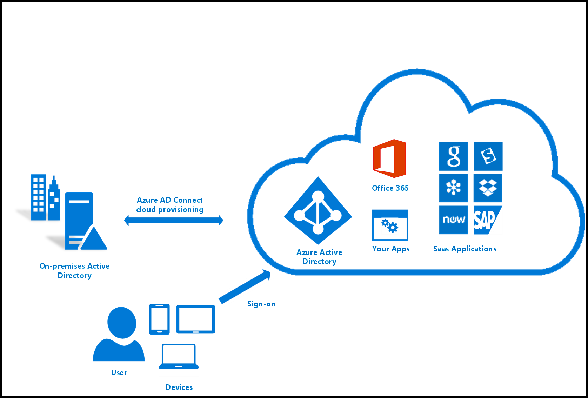

# What is Azure AD Connect cloud provisioning?
Azure AD Connect cloud provisioning is a new Microsoft agent designed to meet and accomplish your hybrid identity goals for synchronization of users, groups and contacts to Azure AD.  It can be used alongside Azure AD Connect sync, and provides the following benefits:
    
- Support for synchronizing to an Azure AD tenant from a multi-forest disconnected Active Directory forest environment: The common scenarios include merger & acquisition, where the acquired company's AD forests are isolated from the parent company's AD forests and companies that have historically had multiple AD forests.
- Simplified installation with light-weight provisioning agents: The agents act as a bridge from AD to Azure AD, with all the sync configuration managed in the cloud. 
- Multiple provisioning agents can be used to simplify high availability deployments, particularly critical for organizations relying upon password hash synchronization from AD to Azure AD.

## How is Azure AD Connect cloud provisioning different from Azure AD Connect sync?
With Azure AD Connect cloud provisioning, provisioning from AD to Azure AD is orchestrated in Microsoft Online Services. An organization only needs to deploy, in their on-premises and IaaS-hosted environment, a lightweight agent that acts as a bridge between Azure AD and AD. The provisioning configuration is stored in Azure AD and managed as part of the service.

The following table provides a comparison between Azure AD Connect and Azure AD Connect cloud provisioning:

| Feature | Azure Active Directory Connect sync| Azure Active Directory Connect cloud provisioning |
|:--- |:---:|:---:|
|Connect to single on-premises AD forest|● |● |
| Connect to multiple on-premises AD forests |● |● |
| Connect to multiple disconnected on-premises AD forests | |● |
| Lightweight agent installation model | |● |
| Multiple active agents for high availability | |● |
| Connect to LDAP directories|●| | 
| Support for user objects |● |● |
| Support for group objects |● |● |
| Support for contact objects |● |● |
| Support for device objects |● | |
| Allow basic customization for attribute flows |● |● |
| Sychronize Exchange online attributes |● |● |
| Synchronize extension attributes 1-15 |● |● |
| Synchronize customer defined AD attributes (directory extensions) |● | |
| Support for Password Hash Sync |●|●|
| Support for Pass-Through Authentication |●||
| Support for federation |●|●|
| Seamless Single Sign-on|● |●|
| Supports installation on a Domain Controller |● |● |
| Support for Windows Server 2012 and Windows Server 2012 R2 |● |● |
| Filter on Domains/OUs/groups |● |● |
| Filter on objects' attribute values |● | |
| Allow minimal set of attributes to be synchronized (MinSync) |● |● |
| Allow removing attributes from flowing from AD to Azure AD |● |● |
| Allow advanced customization for attribute flows |● | |
| Support for writeback (passwords, devices, groups) |● | |
| Azure AD Domain Services support|● | |
| [Exchange hybrid writeback](../hybrid/reference-connect-sync-attributes-synchronized.md#exchange-hybrid-writeback) |● | |
| Support for more than 50,000 objects per AD domain |● | |

## Next steps 

- [What is provisioning?](what-is-provisioning.md)
- [Install cloud provisioning](how-to-install.md)
