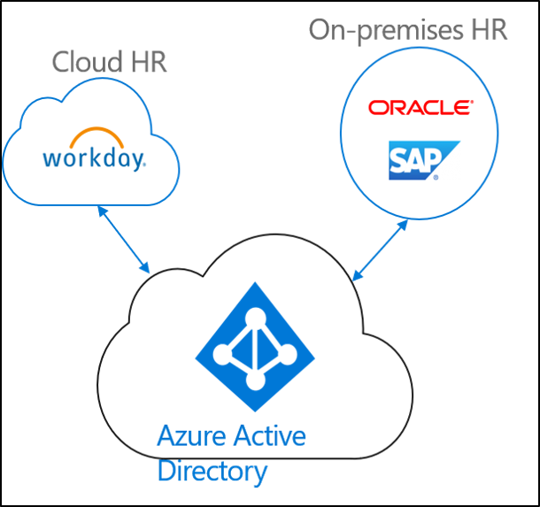
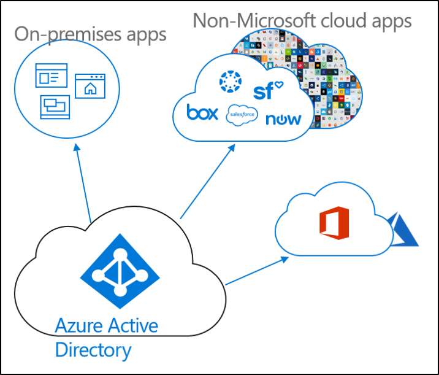

# What is identity provisioning?

Today, businesses, and corporations are becoming more and more a mixture of on-premises and cloud applications.  Users require access to  applications both on-premises and in the cloud. There is need to have a single identity across these various applications (on-premises as well as cloud).

Provisioning is the process of creating an object based on certain conditions, keeping the object upto date and deleting the object when conditions are no longer met. For example, when a new user joins your organization, that user is entered in to the HR system.  At that point, provisioning can create a corresponding user account in the cloud, in Active Directory, and different applications that the user needs access to.  This allows the user to start work and have access to the applications and systems they need on day one. 

With regard to Azure Active Directory, provisioning can be broken down in to the following key scenarios.  

- **[HR-driven provisioning](#hr-driven-provisioning)**  
- **[App provisioning](#app-provisioning)**  
- **[Directory provisioning](#directory-provisioning)** 

## HR-driven provisioning

Provisioning from HR to the cloud involves the creation of objects (users, roles, groups, etc.) based on the information that is in your HR system.  

The most common scenario would be, when a new employee joins your company, they are entered into the HR system.  Once that occurs, they are provisioned to the cloud.  In this case, Azure AD.  Provisioning from HR can cover the following scenarios. 

- **Hiring new employees** - When a new employee is added to cloud HR, a user account is automatically created in Active Directory, Azure Active Directory, and optionally Office 365 and other SaaS applications supported by Azure AD, with write-back of the email address to Cloud HR.
- **Employee attribute and profile updates** - When an employee record is updated in cloud HR (such as their name, title, or manager), their user account will be automatically updated in Active Directory, Azure Active Directory, and optionally Office 365 and other SaaS applications supported by Azure AD.
- **Employee terminations** - When an employee is terminated in cloud HR, their user account is automatically disabled in Active Directory, Azure Active Directory, and optionally Office 365 and other SaaS applications supported by Azure AD.
- **Employee rehires** - When an employee is rehired in cloud HR, their old account can be automatically reactivated or re-provisioned (depending on your preference) to Active Directory, Azure Active Directory, and optionally Office 365 and other SaaS applications supported by Azure AD.

## App provisioning

In Azure Active Directory (Azure AD), the term **[app provisioning](https://docs.microsoft.com/azure/active-directory/manage-apps/user-provisioning)** refers to automatically creating user identities and roles in the cloud applications that users need access to. In addition to creating user identities, automatic provisioning includes the maintenance and removal of user identities as status or roles change. Common scenarios include provisioning an Azure AD user into applications like [Dropbox](https://docs.microsoft.com/azure/active-directory/saas-apps/dropboxforbusiness-provisioning-tutorial), [Salesforce](https://docs.microsoft.com/azure/active-directory/saas-apps/salesforce-provisioning-tutorial), [ServiceNow](https://docs.microsoft.com/azure/active-directory/saas-apps/servicenow-provisioning-tutorial), and more.

## Directory provisioning

On-premises provisioning involves provisioning from on-premises sources (like Active Directory) to Azure AD.  

The most common scenario would be, when a user in Active Directory (AD) is provisioned into Azure AD.

This has been accomplished by Azure AD Connect sync, Azure AD Connect cloud provisioning and Microsoft Identity Manager. 
 
## Next steps 

- [What is Azure AD Connect cloud provisioning?](what-is-cloud-provisioning.md)
- [Install cloud provisioning](how-to-install.md)
