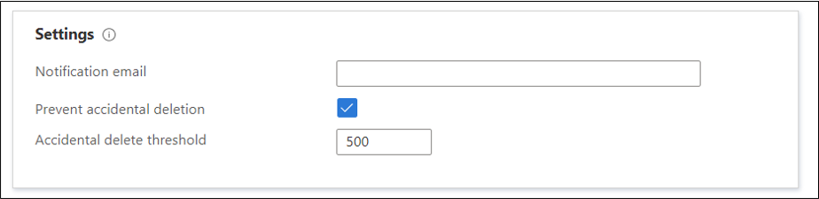
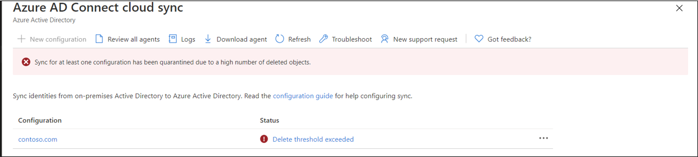
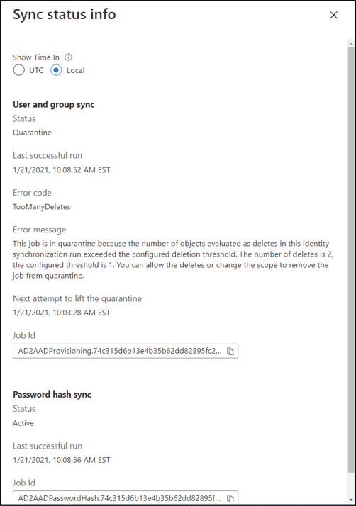
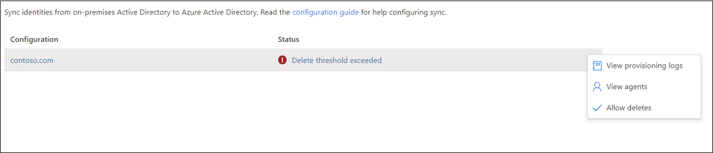

# Accidental delete prevention

The following document describes the accidental deletion feature for Azure AD Connect cloud sync.  The accidental delete feature is designed to protect you from accidental configuration changes and changes to your on-premises directory that would affect many users and groups.  This feature allows you to:

- configure the ability to prevent accidental deletes automatically. 
- Set the # of objects (threshold) beyond which the configuration will take effect 
- set up a notification email address so they can get an email notification once the sync job in question is put in quarantine for this scenario 

To use this feature, you set the threshold for the number of objects that, if deleted, synchronization should stop.  So if this number is reached, the synchronization will stop and a notification will be sent to the email that is specified.  This notification will allow you to investigate what is going on.

## Configure accidental delete prevention
To use the new feature, follow the steps below.

1.  In the Azure portal, select **Azure Active Directory**.
2.  Select **Azure AD Connect**.
3.  Select **Manage cloud sync**.
4. Under **Configuration**, select your configuration.
5. Under **Settings** fill in the following:
	- **Notification email** - email used for notifications
	- **Prevent accidental deletions** - check this box to enable the feature
	- **Accidental deletion threshold** - enter the number of objects to stop synchronization and send a notification

## Recovering from an accidental delete instance
If you encounter an accidental delete you will see this on the status of your provisioning agent configuration.  It will say **Delete threshold exceeded**.
 

By clicking on **Delete threshold exceeded**, you will see the sync status info.  This will provide additional details. 
 
 

By right-clicking on the ellipses, you will get the following options:
 - View provisioning log
 - View agent
 - Allow deletes

 

Using **View provisioning log**, you can see the **StagedDelete** entries and review the information provided on the users that have been deleted.
 
 

### Allowing deletes

The **Allow deletes** action will delete the objects that triggered the accidental delete threshold.  Use the following procedure to accept the deletes.  

1. Right-click on the ellipses and select **Allow deletes**.
2. Click **Yes** on the confirmation to allow the deletions.
 
 

3. You will see confirmation that the deletions were accepted and the status will return to healthy with the next cycle. 
 
 

### Rejecting deletions

If you do not want to allow the deletions, you need to do the following:
- investigate the source of the deletions
- fix the issue (example, OU was moved out of scope accidentally and you have now re-added it back to the scope)
- Run **Restart sync** on the agent configuration

## Next steps 

- [Azure AD Connect cloud sync troubleshooting?](how-to-troubleshoot.md)
- [Azure AD Connect cloud sync error codes](reference-error-codes.md)
 

