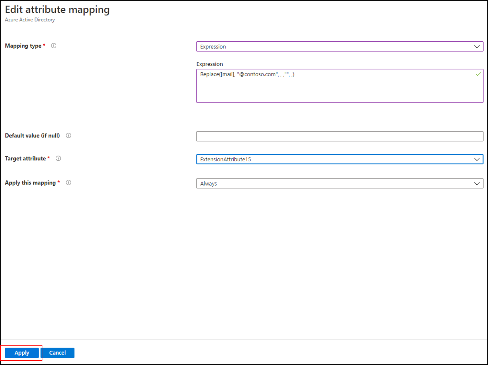

# Attribute mapping in Azure AD Connect cloud sync

You can use the cloud sync feature of Azure Active Directory (Azure AD) Connect to map attributes between your on-premises user or group objects and the objects in Azure AD. This capability has been added to the cloud sync configuration.

You can customize (change, delete, or create) the default attribute mappings according to your business needs. For a list of attributes that are synchronized, see [Attributes synchronized to Azure Active Directory](../hybrid/reference-connect-sync-attributes-synchronized.md?context=azure%2factive-directory%2fcloud-provisioning%2fcontext%2fcp-context/hybrid/reference-connect-sync-attributes-synchronized.md).

## Understand types of attribute mapping
With attribute mapping, you control how attributes are populated in Azure AD. Azure AD supports four mapping types:

- **Direct**: The target attribute is populated with the value of an attribute of the linked object in Active Directory.
- **Constant**: The target attribute is populated with a specific string that you specify.
- **Expression**: The target attribute is populated based on the result of a script-like expression. For more information, see [Writing expressions for attribute mappings in Azure Active Directory](reference-expressions.md).
- **None**: The target attribute is left unmodified. However, if the target attribute is ever empty, it's populated with the default value that you specify.

Along with these basic types, custom attribute mappings support the concept of an optional *default* value assignment. The default value assignment ensures that a target attribute is populated with a value if Azure AD or the target object doesn't have a value. The most common configuration is to leave this blank.

## Understand properties of attribute mapping

Along with the type property, attribute mappings support the following attributes:

- **Source attribute**: The user attribute from the source system (example: Active Directory).
- **Target attribute**: The user attribute in the target system (example: Azure Active Directory).
- **Default value if null (optional)**: The value that will be passed to the target system if the source attribute is null. This value will be provisioned only when a user is created. It won't be provisioned when you're updating an existing user.  
- **Apply this mapping**:
  - **Always**: Apply this mapping on both user-creation and update actions.
  - **Only during creation**: Apply this mapping only on user-creation actions.

> [!NOTE]
> This article describes how to use the Azure portal to map attributes.  For information on using Microsoft Graph, see [Transformations](how-to-transformation.md).

## Add an attribute mapping

To use the new capability, follow these steps:

1.  In the Azure portal, select **Azure Active Directory**.
2.  Select **Azure AD Connect**.
3.  Select **Manage cloud sync**.

    

4. Under **Configuration**, select your configuration.
5. Select **Click to edit mappings**.  This link opens the **Attribute mappings** screen.

    

6.  Select **Add attribute**.

    

7. Select the mapping type. For this example, we're using **Expression**.
8. Enter the expression in the box. For this example, we're using `Replace([mail], "@contoso.com", , ,"", ,)`.
9. Enter the target attribute. For this example, we're using **ExtensionAttribute15**.
10. Select when to apply this mapping, and then select **Apply**.

    

11. Back on the **Attribute mappings** screen, you should see your new attribute mapping.  
12. Select **Save schema**.

    

## Test your attribute mapping

To test your attribute mapping, you can use [on-demand provisioning](how-to-on-demand-provision.md): 

1. In the Azure portal, select **Azure Active Directory**.
2. Select **Azure AD Connect**.
3. Select **Manage provisioning**.
4. Under **Configuration**, select your configuration.
5. Under **Validate**, select the **Provision a user** button. 
6. On the **Provision on demand** screen, enter the distinguished name of a user or group and select the **Provision** button. 

   The screen shows that the provisioning is in progress.

   

8. After provisioning finishes, a success screen appears with four green check marks. 

   Under **Perform action**, select **View details**. On the right, you should see the new attribute synchronized and the expression applied.

   

## Next steps

- [What is Azure AD Connect cloud sync?](what-is-cloud-sync.md)
- [Writing expressions for attribute mappings](reference-expressions.md)
- [Attributes synchronized to Azure Active Directory](../hybrid/reference-connect-sync-attributes-synchronized.md?context=azure%2factive-directory%2fcloud-provisioning%2fcontext%2fcp-context/hybrid/reference-connect-sync-attributes-synchronized.md)
