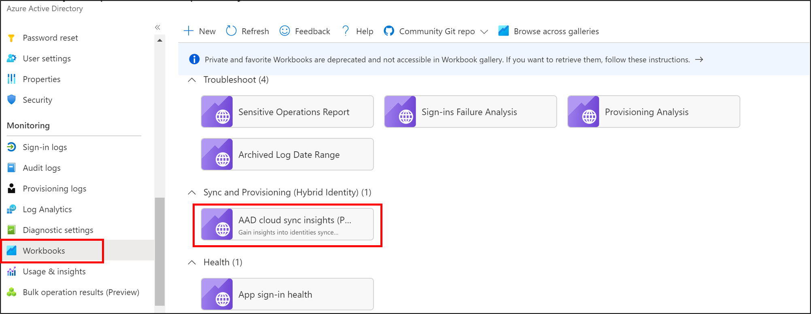
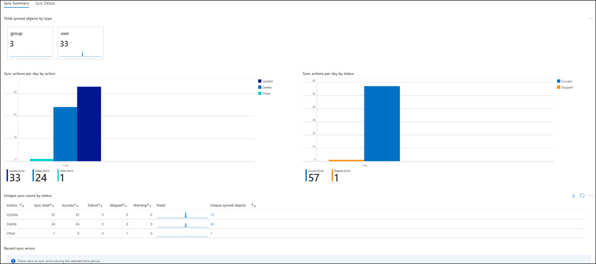

# Azure AD cloud sync insights workbook
The Cloud sync workbook provide a flexible canvas for data analysis. The workbook allows you to create rich visual reports within the Azure portal. To learn more, see Azure Monitor Workbooks overview.

This workbook is intended for Hybrid Identity Admins who use cloud sync to sync users from AD to Azure AD.  It allows admins to gain insights into sync status and details.

 

This workbook:

- Provides a synchronization summary of users and groups synchronized from AD to Azure AD
- Provides and agrigated and detailed view of information captured by the cloud sync provisioning logs.
- Allows you to customize the data to tailor it to your specific needs

## Enabling provisioning logs

You should already be familiar with Azure monitoring and Log Analytics. If not, jump over to learn about them and then come back to learn about application provisioning logs. To learn more about Azure monitoring, see [Azure Monitor overview](../../azure-monitor/overview.md). To learn more about Azure Monitor logs and Log Analytics, see [Overview of log queries in Azure Monitor](../../azure-monitor/logs/log-query-overview.md) and [Provisioning Logs for troubleshooting cloud sync](how-to-troubleshoot.md#provisioning-logs).

## Sync Summary  
The sync summary section provides a summary of your organizations synchronization activies.  These activies include:
   - Sync actions per day by action
   - Sync actions per day by status
   - Unique sync count by status
   - Recent sync errrors

 

## Sync details
The sync details tab allows you to drill into the synchronization data and get more information.  This information includes:
   - Objects sync by status
   - Sync log details
 
 

You can further drill in to the sync log details for additional information.

 

## Custom queries

You can create custom queries and show the data on Azure dashboards. To learn how, see [Create and share dashboards of Log Analytics data](../../azure-monitor/logs/get-started-queries.md). Also, be sure to check out [Overview of log queries in Azure Monitor](../../azure-monitor/logs/log-query-overview.md).

## Custom alerts

Azure Monitor lets you configure custom alerts so that you can get notified about key events related to Provisioning. For example, you might want to receive an alert on spikes in failures. Or perhaps spikes in disables or deletes. Another example of where you might want to be alerted is a lack of any provisioning, which indicates something is wrong.

To learn more about alerts, see [Azure Monitor Log Alerts](../../azure-monitor/alerts/alerts-log.md).

## Next steps 

- [What is provisioning?](what-is-provisioning.md)
- [What is Azure AD Connect cloud sync?](what-is-cloud-sync.md)
- [Known limitations](how-to-prerequisites.md#known-limitations)
- [Error codes](reference-error-codes.md)