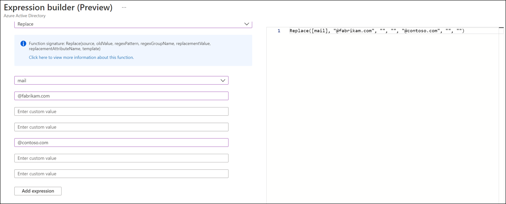

# Expression builder with cloud sync
The expression builder is a new blade in Azure located under cloud sync.  It assits in building complex expressions and allows you to test these expressions before you apply them to your cloud sync environment.

## Use the expression builder
To access the expression builder, use the following steps.

 1. In the Azure portal, select **Azure Active Directory**
 2. Select **Azure AD Connect**.
 3. Select **Manage cloud sync**.
 4. Under **Configuration**, select your configuration.
 5. Under **Manage attributes**, select **Click to edit mappings**.
 6. On the **Edit attribute mappings** blade, click **Add attribute mapping**.
 7. Under **Mapping type** select **Expression**.
 8. Select **Try the expression builder (Preview)**.
 

## Build an expression
This sections allows you to use the drop-down to select from a list of supported functions.  Then it provides additonal fields for you to fill in, depending on the function selected.  Once you select **Apply expression**, the syntax will appear in the **Expression input** box.

For example, by selecting **Replace** from the drop-down, additonal boxes are provided.  The first is a list of attributes that you would like to occur on.  In our example, we selected the **mail** attribute.  Next, a box is provided for the value that you would like the current attribute to be replaced with.  In the example, we use @contoso.com.  So our expression, basically says, replace the mail attribute on user objects with the @contoso.com value.  By clicking the **Add expression** button, we can see the syntax in the **Expression input**

 

For additional information on supported expressions see [Writing expressions for attribute mappings in Azure Active Directory](reference-expressions.md)

## Test an expression
In this section, you can test your expressions.

## Next steps 

- [What is provisioning?](what-is-provisioning.md)
- [What is Azure AD Connect cloud sync?](what-is-cloud-sync.md)
