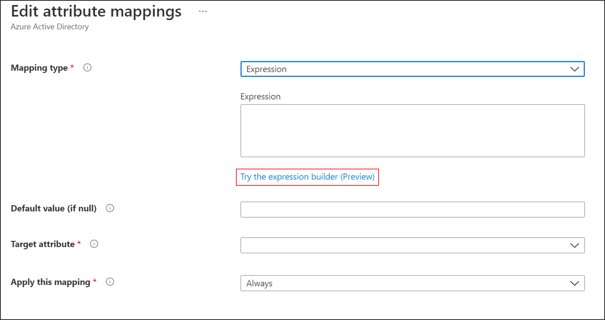
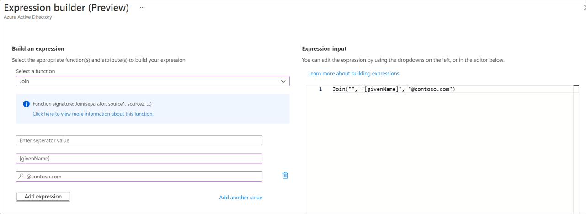
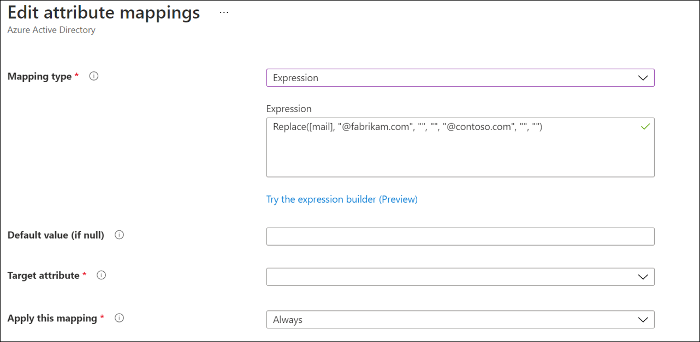
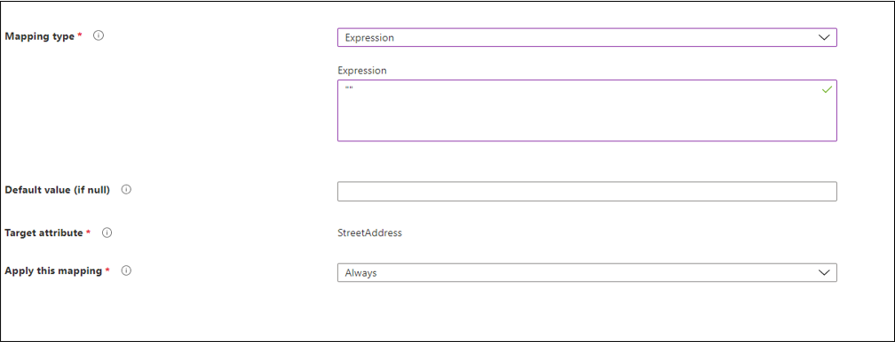

# Expression builder with cloud sync
The expression builder is a new blade in Azure located under cloud sync.  It helps in building complex expressions and allows you to test these expressions before you apply them to your cloud sync environment.

## Use the expression builder
To access the expression builder, use the following steps.

 1. In the Azure portal, select **Azure Active Directory**
 2. Select **Azure AD Connect**.
 3. Select **Manage cloud sync**.
 4. Under **Configuration**, select your configuration.
 5. Under **Manage attributes**, select **Click to edit mappings**.
 6. On the **Edit attribute mappings** blade, click **Add attribute mapping**.
 7. Under **Mapping type**, select **Expression**.
 8. Select **Try the expression builder (Preview)**.
 

## Build an expression
This section allows you to use the drop-down to select from a list of supported functions.  Then it provides additional fields for you to fill in, depending on the function selected.  Once you select **Apply expression**, the syntax will appear in the **Expression input** box.

For example, by selecting **Replace** from the drop-down, additional boxes are provided.  The syntax for the function is displayed in the light blue box.  The boxes that are displayed correspond to the syntax of the function you selected.  Replace works differently depending on the parameters provided.  For our example we will use:

- When oldValue and replacementValue are provided:
    - Replaces all occurrences of oldValue in the source with replacementValue

For more information, see [Replace](reference-expressions.md#replace)

The first thing we need to do is select the attribute that is the source for the replace function. In our example, we selected the **mail** attribute. 

Next, we fill in the value for oldValue.  This oldValue will be **@fabrikam.com**.  Finally, in the box for replacementValue, we will fill in the value **@contoso.com**.

So our expression, basically says, replace the mail attribute on user objects that have a value of @fabrikam.com with the @contoso.com value.  By clicking the **Add expression** button, we can see the syntax in the **Expression input**

>[!NOTE]
>Be sure to place the values in the boxes that would correspond with oldValue and replacementValue based on the syntax that occurs when you have selected Replace.

For more information on supported expressions, see [Writing expressions for attribute mappings in Azure Active Directory](reference-expressions.md)

### Information on expression builder input boxes
Depending on which function you have selected, the boxes provided by expression builder, will accept multiple values.  For example, the JOIN function will accept strings or the value that is associated with a given attribute.  For example, we can use the value contained in the attribute value of [givenName] and join this with a string value of "@contoso.com" to create an email address.

  

For more information on acceptable values and how to write expressions, see [Writing expressions for attribute mappings in Azure Active Directory](reference-expressions.md).

## Test an expression
In this section, you can test your expressions.  From the drop-down, select the **mail** attribute.  Fill in the value with **@fabrikam.com** and now click **Test expression**.  

You will see the value of **@contoso.com** displayed in the **View expression output** box.

 

## Deploy the expression
Once you are satisfied with the expression, simply click the **Apply expression** button.

This will add the expression to the agent configuration.

## Setting a NULL value on an expression
To set an attributes value to NULL.  You can use an expression with the value of `""`.  This will flow the NULL value to the target attribute.

## Next steps 

- [Writing expressions for attribute mappings in Azure Active Directory](reference-expressions.md)
- [Cloud sync configuration](how-to-configure.md)
