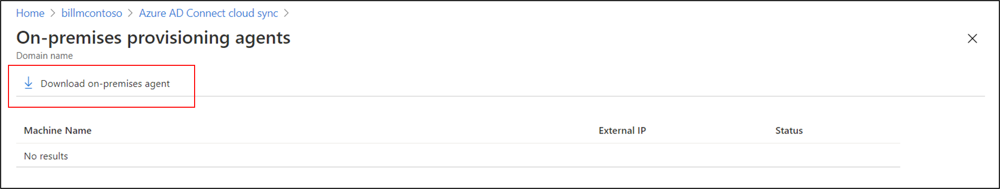

# Install the Azure AD Connect provisioning agent by using a CLI and PowerShell
This article shows you how to install the Azure Active Directory (Azure AD) Connect provisioning agent by using PowerShell cmdlets.
 
>[!NOTE]
>This article deals with installing the provisioning agent by using the command-line interface (CLI). For information on how to install the Azure AD Connect provisioning agent by using the wizard, see [Install the Azure AD Connect provisioning agent](how-to-install.md).

## Prerequisite

The Windows server must have TLS 1.2 enabled before you install the Azure AD Connect provisioning agent by using PowerShell cmdlets. To enable TLS 1.2, follow the steps in [Prerequisites for Azure AD Connect cloud sync](how-to-prerequisites.md#tls-requirements).

>[!IMPORTANT]
>The following installation instructions assume that all the [prerequisites](how-to-prerequisites.md) were met.

## Install the Azure AD Connect provisioning agent by using PowerShell cmdlets 

 1. Sign in to the Azure portal, and then go to **Azure Active Directory**.
 1. In the menu on the left, select **Azure AD Connect**.
 1. Select **Manage provisioning (preview)** > **Review all agents**.
 1. Download the Azure AD Connect provisioning agent from the Azure portal.

    </br>

 1. For the purposes of these instructions, the agent was downloaded to the C:\ProvisioningSetup folder. 
 1. Install ProvisioningAgent in quiet mode.

       ```
       $installerProcess = Start-Process c:\temp\AADConnectProvisioningAgent.Installer.exe /quiet -NoNewWindow -PassThru 
       $installerProcess.WaitForExit()  
       ```
 1. Import the Provisioning Agent PS module.

       ```
       Import-Module "C:\Program Files\Microsoft Azure AD Connect Provisioning Agent\Microsoft.CloudSync.PowerShell.dll" 
       ```
 1. Connect to Azure AD by using global administrator credentials. You can customize this section to fetch a password from a secure store. 

       ```
       $globalAdminPassword = ConvertTo-SecureString -String "Global admin password" -AsPlainText -Force 
    
       $globalAdminCreds = New-Object System.Management.Automation.PSCredential -ArgumentList ("GlobalAdmin@contoso.onmicrosoft.com", $globalAdminPassword) 
       
       Connect-AADCloudSyncAzureAD -Credential $globalAdminCreds 
       ```
 1. Add the gMSA account, and provide credentials of the domain admin to create the default gMSA account.
 
       ```
       $domainAdminPassword = ConvertTo-SecureString -String "Domain admin password" -AsPlainText -Force 
    
       $domainAdminCreds = New-Object System.Management.Automation.PSCredential -ArgumentList ("DomainName\DomainAdminAccountName", $domainAdminPassword) 
    
       Add-AADCloudSyncGMSA -Credential $domainAdminCreds 
       ```
 1. Or use the preceding cmdlet to provide a pre-created gMSA account.
 
       ```
       Add-AADCloudSyncGMSA -CustomGMSAName preCreatedGMSAName$ 
       ```
 1. Add the domain.

       ```
       $contosoDomainAdminPassword = ConvertTo-SecureString -String "Domain admin password" -AsPlainText -Force 
    
       $contosoDomainAdminCreds = New-Object System.Management.Automation.PSCredential -ArgumentList ("DomainName\DomainAdminAccountName", $contosoDomainAdminPassword) 
    
       Add-AADCloudSyncADDomain -DomainName contoso.com -Credential $contosoDomainAdminCreds 
       ```
 1. Or use the preceding cmdlet to configure preferred domain controllers.

       ```
       $preferredDCs = @("PreferredDC1", "PreferredDC2", "PreferredDC3") 
    
       Add-AADCloudSyncADDomain -DomainName contoso.com -Credential $contosoDomainAdminCreds -PreferredDomainControllers $preferredDCs 
       ```
 1. Repeat the previous step to add more domains. Provide the account names and domain names of the respective domains.
 
 1. Restart the service.
 
       ```
       Restart-Service -Name AADConnectProvisioningAgent  
       ```
 1. Go to the Azure portal to create the cloud sync configuration.

## Provisioning agent gMSA PowerShell cmdlets
Now that you've installed the agent, you can apply more granular permissions to the gMSA. For information and step-by-step instructions on how to configure the permissions, see [Azure AD Connect cloud provisioning agent gMSA PowerShell cmdlets](how-to-gmsa-cmdlets.md).

## Next steps 

- [What is provisioning?](what-is-provisioning.md)
- [Azure AD Connect cloud provisioning agent gMSA PowerShell cmdlets](how-to-gmsa-cmdlets.md)
- [What is Azure AD Connect cloud sync?](what-is-cloud-sync.md)