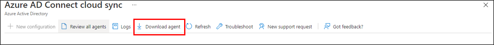
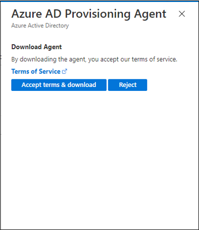
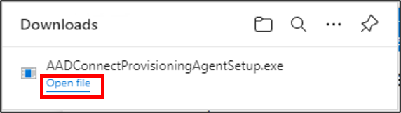
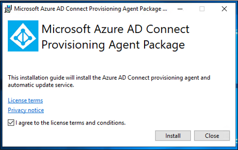
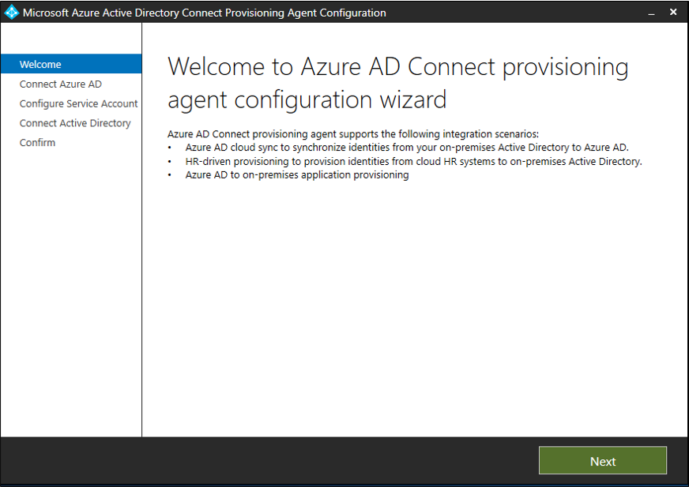
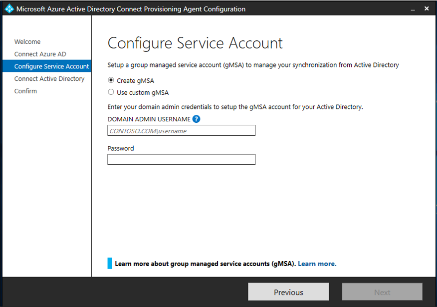
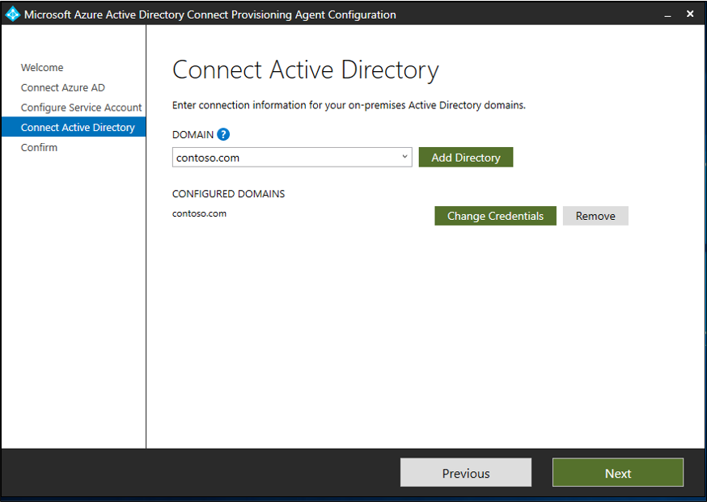

# Install the Azure AD Connect provisioning agent
This article walks you through the installation process for the Azure Active Directory (Azure AD) Connect provisioning agent and how to initially configure it in the Azure portal.

>[!IMPORTANT]
>The following installation instructions assume that all the [prerequisites](how-to-prerequisites.md) were met.

>[!NOTE]
>This article deals with installing the provisioning agent by using the wizard. For information on installing the Azure AD Connect provisioning agent by using a command-line interface (CLI), see [Install the Azure AD Connect provisioning agent by using a CLI and PowerShell](how-to-install-pshell.md).

For more information and an example, see the following video.

> [!VIDEO https://www.microsoft.com/en-us/videoplayer/embed/RWK5mR]

## Group Managed Service Accounts
A group Managed Service Account (gMSA) is a managed domain account that provides automatic password management, simplified service principal name (SPN) management, and the ability to delegate the management to other administrators. It also extends this functionality over multiple servers. Azure AD Connect cloud sync supports and recommends the use of a group Managed Service Account for running the agent. For more information on a group Managed Service Account, see [Group Managed Service Accounts](how-to-prerequisites.md#group-managed-service-accounts).


### Upgrade an existing agent to use the gMSA
To upgrade an existing agent to use the group Managed Service Account created during installation, update the agent service to the latest version by running AADConnectProvisioningAgent.msi. Now run through the installation wizard again and provide the credentials to create the account when prompted.

## Install the agent

To install the agent:

 1. Sign in to the server you'll use with enterprise admin permissions.
 2. Sign in to the Azure portal, and then go to **Azure Active Directory**.
 3. On the menu on the left, select **Azure AD Connect**.
 4. Select **Manage cloud sync**.
     [](media/how-to-install/new-install-1.png#lightbox)</br>
 5. At the top, click **Download agent**.
    [](media/how-to-install/new-install-2.png#lightbox)</br>
 7. On the right, click **Accept terms and download**.
   [](media/how-to-install/new-install-3.png#lightbox)</br>
 9. Once the agent has completed downloading, click **Open file**.  This will start the installation.
    [](media/how-to-install/new-install-4.png#lightbox)</br>
 10. On the **Microsoft Azure AD Connect Provisioning Agent Package** screen, accept the licensing terms, and select **Install**.
  [](media/how-to-install/new-install-5.png#lightbox)</br>
 11. After this operation finishes, the configuration wizard starts. Click **Next**.
 [](media/how-to-install/new-install-6.png#lightbox)</br>
 13. Sign in with your Azure AD global administrator account.
 14. On the **Configure Service Account** screen, select either **Create gMSA**, or **Use custom gMSA**. If you allow the agent to create the account, it will be named **provAgentgMSA$**. If you specify **Use custom gMSA**, you're prompted to provide this account.
 [](media/how-to-install/new-install-7.png#lightbox)</br>
 15. Enter the domain administrator credentials to create the group Managed Service account that will be used to run the agent service. Select **Next**.
  </br>
 16. On the **Connect Active Directory** screen, click **Next**.  Your current domain has been added automatically.  If you wish to add additional domains, enter them and select **Add Directory**. Then sign in with an administrator account from that domain.
 [](media/how-to-install/new-install-8.png#lightbox)</br>
 17. Optionally, you can manage the preference of domain controllers the agent will use.  To do this, click **Add Directory** and select the **Select domain controller priority** checkbox and then order the list of domain controllers. Select **OK**.  Click **Next**.
    [](media/how-to-install/new-install-10.png#lightbox)</br>
 18. On the **Agent installation** screen, confirm settings and the account that will be created and select **Confirm**.
  [](media/how-to-install/new-install-11.png#lightbox)</br>
 20. After this operation finishes, you should see **Your agent installation is complete.** Select **Exit**.
 21. If you still see the initial **Microsoft Azure AD Connect Provisioning Agent Package** screen, select **Close**.

## Verify agent installation
Agent verification occurs in the Azure portal and on the local server that's running the agent.

### Azure portal agent verification
To verify the agent is being seen by Azure:

 1. Sign in to the Azure portal.
 2. On the left, select **Azure Active Directory** > **Azure AD Connect**. In the center, select **Manage cloud sync**.
    </br>
 3. On the **Azure AD Connect cloud sync** screen, select **Review all agents**.
    </br>
 4.  On the **On-premises provisioning agents** screen, you see the agents you installed. Verify that the agent in question is there and is marked *active*.
    </br>

### On the local server
To verify that the agent is running:

1. Sign in to the server with an administrator account.
2. Open **Services** by going to it or by selecting **Start** > **Run** > **Services.msc**.
3. Under **Services**, make sure **Microsoft Azure AD Connect Agent Updater** and **Microsoft Azure AD Connect Provisioning Agent** are present.  Also, ensure the status is *Running*.
 

>[!IMPORTANT]
>The agent has been installed, but it must be configured and enabled before it will start synchronizing users. To configure a new agent, see [Create a new configuration for Azure AD Connect cloud sync](how-to-configure.md).

## Enable password writeback in Azure AD Connect cloud sync 

To use password writeback and enable the self-service password reset (SSPR) service to detect the cloud sync agent, you need to use the `Set-AADCloudSyncPasswordWritebackConfiguration` cmdlet and tenant’s global administrator credentials: 

  ```   
   Import-Module "C:\\Program Files\\Microsoft Azure AD Connect Provisioning Agent\\Microsoft.CloudSync.Powershell.dll" 
   Set-AADCloudSyncPasswordWritebackConfiguration -Enable $true -Credential $(Get-Credential)
  ```

For more information on using password writeback with Azure AD Connect cloud sync, see [Tutorial: Enable cloud sync self-service password reset writeback to an on-premises environment (preview)](../../active-directory/authentication/tutorial-enable-cloud-sync-sspr-writeback.md).

## Installing against US govt cloud
By default, the Azure Active Directory (Azure AD) Connect provisioning agent installs against the default Azure cloud environment.  If you are installing the agent for use in the US government cloud do the following:

- In step #7 above, instead of click **Open file**, go to start run and navigate to the **AADConnectProvisioningAgentSetup.exe** file.  In the run box, after the executable, enter **ENVIRONMENTNAME=AzureUSGovernment** and click **Ok**.
 [](media/how-to-install/new-install-12.png#lightbox)</br>

## Password hash synchronization and FIPS with cloud sync
If your server has been locked down according to Federal Information Processing Standard (FIPS), then MD5 is disabled.

**To enable MD5 for password hash synchronization, perform the following steps:**

1. Go to %programfiles%\Microsoft Azure AD Connect Provisioning Agent.
2. Open AADConnectProvisioningAgent.exe.config.
3. Go to the configuration/runtime node at the top of the file.
4. Add the following node: `<enforceFIPSPolicy enabled="false"/>`
5. Save your changes.

For reference, this snippet is what it should look like:

```
    <configuration>
        <runtime>
            <enforceFIPSPolicy enabled="false"/>
        </runtime>
    </configuration>
```

For information about security and FIPS, see [Azure AD password hash sync, encryption, and FIPS compliance](https://blogs.technet.microsoft.com/enterprisemobility/2014/06/28/aad-password-sync-encryption-and-fips-compliance/).


## Next steps 

- [What is provisioning?](what-is-provisioning.md)
- [What is Azure AD Connect cloud sync?](what-is-cloud-sync.md)
- [Create a new configuration for Azure AD Connect cloud sync](how-to-configure.md).

