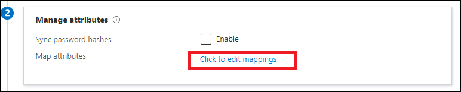

# Map UserType with cloud sync

Cloud sync supports synchronization of the **UserType** attribute for User objects.

By default, the **UserType** attribute isn't enabled for synchronization because there's no corresponding **UserType** attribute in on-premises Active Directory. You must manually add this mapping for synchronization. Before you do this step, you must take note of the following behavior enforced by Azure Active Directory (Azure AD):

- Azure AD only accepts two values for the **UserType** attribute: Member and Guest.
- If the **UserType** attribute isn't mapped in cloud sync, Azure AD users created through directory synchronization would have the **UserType** attribute set to Member.

Before you add a mapping for the **UserType** attribute, you must first decide how the attribute is derived from on-premises Active Directory. The following approaches are the most common:

 - Designate an unused on-premises Active Directory attribute, such as extensionAttribute1, to be used as the source attribute. The designated on-premises Active Directory attribute should be of the type string, be single-valued, and contain the value Member or Guest.
 - If you choose this approach, you must ensure that the designated attribute is populated with the correct value for all existing user objects in on-premises Active Directory that are synchronized to Azure AD before you enable synchronization of the **UserType** attribute.

## Add the UserType mapping
To add the **UserType** mapping:

 1. In the Azure portal, select **Azure Active Directory**.
 1. Select **Azure AD Connect**.
 1. Select **Manage cloud sync**.
 1. Under **Configuration**, select your configuration.
 1. Under **Manage attributes**, select **Click to edit mappings**.
 
     

 1. Select **Add attribute mapping**.
 
     
1. Select the mapping type. You can do the mapping in one of three ways:
   - A direct mapping, for example, from an Active Directory attribute
   - An expression, such as IIF(InStr([userPrincipalName], "@partners") > 0,"Guest","Member")
   - A constant, for example, make all user objects as Guest
 
     

1. In the **Target attribute** dropdown box, select **UserType**.
1. Select **Apply** at the bottom of the page to create a mapping for the Azure AD **UserType** attribute.

## Next steps 

- [Writing expressions for attribute mappings in Azure Active Directory](reference-expressions.md)
- [Cloud sync configuration](how-to-configure.md)
