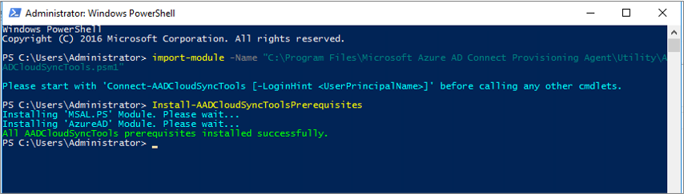

# AADCloudSyncTools PowerShell Module for Azure AD Connect cloud sync

The AADCloudSyncTools module provides a set of useful tools that you can use to help manage your Azure AD Connect Cloud Sync deployments.

## Pre-requisites
The following pre-requisites are required:

- All the prerequisites for this module can be automatically installed using `Install-AADCloudSyncToolsPrerequisites`
- This module uses MSAL authentication, so it requires MSAL.PS module  installed. To verify, in a PowerShell window, execute `Get-module MSAL.PS -ListAvailable`. If the module is installed correctly you will get a response. You can use `Install-AADCloudSyncToolsPrerequisites` to install the latest version of MSAL.PS
- Although the AzureAD PowerShell module is not a pre-requisite for any functionality of this module, it is useful to have so it is also automatically installed with using `Install-AADCloudSyncToolsPrerequisites`.
- Manually installing modules from PowerShell require TLS 1.2 enforcement. To ensure you can install modules, set the following in the PowerShell session before using
  ```
   Install-Module:
  [Net.ServicePointManager]::SecurityProtocol = [Net.SecurityProtocolType]::Tls12 
  ```


## Install the AADCloudSyncTools PowerShell module
To install and use the AADCloudSyncTools module use the following steps:

1. Open Windows PowerShell with administrative privileges
2. Type or copy and paste the following: `Import-module -Name "C:\Program Files\Microsoft Azure AD Connect Provisioning Agent\Utility\AADCloudSyncTools"`
3. Hit enter.
4. To verify the module was imported, enter or copy and paste the following: `Get-module AADCloudSyncTools`
5. You should now see information about the module.
6. Next, to install the AADCloudSyncTools module pre-requisites run: `Install-AADCloudSyncToolsPrerequisites`
7. On the first run, the PoweShellGet module will be installed if not present. To load the new PowershellGet module close the PowerShell Window and open a new PowerShell session with administrative privileges. 
8. Import the module again using step 3.
9. Run `Install-AADCloudSyncToolsPrerequisites` to install the MSAL and AzureAD modules
11. All pre-reqs should be successfully installed
 


## AADCloudSyncTools  Cmdlets
### Connect-AADCloudSyncTools
Uses the MSAL.PS module to request a token for the Azure AD administrator to access Microsoft Graph 


### Export-AADCloudSyncToolsLogs
Exports and packages all the troubleshooting data in a compressed file, as follows:
 1. Starts a verbose tracing with Start-AADCloudSyncToolsVerboseLogs.  You can find these trace logs in the folder C:\ProgramData\Microsoft\Azure AD Connect Provisioning Agent\Trace.
 2. Collects a trace log for 3 minutes.
   You can specify a different time with -TracingDurationMins or skip verbose tracing with -SkipVerboseTrace
 3. Stops verbose tracing with Stop-AADCloudSyncToolsVerboseLogs
 4. Collects Event Viewer Logs for the last 24 hours
 5. Compresses all the agent logs, verbose logs and event viewer logs into a compressed zip file under the User's Documents folder. 
 </br>You can specify a different output folder with -OutputPath \<folder path\>

### Get-AADCloudSyncToolsInfo
Shows Azure AD Tenant details and internal variables state

### Get-AADCloudSyncToolsJob
Uses Graph to get AD2AAD Service Principals and returns the Synchronization Job information.
Can be also called using the specific Sync Job ID as a parameter.

### Get-AADCloudSyncToolsJobSchedule
Uses Graph to get AD2AAD Service Principals and returns the Synchronization Job's Schedule.
Can be also called using the specific Sync Job ID as a parameter.

### Get-AADCloudSyncToolsJobSchema
Uses Graph to get AD2AAD Service Principals and returns the Synchronization Job's Schema.

### Get-AADCloudSyncToolsJobScope
Uses Graph to get the Synchronization Job's Schema for the provided Sync Job ID and outputs all filter group's scopes.

### Get-AADCloudSyncToolsJobSettings
Uses Graph to get AD2AAD Service Principals and returns the Synchronization Job's Settings.
Can be also called using the specific Sync Job ID as a parameter.

### Get-AADCloudSyncToolsJobStatus
Uses Graph to get AD2AAD Service Principals and returns the Synchronization Job's Status.
Can be also called using the specific Sync Job ID as a parameter.

### Get-AADCloudSyncToolsServicePrincipal
Uses Graph to get the Service Principal(s) for AD2AAD and/or SyncFabric.
Without parameters, will only return AD2AAD Service Principal(s).

### Install-AADCloudSyncToolsPrerequisites
Checks for the presence of PowerShellGet v2.2.4.1 or later and Azure AD and MSAL.PS modules and installs these if missing.

### Invoke-AADCloudSyncToolsGraphQuery
Invokes a Web request for the URI, Method and Body specified as parameters

### Repair-AADCloudSyncToolsAccount
Uses Azure AD PowerShell to delete the current account (if present) and resets the Sync Account authentication with a new synchronization account in Azure AD.

### Restart-AADCloudSyncToolsJob
Restarts a full synchronization.

### Resume-AADCloudSyncToolsJob
Continues synchronization from the previous watermark.

### Start-AADCloudSyncToolsVerboseLogs
Modifies the 'AADConnectProvisioningAgent.exe.config' to enable verbose tracing and restarts the AADConnectProvisioningAgent service
You can use -SkipServiceRestart to prevent service restart but any config changes will not take effect.  You can find these trace logs in the folder C:\ProgramData\Microsoft\Azure AD Connect Provisioning Agent\Trace.

### Stop-AADCloudSyncToolsVerboseLogs
Modifies the 'AADConnectProvisioningAgent.exe.config' to disable verbose tracing and restarts the AADConnectProvisioningAgent service. 
You can use -SkipServiceRestart to prevent service restart but any config changes will not take effect.

### Suspend-AADCloudSyncToolsJob
Pauses synchronization.

## Next steps 

- [What is provisioning?](what-is-provisioning.md)
- [What is Azure AD Connect cloud sync?](what-is-cloud-sync.md)

