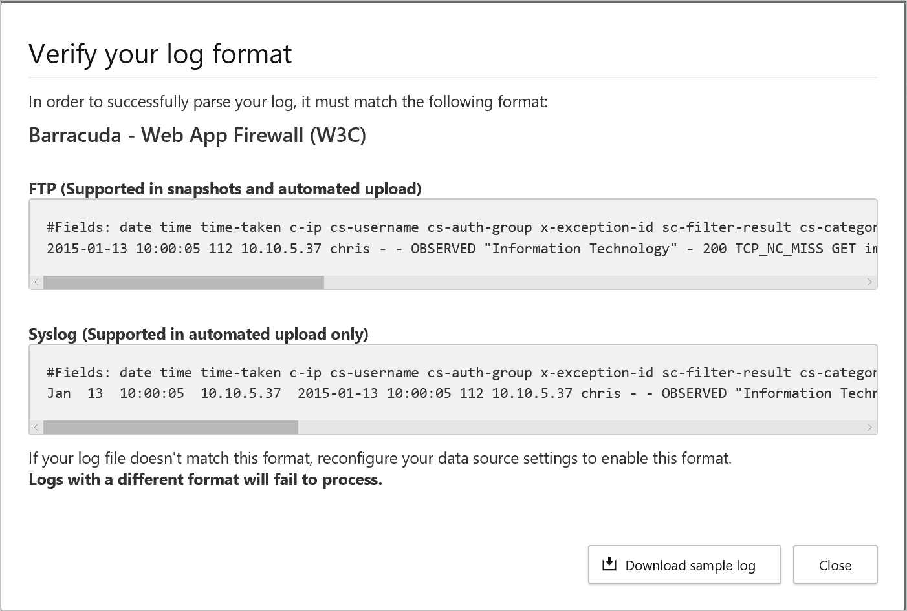

# Create Cloud App Discovery snapshot reports

Before setting up the automatic log collector, upload a log manually and let Cloud App Security parse it. If you don't have a log yet and you want to see a sample of what your log should look like, use the procedure below to download a sample log file to see what your log is supposed
to look like.

## To create a snapshot report

1. Collect log files from your firewall and proxy server through which users in your organization access the Internet. Gather logs during times of peak traffic that are representative of the user activity in your organization.
2. On [the Cloud App Security menu bar](https://portal.cloudappsecurity.com), select **Discover**, and then **Create snapshot report**.
  
  
3. Enter a **Report name** and a **Description**.
    
  
4. Select the **Data source** from which you want to upload the log files.
5. Verify your log format to make sure that it is formatted properly according to the sample you can download. Click **View and verify** and then click **Download sample log**. Then compare your log with the sample provided to make sure it's compatible.
  
  
  >  [!NOTE]
  > The FTP sample format is supported in snapshots and automated upload while syslog is supported in automated upload only. Downloading a sample log downloads a sample FTP log.
6. **Choose the traffic logs** that you want to upload. You can upload up to 20 files at once. Compressed and zipped files are also supported.
  
7. Click **Create**. After upload completes, it might take some time for them to be parsed and analyzed. If it does, Cloud App Discovery sends an email notification when they're ready.

8. Select **Manage snapshot reports** and the select your snapshot report.
  
  

## Next steps

* [Get started using Cloud App Discovery in Azure AD](cloudappdiscovery-get-started.md)
* [Configure automatic log upload for continuous reporting](https://docs.microsoft.com/cloud-app-security/discovery-docker)
* [Use a custom log parser](https://docs.microsoft.com/cloud-app-security/custom-log-parser)
