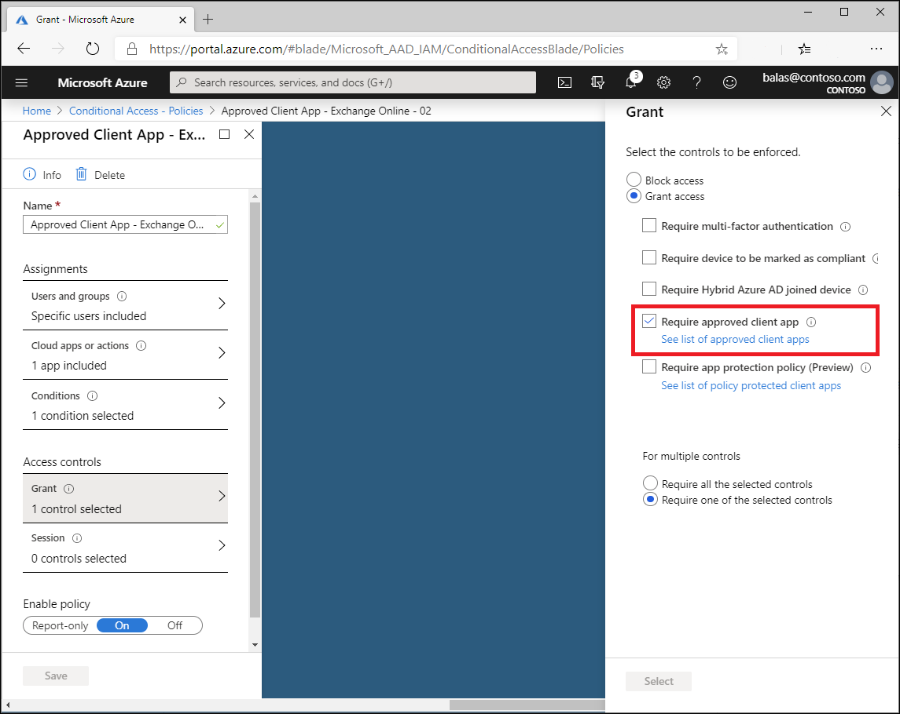

# How To: Require approved client apps for cloud app access with Conditional Access 

Employees regularly use mobile devices for both personal and work tasks. While making sure your employees can be productive, you also want to prevent data loss. With Conditional Access, you can restrict access approved client apps on compliant devices to protect your organization's data.  

This article presents four scenarios to configure Conditional Access policies for resources like Exchange Online and SharePoint Online. 

- [Scenario 1: Exchange Online require approved client app](#scenario-1-exchange-online-require-approved-client-app)
- [Scenario 2: Exchange Online and SharePoint Online require approved client app](#scenario-2-exchange-online-and-sharepoint-online-require-approved-client-app)
- [Scenario 3: Exchange Online and SharePoint Online require approved client app OR compliant device](#scenario-3-exchange-online-and-sharepoint-online-require-approved-client-app-or-compliant-device)
- [Scenario 4: Exchange Online and SharePoint Online require approved client app AND compliant device](#scenario-4-exchange-online-and-sharepoint-online-require-approved-client-app-and-compliant-device)

## Overview

With [Azure AD Conditional Access](overview.md), you can fine-tune how authorized users can access your resources. For example, you can limit the access to your cloud apps to trusted devices.

You can use [Intune app protection policies](/intune/app-protection-policy) to help protect your company’s data. Intune app protection policies don't require mobile-device management (MDM) solution, which enables you to protect your company’s data with or without enrolling devices in a device management solution.

Azure Active Directory Conditional Access enables you to limit access to your cloud apps to client apps that support Intune app protection policies. Like restricting access to Exchange Online to the Outlook app.

In Conditional Access, this functionality is known as requiring an approved client app. For a list of approved client apps, see [approved client app requirement](concept-conditional-access-grant.md#require-approved-client-app).

## Scenario 1: Exchange Online require approved client app

Contoso has decided that all mail on mobile or ActiveSync clients must use an approved client app like Outlook mobile. All of their users already sign in with Azure AD credentials and have licenses assigned to them that include Azure AD Premium P1 or P2 and Microsoft Intune.

Organizations must complete the following three steps in order to require the use of an approved client app on mobile devices and Exchange ActiveSync clients.

**Step 1: Policy for Android and iOS based modern authentication clients requiring the use of an approved client application when accessing Exchange Online.**

1. Sign in to the **Azure portal** as a global administrator, security administrator, or Conditional Access administrator.
1. Browse to **Azure Active Directory** > **Security** > **Conditional Access**.
1. Select **New policy**.
1. Give your policy a name. We recommend that organizations create a meaningful standard for the names of their policies.
1. Under **Assignments**, select **Users and groups**
   1. Under **Include**, select **All users** or the specific **Users and groups** you wish to apply this policy to. 
   1. Select **Done**.
1. Under **Cloud apps or actions** > **Include**, select **Office 365 Exchange Online**.
1. Under **Conditions**, select **Device platforms**.
   1. Set **Configure** to **Yes**.
   1. Include **Android** and **iOS**.
1. Under **Conditions**, select **Client apps (preview)**.
   1. Set **Configure** to **Yes**.
   1. Select **Mobile apps and desktop clients** and **Modern authentication clients**.
1. Under **Access controls** > **Grant**, select **Grant access**, **Require approved client app**, and select **Select**.
1. Confirm your settings and set **Enable policy** to **On**.
1. Select **Create** to create and enable your policy.

**Step 2: Policy for Exchange ActiveSync clients requiring the use of an approved client app.**

1. Browse to **Azure Active Directory** > **Security** > **Conditional Access**.
1. Select **New policy**.
1. Give your policy a name. We recommend that organizations create a meaningful standard for the names of their policies.
1. Under **Assignments**, select **Users and groups**
   1. Under **Include**, select **All users** or the specific **Users and groups** you wish to apply this policy to. 
   1. Select **Done**.
1. Under **Cloud apps or actions** > **Include**, select **Office 365 Exchange Online**.
1. Under **Conditions**:
   1. **Device platforms**:
      1. Set **Configure** to **Yes**.
      1. Include **Android** and **iOS**.
   1. **Client apps (preview)**:
      1. Set **Configure** to **Yes**.
      1. Select **Mobile apps and desktop clients** and **Exchange ActiveSync clients**.
1. Under **Access controls** > **Grant**, select **Grant access**, **Require approved client app**, and select **Select**.
1. Confirm your settings and set **Enable policy** to **On**.
1. Select **Create** to create and enable your policy.

**Step 3: Configure Intune app protection policy for iOS and Android client applications.**

Review the article [How to create and assign app protection policies](/intune/apps/app-protection-policies), for steps to create app protection policies for Android and iOS. 

## Scenario 2: Exchange Online and SharePoint Online require approved client app

Contoso has decided that all mail and SharePoint access from mobile or ActiveSync clients must use an approved client app like Outlook mobile. All of their users already sign in with Azure AD credentials and have licenses assigned to them that include Azure AD Premium P1 or P2 and Microsoft Intune.

Organizations must complete the following three steps in order to require the use of an approved client app on mobile devices and Exchange ActiveSync clients.

**Step 1: Policy for Android and iOS based modern authentication clients requiring the use of an approved client application when accessing Exchange Online and SharePoint Online.**

1. Sign in to the **Azure portal** as a global administrator, security administrator, or Conditional Access administrator.
1. Browse to **Azure Active Directory** > **Security** > **Conditional Access**.
1. Select **New policy**.
1. Give your policy a name. We recommend that organizations create a meaningful standard for the names of their policies.
1. Under **Assignments**, select **Users and groups**
   1. Under **Include**, select **All users** or the specific **Users and groups** you wish to apply this policy to. 
   1. Select **Done**.
1. Under **Cloud apps or actions** > **Include**, select **Office 365 Exchange Online** and **Office 365 SharePoint Online**.
1. Under **Conditions**, select **Device platforms**.
   1. Set **Configure** to **Yes**.
   1. Include **Android** and **iOS**.
1. Under **Conditions**, select **Client apps (preview)**.
   1. Set **Configure** to **Yes**.
   1. Select **Mobile apps and desktop clients** and **Modern authentication clients**.
1. Under **Access controls** > **Grant**, select **Grant access**, **Require approved client app**, and select **Select**.
1. Confirm your settings and set **Enable policy** to **On**.
1. Select **Create** to create and enable your policy.

**Step 2: Policy for Exchange ActiveSync clients requiring the use of an approved client app.**

1. Browse to **Azure Active Directory** > **Security** > **Conditional Access**.
1. Select **New policy**.
1. Give your policy a name. We recommend that organizations create a meaningful standard for the names of their policies.
1. Under **Assignments**, select **Users and groups**
   1. Under **Include**, select **All users** or the specific **Users and groups** you wish to apply this policy to. 
   1. Select **Done**.
1. Under **Cloud apps or actions** > **Include**, select **Office 365 Exchange Online**.
1. Under **Conditions**:
   1. **Device platforms**:
      1. Set **Configure** to **Yes**.
      1. Include **Android** and **iOS**.
   1. **Client apps (preview)**:
      1. Set **Configure** to **Yes**.
      1. Select **Mobile apps and desktop clients** and **Exchange ActiveSync clients**.
1. Under **Access controls** > **Grant**, select **Grant access**, **Require approved client app**, and select **Select**.
1. Confirm your settings and set **Enable policy** to **On**.
1. Select **Create** to create and enable your policy.

**Step 3: Configure Intune app protection policy for iOS and Android client applications.**

Review the article [How to create and assign app protection policies](/intune/apps/app-protection-policies), for steps to create app protection policies for Android and iOS. 

## Scenario 3: Exchange Online and SharePoint Online require approved client app OR compliant device

Contoso has decided that all mail and SharePoint access from mobile or ActiveSync clients must use an approved client app like Outlook mobile and use a device that is marked as compliant with their Intune configuration policies. All of their users already sign in with Azure AD credentials and have licenses assigned to them that include Azure AD Premium P1 or P2 and Microsoft Intune.

Organizations must complete the following three steps in order to require the use of an approved client app **OR** compliant device on mobile devices and Exchange ActiveSync clients.

**Step 1: Policy for Android and iOS based modern authentication clients requiring the use of an approved client application OR compliant device when accessing Exchange Online and SharePoint Online.**

1. Sign in to the **Azure portal** as a global administrator, security administrator, or Conditional Access administrator.
1. Browse to **Azure Active Directory** > **Security** > **Conditional Access**.
1. Select **New policy**.
1. Give your policy a name. We recommend that organizations create a meaningful standard for the names of their policies.
1. Under **Assignments**, select **Users and groups**
   1. Under **Include**, select **All users** or the specific **Users and groups** you wish to apply this policy to. 
   1. Select **Done**.
1. Under **Cloud apps or actions** > **Include**, select **Office 365 Exchange Online** and **Office 365 SharePoint Online**.
1. Under **Conditions**: 
   1. **Device platforms**:
      1. Set **Configure** to **Yes**.
      1. Include **Android** and **iOS**.
   1. **Client apps (preview)**.
      1. Set **Configure** to **Yes**.
      1. Select **Mobile apps and desktop clients** and **Modern authentication clients**.
1. Under **Access controls** > **Grant**, select **Grant access**.
   1. Select **Require approved client app** and **Require device to be marked as compliant**.
   1. **For multiple controls**, select **Require one of the selected controls**, then select **Select**.
1. Confirm your settings and set **Enable policy** to **On**.
1. Select **Create** to create and enable your policy.

**Step 2: Policy for Exchange ActiveSync clients requiring the use of an approved client app or compliant device.**

1. Browse to **Azure Active Directory** > **Security** > **Conditional Access**.
1. Select **New policy**.
1. Give your policy a name. We recommend that organizations create a meaningful standard for the names of their policies.
1. Under **Assignments**, select **Users and groups**
   1. Under **Include**, select **All users** or the specific **Users and groups** you wish to apply this policy to. 
   1. Select **Done**.
1. Under **Cloud apps or actions** > **Include**, select **Office 365 Exchange Online**.
1. Under **Conditions**:
   1. **Device platforms**:
      1. Set **Configure** to **Yes**.
      1. Include **Android** and **iOS**.
   1. **Client apps (preview)**:
      1. Set **Configure** to **Yes**.
      1. Select **Mobile apps and desktop clients** and **Exchange ActiveSync clients**.
1. Under **Access controls** > **Grant**, select **Grant access**.
   1. Select **Require approved client app** and **Require device to be marked as compliant**.
   1. **For multiple controls**, select **Require one of the selected controls**, then select **Select**.
1. Confirm your settings and set **Enable policy** to **On**.
1. Select **Create** to create and enable your policy.

**Step 3: Configure Intune app protection policy for iOS and Android client applications**

Review the article [How to create and assign app protection policies](/intune/apps/app-protection-policies), for steps to create app protection policies for Android and iOS. 

## Scenario 4: Exchange Online and SharePoint Online require approved client app AND compliant device

Contoso has decided that all mail and SharePoint access from mobile or ActiveSync clients must use an approved client app like Outlook mobile and use a device that is marked as compliant with their Intune configuration policies. All of their users already sign in with Azure AD credentials and have licenses assigned to them that include Azure AD Premium P1 or P2 and Microsoft Intune.

Organizations must complete the following three steps in order to require the use of an approved client app AND compliant device on mobile devices and Exchange ActiveSync clients.

**Step 1: Policy for Android and iOS based modern authentication clients requiring the use of an approved client application and compliant device when accessing Exchange Online and SharePoint Online.**

1. Sign in to the **Azure portal** as a global administrator, security administrator, or Conditional Access administrator.
1. Browse to **Azure Active Directory** > **Security** > **Conditional Access**.
1. Select **New policy**.
1. Give your policy a name. We recommend that organizations create a meaningful standard for the names of their policies.
1. Under **Assignments**, select **Users and groups**
   1. Under **Include**, select **All users** or the specific **Users and groups** you wish to apply this policy to. 
   1. Select **Done**.
1. Under **Cloud apps or actions** > **Include**, select **Office 365 Exchange Online** and **Office 365 SharePoint Online**.
1. Under **Conditions**, select **Device platforms**.
   1. Set **Configure** to **Yes**.
   1. Include **Android** and **iOS**.
1. Under **Conditions**, select **Client apps (preview)**.
   1. Set **Configure** to **Yes**.
   1. Select **Mobile apps and desktop clients** and **Modern authentication clients**.
1. Under **Access controls** > **Grant**, select **Grant access**.
   1. Select **Require approved client app** and **Require device to be marked as compliant**.
   1. **For multiple controls**, select **Require all the selected controls**, then select **Select**.
1. Confirm your settings and set **Enable policy** to **On**.
1. Select **Create** to create and enable your policy.

**Step 2: Policy for Exchange ActiveSync clients requiring the use of an approved client app and compliant device.**

1. Browse to **Azure Active Directory** > **Security** > **Conditional Access**.
1. Select **New policy**.
1. Give your policy a name. We recommend that organizations create a meaningful standard for the names of their policies.
1. Under **Assignments**, select **Users and groups**
   1. Under **Include**, select **All users** or the specific **Users and groups** you wish to apply this policy to. 
   1. Select **Done**.
1. Under **Cloud apps or actions** > **Include**, select **Office 365 Exchange Online**.
1. Under **Conditions**:
   1. **Device platforms**:
      1. Set **Configure** to **Yes**.
      1. Include **Android** and **iOS**.
   1. **Client apps (preview)**:
      1. Set **Configure** to **Yes**.
      1. Select **Mobile apps and desktop clients** and **Exchange ActiveSync clients**.
1. Under **Access controls** > **Grant**, select **Grant access**.
   1. Select **Require approved client app** and **Require device to be marked as compliant**.
   1. **For multiple controls**, select **Require all the selected controls**, then select **Select**.
1. Confirm your settings and set **Enable policy** to **On**.
1. Select **Create** to create and enable your policy.

**Step 3: Configure Intune app protection policy for iOS and Android client applications.**

Review the article [How to create and assign app protection policies](/intune/apps/app-protection-policies), for steps to create app protection policies for Android and iOS. 

## Next steps

[What is Conditional Access?](overview.md)

[Conditional access components](concept-conditional-access-policies.md)

[Common Conditional Access policies](concept-conditional-access-policy-common.md)
