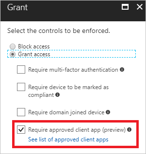
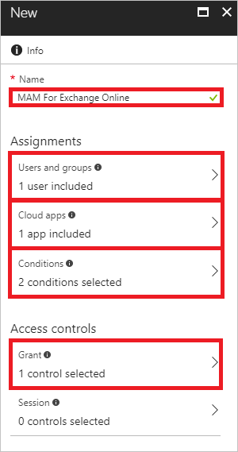
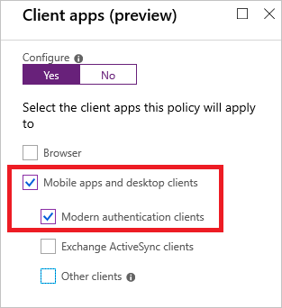
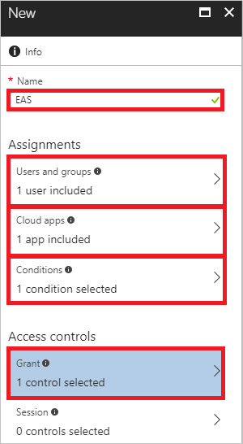
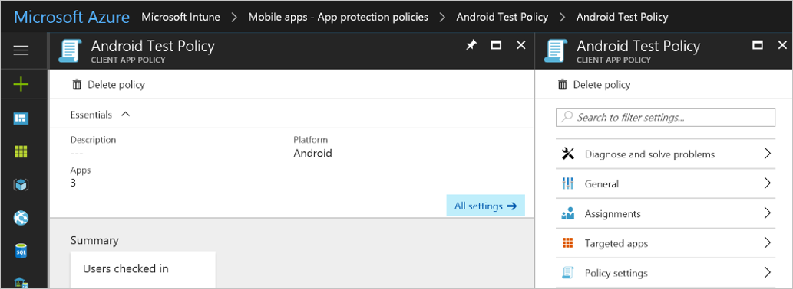
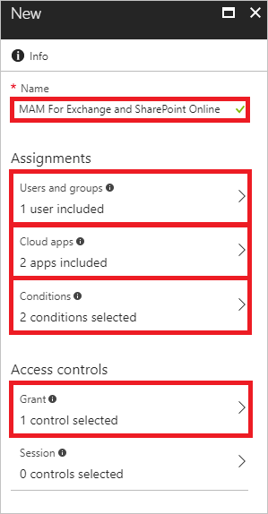
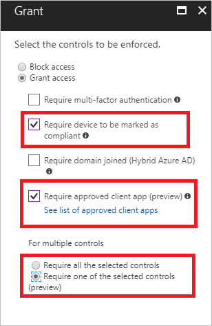
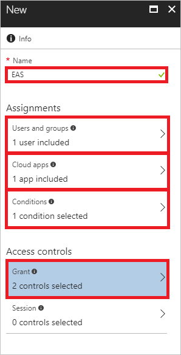
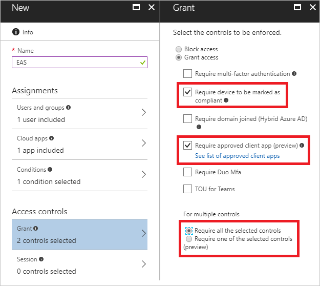
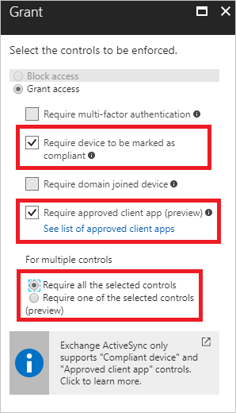

# How To: Require approved client apps for cloud app access with Conditional Access 

Your employees use mobile devices for both personal and work tasks. While making sure your employees can be productive, you also want to prevent data loss. With Azure Active Directory (Azure AD) Conditional Access, you can restrict access to your cloud apps to approved client apps that can protect your corporate data.  

This topic explains how to configure condition access policies that require approved client apps.

## Overview

With [Azure AD Conditional Access](overview.md), you can fine-tune how authorized users can access your resources. For example, you can limit the access to your cloud apps to trusted devices.

You can use [Intune app protection policies](https://docs.microsoft.com/intune/app-protection-policy) to help protect your company’s data. Intune app protection policies don't require mobile-device management (MDM) solution, which enables you to protect your company’s data with or without enrolling devices in a device management solution.

Azure Active Directory Conditional Access enables you to limit access to your cloud apps to client apps that support Intune app protection policies. For example, you can restrict access to Exchange Online to the Outlook app.

In the Conditional Access terminology, these client apps are known as **approved client apps**.  

For a list of approved client apps, see [approved client app requirement](technical-reference.md#approved-client-app-requirement).

You can combine app-based Conditional Access policies with other policies such as [device-based Conditional Access policies](require-managed-devices.md) to provide flexibility in how to protect data for both personal and corporate devices.

## Before you begin

This topic assumes that you are familiar with:

- The [approved client app requirement](technical-reference.md#approved-client-app-requirement) technical reference.
- The basic concepts of [Conditional Access in Azure Active Directory](overview.md).
- How to [configure a Conditional Access policy](app-based-mfa.md).
- The [migration of Conditional Access policies](best-practices.md#policy-migration).

## Prerequisites

To create an app-based Conditional Access policy, you must have an Enterprise Mobility + Security or an Azure Active Directory premium subscription, and the users must be licensed for EMS or Azure AD. 

## Exchange Online policy 

This scenario consists of an app-based Conditional Access policy for access to Exchange Online.

### Scenario playbook

This scenario assumes that a user:

- Configures email using a native mail application on iOS or Android to connect to Exchange
- Receives an email that indicates that access is only available using Outlook app
- Downloads the application with the link
- Opens the Outlook application and signs in with the Azure AD credentials
- Is prompted to install either Authenticator (iOS) or Company Portal (Android) to continue
- Installs the application and can return to the Outlook app to continue
- Is prompted to register a device
- Is able to access email

Any Intune app protection policies are activated at the time the access corporate data and may prompt the user to restart the application, use an additional PIN etc. (if configured for the application and platform).

### Configuration 

**Step 1 - Configure an Azure AD Conditional Access policy for Exchange Online**

For the Conditional Access policy in this step, you need to configure the following components:

1. The **Name** of your Conditional Access policy.
1. **Users and groups**: Each Conditional Access policy must have at least one user or group selected.
1. **Cloud apps:** As cloud apps, you need to select **Office 365 Exchange Online**.

   

1. **Conditions:** As **Conditions**, you need to configure **Device platforms** and **Client apps**:
   1. As **Device platforms**, select **Android** and **iOS**.

      

   1. As **Client apps (preview)**, select **Mobile apps and desktop apps** and **Modern authentication clients**.

      

1. As **Access controls**, you need to have **Require approved client app (preview)** selected.

   

**Step 2 - Configure an Azure AD Conditional Access policy for Exchange Online with Active Sync (EAS)**

For the Conditional Access policy in this step, you need to configure the following components:

1. The **Name** of your Conditional Access policy.
1. **Users and groups**: Each Conditional Access policy must have at least one user or group selected.
1. **Cloud apps:** As cloud apps, you need to select **Office 365 Exchange Online**.

   

1. **Conditions:** As **Conditions**, you need to configure **Client apps (preview)**. 
   1. As **Client apps (preview)**, select **Mobile apps and desktop clients** and **Exchange ActiveSync clients**.

      

   1. As **Access controls**, you need to have **Require approved client app (preview)** selected.

      

**Step 3 - Configure Intune app protection policy for iOS and Android client applications**

See [Protect apps and data with Microsoft Intune](https://docs.microsoft.com/intune-classic/deploy-use/protect-apps-and-data-with-microsoft-intune) for more information.

## Exchange Online and SharePoint Online policy

This scenario consists of a Conditional Access with mobile app management policy for access to Exchange Online and SharePoint Online with approved apps.

### Scenario playbook

This scenario assumes that a user:

- Tries to use the SharePoint app to connect and also to view their corporate sites
- Attempts to sign in with the same credentials as the Outlook app credentials
- Does not have to re-register and can get access to the resources

### Configuration

**Step 1 - Configure an Azure AD Conditional Access policy for Exchange Online and SharePoint Online**

For the Conditional Access policy in this step, you need to configure the following components:

1. The **Name** of your Conditional Access policy.
1. **Users and groups**: Each Conditional Access policy must have at least one user or group selected.
1. **Cloud apps:** As cloud apps, you need to select **Office 365 Exchange Online** and **Office 365 SharePoint Online**. 

   

1. **Conditions:** As **Conditions**, you need to configure **Device platforms** and **Client apps**:
   1. As **Device platforms**, select **Android** and **iOS**.

      

   1. As **Client apps (preview)**, select **Mobile apps and desktop clients** and **Modern authentication clients**.

      

1. As **Access controls**, you need to have **Require approved client app (preview)** selected.

   

**Step 2 - Configure an Azure AD Conditional Access policy for Exchange Online with Active Sync (EAS)**

For the Conditional Access policy in this step, you need to configure the following components:

1. The **Name** of your Conditional Access policy.
1. **Users and groups**: Each Conditional Access policy must have at least one user or group selected.
1. **Cloud apps:** As cloud apps, you need to select **Office 365 Exchange Online**. Online 

   

1. **Conditions:** As **Conditions**, you need to configure **Client apps**:
   1. As **Client apps (preview)**, select **Mobile apps and desktop clients** and **Exchange ActiveSync clients**.

      

   1. As **Access controls**, you need to have **Require approved client app (preview)** selected.

      

**Step 3 - Configure Intune app protection policy for iOS and Android client applications**

See [Protect apps and data with Microsoft Intune](https://docs.microsoft.com/intune-classic/deploy-use/protect-apps-and-data-with-microsoft-intune) for more information.

## App-based or compliant device policy for Exchange Online and SharePoint Online

This scenario consists of an app-based or compliant device Conditional Access policy for access to Exchange Online.

### Scenario playbook

This scenario assumes that:
 
- Some users are already enrolled (with or without corporate devices)
- Users who are not enrolled and registered with Azure AD using an app protected application need to register a device to access resources
- Enrolled users using the app protected application don't have to re-register the device

### Configuration

**Step 1 - Configure an Azure AD Conditional Access policy for Exchange Online and SharePoint Online**

For the Conditional Access policy in this step, you need to configure the following components:

1. The **Name** of your Conditional Access policy.
1. **Users and groups**: Each Conditional Access policy must have at least one user or group selected.
1. **Cloud apps:** As cloud apps, you need to select **Office 365 Exchange Online** and **Office 365 SharePoint Online**. 

     

1. **Conditions:** As **Conditions**, you need to configure **Device platforms** and **Client apps**. 
   1. As **Device platforms**, select **Android** and **iOS**.

      

   1. As **Client apps (preview)**, select **Mobile apps and desktop clients** and **Modern authentication clients**.

      

1. As **Access controls**, you need to have the following selected:
   - **Require device to be marked as compliant**
   - **Require approved client app (preview)**
   - **Require one of the selected controls**   
 
      

**Step 2 - Configure an Azure AD Conditional Access policy for Exchange Online with Active Sync (EAS)**

For the Conditional Access policy in this step, you need to configure the following components:

1. The **Name** of your Conditional Access policy.
1. **Users and groups**: Each Conditional Access policy must have at least one user or group selected.
1. **Cloud apps:** As cloud apps, you need to select **Office 365 Exchange Online**. 

   

1. **Conditions:** As **Conditions**, you need to configure **Client apps**. 

   As **Client apps (preview)**, select **Mobile apps and desktop clients** and **Exchange ActiveSync clients**.

   

1. As **Access controls**, you need to have **Require approved client app (preview)** selected.
 
   

**Step 3 - Configure Intune app protection policy for iOS and Android client applications**

See [Protect apps and data with Microsoft Intune](https://docs.microsoft.com/intune-classic/deploy-use/protect-apps-and-data-with-microsoft-intune) for more information.

## App-based and compliant device policy for Exchange Online and SharePoint Online

This scenario consists of an app-based and compliant device Conditional Access policy for access to Exchange Online.

### Scenario playbook

This scenario assumes that a user:
 
- Configures email using a native mail application on iOS or Android to connect to Exchange
- Receives an email that indicates that access requires your device to be enrolled
- Downloads the company portal and signs in to company portal
- Checks mail and is asked to use the Outlook app
- Downloads the Outlook app
- Opens the Outlook app and enters the credentials used in the enrollment
- User is able to access email

Any Intune app protection policies are activated at the time of access to the corporate data and may prompt the user to restart the application, use an additional PIN etc. (if configured for the application and platform)

### Configuration

**Step 1 - Configure an Azure AD Conditional Access policy for Exchange Online and SharePoint Online**

For the Conditional Access policy in this step, you need to configure the following components:

1. The **Name** of your Conditional Access policy.
1. **Users and groups**: Each Conditional Access policy must have at least one user or group selected.
1. **Cloud apps:** As cloud apps, you need to select **Office 365 Exchange Online** and **Office 365 SharePoint Online**. 

   

1. **Conditions:** As **Conditions**, you need to configure **Device platforms** and **Client apps**. 
   1. As **Device platforms**, select **Android** and **iOS**.

      

   1. As **Client apps (preview)**, select **Mobile apps and desktop apps** and **Modern authentication clients**.

      

1. As **Access controls**, you need to have the following selected:
   - **Require device to be marked as compliant**
   - **Require approved client app (preview)**
   - **Require all the selected controls**   
 
      

**Step 2 - Configure an Azure AD Conditional Access policy for Exchange Online with Active Sync (EAS)**

For the Conditional Access policy in this step, you need to configure the following components:

1. The **Name** of your Conditional Access policy.
1. **Users and groups**: Each Conditional Access policy must have at least one user or group selected.
1. **Cloud apps:** As cloud apps, you need to select **Office 365 Exchange Online**. 

   

1. **Conditions:** As **Conditions**, you need to configure **Client apps (preview)**. 

   As **Client apps (preview)**, select **Mobile apps and desktop clients** and **Exchange ActiveSync clients**.

   

1. As **Access controls**, you need to have the following selected:
   - **Require device to be marked as compliant**
   - **Require approved client app (preview)**
   - **Require all the selected controls**   
 
      

**Step 3 - Configure Intune app protection policy for iOS and Android client applications**

See [Protect apps and data with Microsoft Intune](https://docs.microsoft.com/intune-classic/deploy-use/protect-apps-and-data-with-microsoft-intune) for more information.

## Next steps

If you want to know how to configure a Conditional Access policy, see [Require MFA for specific apps with Azure Active Directory Conditional Access](app-based-mfa.md).

If you are ready to configure Conditional Access policies for your environment, see the [best practices for Conditional Access in Azure Active Directory](best-practices.md). 
