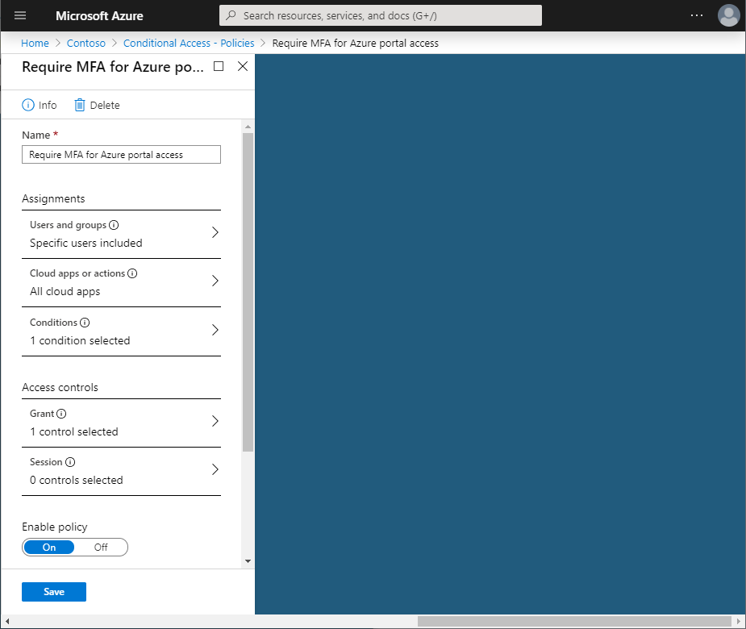
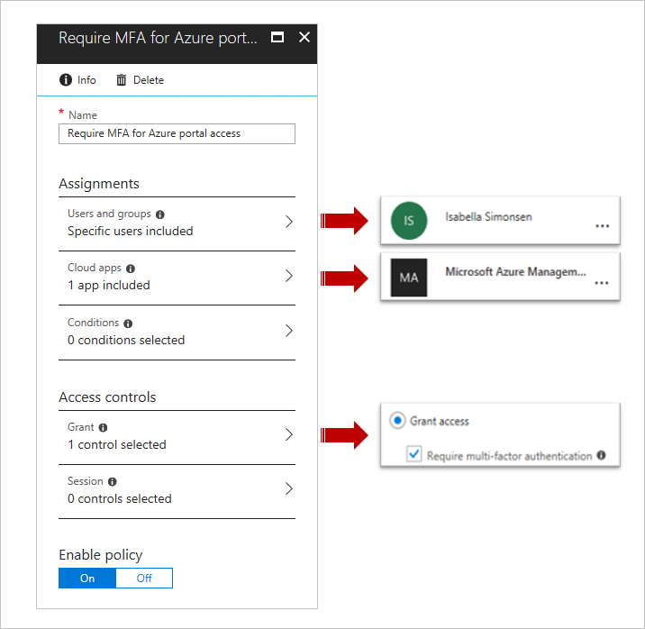
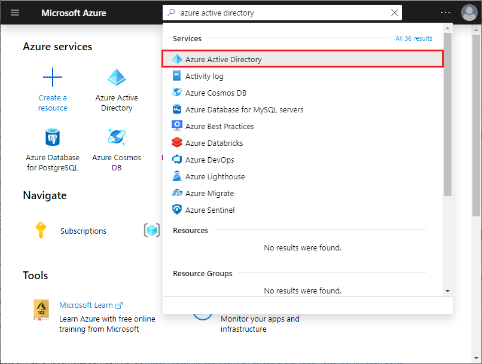
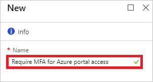
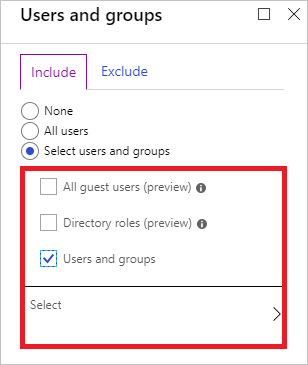
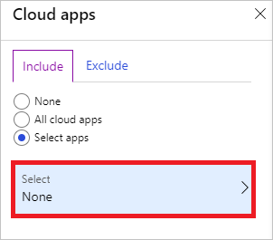
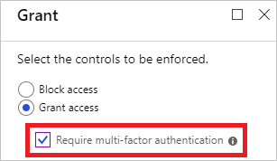
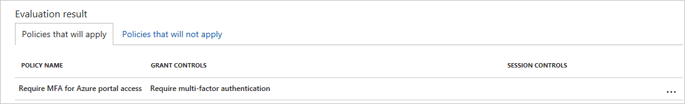
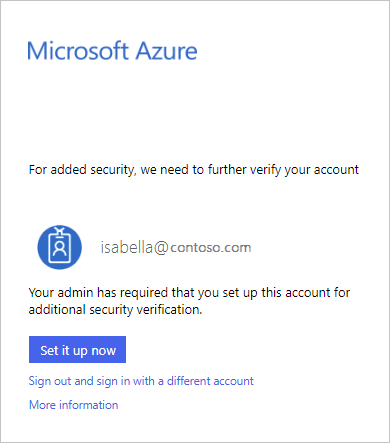
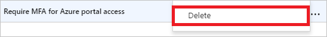

# Quickstart: Require MFA for specific apps with Azure Active Directory conditional access 

To simplify the sign-in experience of your users, you might want to allow them to sign in to your cloud apps using a user name and a password. However, many environments have at least a few apps for which it is advisable to require a stronger form of account verification, such as multi-factor authentication (MFA). This might be, for example true, for access to your organization's email system or your HR apps. In Azure Active Directory (Azure AD), you can accomplish this goal with a conditional access policy.    

This quickstart shows how to configure an [Azure AD conditional access policy](../active-directory-conditional-access-azure-portal.md) that requires multi-factor authentication for a selected cloud app in your environment.

If you don't have an Azure subscription, create a [free account](https://azure.microsoft.com/free/?WT.mc_id=A261C142F) before you begin.

## Prerequisites 

To complete the scenario in this quickstart, you need:

- **Access to an Azure AD Premium edition** - Azure AD conditional access is an Azure AD Premium capability. 

- **A test account called Isabella Simonsen** - If you don't know how to create a test account, see [Add cloud-based users](../fundamentals/add-users-azure-active-directory.md#add-a-new-user).

## Test your sign-in

The goal of this step is to get an impression of the sign-in experience without a conditional access policy.

**To initialize your environment:**

1. Sign in to your Azure portal as Isabella Simonsen.

2. Sign out.

## Create your conditional access policy 

This section shows how to create the required conditional access policy. The scenario in this quickstart uses:

- The Azure portal as placeholder for a cloud app that requires MFA. 
- Your sample user to test the conditional access policy.  

In your policy, set:

|Setting |Value|
|---     | --- |
|Users and groups | Isabella Simonsen |
|Cloud apps | Microsoft Azure Management |
|Grant access | Require multi-factor authentication |
 

 

**To configure your conditional access policy:**

1. Sign in to your [Azure portal](https://portal.azure.com) as global administrator, security administrator, or a conditional access administrator.

2. In the Azure portal, on the left navbar, click **Azure Active Directory**. 

    

3. On the **Azure Active Directory** page, in the **Manage** section, click **Conditional access**.

    
 
4. On the **Conditional Access** page, in the toolbar on the top, click **Add**.

    

5. On the **New** page, in the **Name** textbox, type **Require MFA for Azure portal access**.

    

6. In the **Assignment** section, click **Users and groups**.

    

7. On the **Users and groups** page, perform the following steps:

    

    a. Click **Select users and groups**, and then select **Users and groups**.

    b. Click **Select**.

    c. On the **Select** page, select **Isabella Simonsen**, and then click **Select**.

    d. On the **Users and groups** page, click **Done**.

8. Click **Cloud apps**.

    

9. On the **Cloud apps** page, perform the following steps:

    

    a. Click **Select apps**.

    b. Click **Select**.

    c. On the **Select** page, select **Microsoft Azure Management**, and then click **Select**.

    d. On the **Cloud apps** page, click **Done**.

10. In the **Access controls** section, click **Grant**.

    

11. On the **Grant** page, perform the following steps:

    

    a. Select **Grant access**.

    a. Select **Require multi-factor authentication**.

    b. Click **Select**.

12. In the **Enable policy** section, click **On**.

    

13. Click **Create**.

## Evaluate a simulated sign-in

Now that you have configured your conditional access policy, you probably want to know whether it works as expected. As a first step, use the conditional access what if policy tool to simulate a sign-in of your test user. The simulation estimates the impact this sign-in has on your policies and generates a simulation report.  

To initialize the what if policy evaluation tool, set:

- **Isabella Simonsen** as user 
- **Microsoft Azure Management** as cloud app

 Clicking **What If** creates a simulation report that shows:

- **Require MFA for Azure portal access** under **Policies that will apply** 
- **Require multi-factor authentication** as **Grant Controls**.

**To evaluate your conditional access policy:**

1. On the [Conditional access - Policies](https://portal.azure.com/#blade/Microsoft_AAD_IAM/ConditionalAccessBlade/Policies) page, in the menu on the top, click **What If**.  
 
    

2. Click **Users**, select **Isabella Simonsen**, and then click **Select**.

    

2. To select a cloud app, perform the following steps:

    

    a. Click **Cloud apps**.

    b. On the **Cloud apps page**, click **Select apps**.

    c. Click **Select**.

    d. On the **Select** page, select **Microsoft Azure Management**, and then click **Select**.

    e. On the cloud apps page, click **Done**.

3. Click **What If**.

## Test your conditional access policy

In the previous section, you have learned how to evaluate a simulated sign-in. In addition to a simulation, you should also test your conditional access policy to ensure that it works as expected. 

To test your policy, try to sign-in to your [Azure portal](https://portal.azure.com) using your **Isabella Simonsen** test account. You should see a dialog that requires you to set your account up for additional security verification.

## Clean up resources

When no longer needed, delete the test user and the conditional access policy:

- If you don't know how to delete an Azure AD user, see [Delete users from Azure AD](../fundamentals/add-users-azure-active-directory.md#delete-a-user).

- To delete your policy, select your policy, and then click **Delete** in the quick access toolbar.

    

## Next steps

> [!div class="nextstepaction"]
> [Require terms of use to be accepted](require-tou.md)
> [Block access when a session risk is detected](app-sign-in-risk.md)
