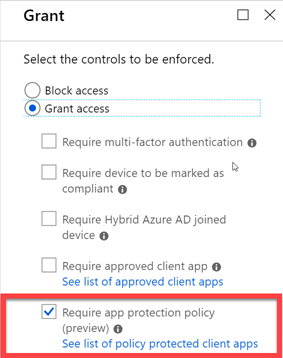
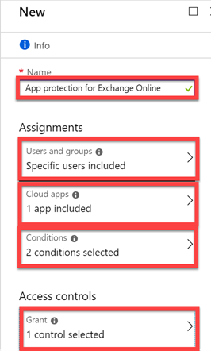
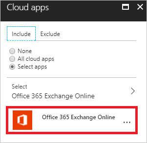
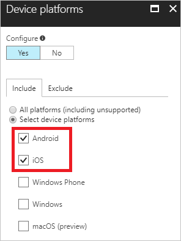
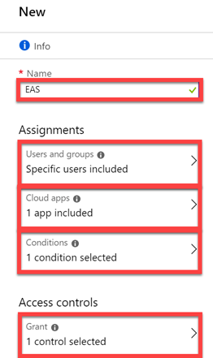
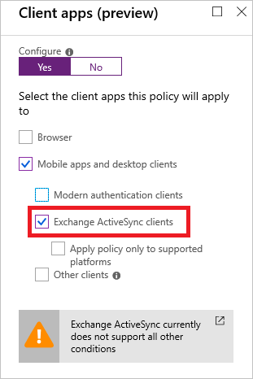
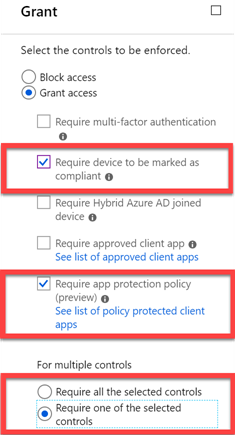
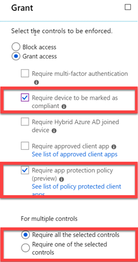
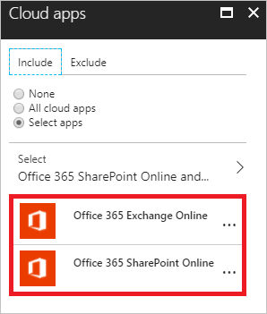
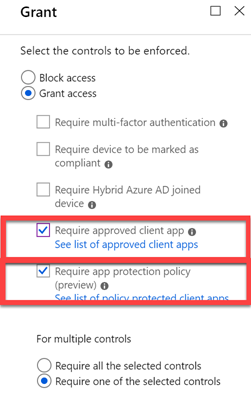

# Require app protection policy for cloud app access with conditional access (preview)

Your employees use mobile devices for both personal and work tasks. While making sure your employees can be productive, you also want to prevent data loss. With Azure Active Directory (Azure AD) conditional access, you can protect your corporate data by restricting access to your cloud apps. Use client apps with an app protection policy first.

This article explains how to configure conditional access policies that can require an app protection policy before access is granted to data.

## Overview

With [Azure AD conditional access](overview.md), you can fine-tune how authorized users can access your resources. For example, you can limit the access to your cloud apps to trusted devices.

You can use [Intune app protection policies](https://docs.microsoft.com/intune/app-protection-policy) to help protect your company’s data. Intune app protection policies don't require a mobile device management (MDM) solution. You can protect your company’s data with or without enrolling devices in a device management solution.

Azure Active Directory conditional access restricts access to your cloud apps to client applications that Intune has reported to Azure AD as receiving an app protection policy. For example, you can restrict access to Exchange Online to the Outlook app that has an Intune app protection policy.

In the conditional access terminology, these client apps are known to be policy protected with an *app protection policy*.  

For a list of policy-protected client apps, see [App protection policy requirement](technical-reference.md#approved-client-app-requirement).

You can combine app-protection-based conditional access policies with other policies, such as [device-based conditional access policies](require-managed-devices.md). This way, you can provide flexibility in how to protect data for both personal and corporate devices.

## Benefits of app protection-based conditional access requirement

Similar to compliance that's reported by Intune for iOS and Android for a managed device, Intune now reports to Azure AD if an app protection policy is applied. Conditional access can use this policy as an access check. This new conditional access policy, the app protection policy, increases security. It protects against admin errors, such as:

- Users who don't have an Intune license.
- Users who can't receive an Intune app protection policy.
- Intune app protection policy apps that aren't configured to receive a policy.

## Before you begin

This article assumes that you're familiar with:

- The [app protection policy requirement](technical-reference.md#app-protection-policy-requirement) technical reference.
- The [approved client app requirement](technical-reference.md#approved-client-app-requirement) technical reference.
- The basic concepts of [conditional access in Azure Active Directory](overview.md).
- How to [configure a conditional access policy](app-based-mfa.md).

## Prerequisites

To create an app protection-based conditional access policy, you must:

- Have an Enterprise Mobility + Security or an Azure Active Directory premium subscription + Intune.
- Make sure the users are licensed for Enterprise Mobility + Security or Azure AD + Intune.
- Make sure the client app is configured in Intune to receive an app protection policy.
- Make sure the users are configured in Intune to receive an Intune app protection policy.

## App protection-based policy for Exchange Online

This scenario consists of an app protection-based conditional access policy for access to Exchange Online.

### Scenario playbook

This scenario assumes that a user:

- Configures email by using a native mail application on iOS or Android to connect to Exchange.
- Receives an email that indicates that access is available only by using the Outlook app.
- Downloads the application with the link.
- Opens the Outlook application and signs in with Azure AD credentials.
- Is prompted to install either Microsoft Authenticator for iOS use or Intune Company Portal for Android use to continue.
- Installs the application and returns to the Outlook app to continue.
- Is prompted to register a device.
- Can receive an Intune app protection policy.
- Can access email.

Any Intune app protection policies must be on the application to access corporate data. The policies might prompt the user to restart the application or use an additional PIN. This is the case if the policies are configured for the application and platform.

### Configuration

**Step 1: Configure an Azure AD conditional access policy for Exchange Online**

For the conditional access policy in this step, configure the following components:

1. Enter the name of your conditional access policy.

2. Under **Assignments**, in **Users and groups**, select at least one user or group for each conditional access policy.

3. In **Cloud apps**, select **Office 365 Exchange Online**.

    

4. In **Conditions**, configure **Device platforms** and **Client apps (preview)**:

    a. In **Device platforms**, select **Android** and **iOS**.

    

    b. In **Client apps (preview)**, select **Mobile apps and desktop clients** and **Modern authentication clients**.

    

5. Under **Access controls**, select **Require app protection policy (preview)**.

    
 

**Step 2: Configure an Azure AD conditional access policy for Exchange Online with ActiveSync (EAS)**

For the conditional access policy in this step, configure the following components:

1. Enter the name of your conditional access policy.

2. Under **Assignments**, in **Users and groups**, select at least one user or group for each conditional access policy.

3. In **Cloud apps**, select **Office 365 Exchange Online**.

    

4. In **Conditions**, configure **Client apps (preview)**. 

    a. In **Client apps (preview)**, select **Mobile apps and desktop clients** and **Exchange ActiveSync clients**.

    

    b. Under **Access controls**, select **Require app protection policy (preview)**.

    

**Step 3: Configure Intune app protection policy for iOS and Android client applications**

For more information, see [Protect apps and data with Microsoft Intune](https://docs.microsoft.com/intune-classic/deploy-use/protect-apps-and-data-with-microsoft-intune).

## App protection-based or compliant device policy for Exchange Online

This scenario consists of an app protection-based or compliant device conditional access policy for access to Exchange Online.

### Scenario playbook

This scenario assumes that:
 
- A user is already enrolled, with or without corporate devices.
- Users who aren't enrolled and registered with Azure AD by using an app protected application need to register a device to access resources.
- Enrolled users who use the app protected application don't have to re-register the device.
- The user can receive an Intune app protection policy if not enrolled.
- The user can access email with Outlook and an Intune app protection policy if not enrolled.
- The user can access email with Outlook if the device is enrolled.

### Configuration

**Step 1: Configure an Azure AD conditional access policy for Exchange Online**

For the conditional access policy in this step, configure the following components:

1. Enter the name of your conditional access policy.

2. Under **Assignments**, in **Users and groups**, select at least one user or group for each conditional access policy.

3. In **Cloud apps**, select **Office 365 Exchange Online**. 

     

4. In **Conditions**, configure **Device platforms** and **Client apps (preview)**. 
 
    a. In **Device platforms**, select **Android** and **iOS**.

    

    b. In **Client apps (preview)**, select **Mobile apps and desktop clients** and **Modern authentication clients**.

    

5. Under **Access controls**, select the following options:

   - **Require device to be marked as compliant**

   - **Require app protection policy (preview)**

   - **Require one of the selected controls**   
 
     

**Step 2: Configure an Azure AD conditional access policy for Exchange Online with ActiveSync**

For the conditional access policy in this step, configure the following components:

1. Enter the name of your conditional access policy.

2. Under **Assignments**, in **Users and groups**, select at least one user or group for each conditional access policy.

3. In **Cloud apps**, select **Office 365 Exchange Online**. 

    

4. In **Conditions**, configure **Client apps (preview)**. 

    In **Client apps (preview)**, select **Mobile apps and desktop clients** and **Exchange ActiveSync clients**.

    

5. Under **Access controls**, select the following options:

   - **Require device to be marked as compliant**

   - **Require app protection policy (preview)**

   - **Require one of the selected controls**

     

**Step 3: Configure Intune app protection policy for iOS and Android client applications**

For more information, see [Protect apps and data with Microsoft Intune](https://docs.microsoft.com/intune-classic/deploy-use/protect-apps-and-data-with-microsoft-intune).

## App protection-based and compliant device policy for Exchange Online

This scenario consists of an app-protection-based and compliant device conditional access policy for access to Exchange Online.

### Scenario playbook

This scenario assumes that a user:
 
-	Configures email by using a native mail application on iOS or Android to connect to Exchange.
-	Receives an email that indicates that access requires their device to be enrolled.
-	Downloads Intune Company Portal and signs in to the portal.
-	Checks mail and is asked to use the Outlook app.
-	Downloads the Outlook app.
-	Opens the Outlook app and enters the credentials used in the enrollment.
-   Can receive an Intune app protection policy.
-	Can access email with Outlook and an Intune app protection policy.

Any Intune app protection policies are activated before access is granted to corporate data. The policies might prompt the user to restart the application or use an additional PIN. This is the case if the policies are configured for the application and platform.

### Configuration

**Step 1: Configure an Azure AD conditional access policy for Exchange Online**

For the conditional access policy in this step, configure the following components:

1. Enter the name of your conditional access policy.

2. Under **Assignments**, in **Users and groups**, select at least one user or group for each conditional access policy.

3. In **Cloud apps**, select **Office 365 Exchange Online**. 

     

4. In **Conditions**, configure **Device platforms** and **Client apps (preview)**. 
 
    a. In **Device platforms**, select **Android** and **iOS**.

    

    b. In **Client apps (preview)**, select **Mobile apps and desktop clients** and **Modern authentication clients**.

    

5. Under **Access controls**, select the following options:

   - **Require device to be marked as compliant**

   - **Require app protection policy (preview)**

   - **Require all the selected controls**   
 
     

**Step 2: Configure an Azure AD conditional access policy for Exchange Online with ActiveSync**

For the conditional access policy in this step, configure the following components:

1. Enter the name of your conditional access policy.

2. Under **Assignments**, in **Users and groups**, select at least one user or group for each conditional access policy.

3. In **Cloud apps**, select **Office 365 Exchange Online**. 

    

4. In **Conditions**, configure **Client apps (preview)**. 

    In **Client apps (preview)**, select **Mobile apps and desktop clients** and **Exchange ActiveSync clients**.

    

5. Under **Access controls**, select the following options:

   - **Require device to be marked as compliant**

   - **Require app protection policy (preview)**

   - **Require all the selected controls**   
 
     

**Step 3: Configure Intune app protection policy for iOS and Android client applications**

For more information, see [Protect apps and data with Microsoft Intune](https://docs.microsoft.com/intune-classic/deploy-use/protect-apps-and-data-with-microsoft-intune).

## App protection-based or app-based policy for Exchange Online and SharePoint Online

This scenario consists of an app protection-based or approved apps policy for access to Exchange Online and SharePoint Online.

### Scenario playbook

This scenario assumes that a user:

- Configures client applications that are either on the list of apps that support the app protection policy requirement or the approved apps requirement.  
- Uses client applications that meet the app protection policy requirement and can receive an Intune app protection policy.
- Uses client applications that meet the approved apps policy requirement that supports Intune app protection policy.
- Opens the application to access email or documents.
- Opens the Outlook application and signs in with Azure AD credentials.
- Is prompted to install either Microsoft Authenticator for iOS use or Intune Company Portal for Android use if they're not already installed.
- Installs the application and can return to the Outlook app to continue.
- Is prompted to register a device.
- Can receive an Intune app protection policy.
- Can access email with Outlook and an Intune app protection policy.
- Can access sites and documents with an app not on the app protection policy requirement but listed in the approved app requirement.

Any Intune app protection policies are required before access is granted to corporate data. The policies might prompt the user to restart the application or use an additional PIN. This is the case if the policies are configured for the application and platform.

**Remarks**

- You can use this scenario if you want to support both app protection-based and app-based conditional access policies.
- In this *OR* policy, apps with an app protection policy requirement are evaluated for access first before the approved client apps requirement.

### Configuration

**Step 1: Configure an Azure AD conditional access policy for Exchange Online**

For the conditional access policy in this step, configure the following components:

1. Enter the name of your conditional access policy.

2. Under **Assignments**, in **Users and groups**, select at least one user or group for each conditional access policy.

3. In **Cloud apps**, select **Office 365 Exchange Online**. 

     

4. In **Conditions**, configure **Device platforms** and **Client apps (preview)**. 
 
    a. In **Device platforms**, select **Android** and **iOS**.

    

    b. In **Client apps (preview)**, select **Mobile apps and desktop clients** and **Modern authentication clients**.

    

5. Under **Access controls**, select the following options:

   - **Require approved client app**

   - **Require app protection policy (preview)**

   - **Require one of the selected controls**
 
     

**Step 2: Configure Intune app protection policy for iOS and Android client applications**

For more information, see [Protect apps and data with Microsoft Intune](https://docs.microsoft.com/intune-classic/deploy-use/protect-apps-and-data-with-microsoft-intune).

## Next steps

- If you want to know how to configure a conditional access policy, see [Require MFA for specific apps with Azure Active Directory conditional access](app-based-mfa.md).
- If you're ready to configure conditional access policies for your environment, see [Best practices for conditional access in Azure Active Directory](best-practices.md). 