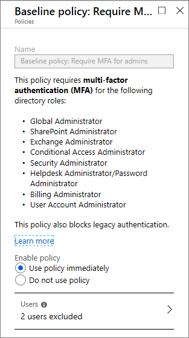
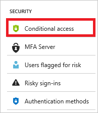

# What is baseline protection (preview)?  

In the last year, identity attacks have increased by 300%. To protect your environment from the ever-increasing attacks, Azure Active Directory (Azure AD) introduces a new feature called baseline protection. Baseline protection is a set of predefined [conditional access policies](../active-directory-conditional-access-azure-portal.md). The goal of these policies is to ensure that you have at least the baseline level of security enabled in all editions of Azure AD. 

This article provides you with an overview of baseline protection in Azure Active Directory.

 
## Require MFA for admins

Users with access to privileged accounts have unrestricted access to your environment. Due to the power these accounts have, you should treat them with special care. One common method to improve the protection of privileged accounts is to require a stronger form of account verification when they are used to sign-in. In Azure Active Directory, you can get a stronger account verification by requiring multi-factor authentication (MFA).  

**Require MFA for admins** is a baseline policy that requires MFA for the following directory roles: 

- Global administrator  

- SharePoint administrator  

- Exchange administrator  

- Conditional access administrator  

- Security administrator  

This baseline policy provides you with the option to exclude users and groups. You might want to exclude one *[emergency-access administrative account](../users-groups-roles/directory-emergency-access.md)* to ensure you are not locked out of the tenant.

## Enable a baseline policy 

While baseline policies are in preview, they are by default not activated. You need to manually enable a policy if you want to activate it. If you explicitly enable the baseline policies at the preview stage, they will remain active when this feature reaches general availability. The planned behavior change is the reason why, in addition to activate and deactivate, you have a third option to set the state of a policy: **Automatically enable policy in the future**. By selecting this option, you can leave the policies disabled during preview, but have Microsoft enable them automatically when this feature reaches general availability. If you do not explicitly enable baseline policies now, and do not select the **Automatically enable policy in the future** option, the policies will remain disabled when this feature reaches general availability.

**To enable a baseline policy:**  

1. Sign in to the [Azure portal](https://portal.azure.com) as global administrator, security administrator, or conditional access administrator.

2. In the **Azure portal**, on the left navbar, click **Azure Active Directory**.

    

3. On the **Azure Active Directory** page, in the **Security** section, click **Conditional access**.

    

4. In the list of policies, click a policy that starts with **Baseline policy:**. 

5. To enable the policy, click **Use policy immediately**.

6. Click **Save**. 
 
  
 

## What you should know 

While managing custom conditional access policies requires an Azure AD Premium license, baseline policies are available in all editions of Azure AD.     

The directory roles that are included in the baseline policy are the most privileged Azure AD roles. 

If you have privileged accounts that are used in your scripts, you should replace them with [managed identities for Azure resources](../managed-identities-azure-resources/overview.md) or [service principals with certificates](../../azure-resource-manager/resource-group-authenticate-service-principal.md). As a temporary workaround, you can exclude specific user accounts from the baseline policy. 

Baseline policies apply to legacy authentication flows like POP, IMAP, older Office desktop client. 

## Next steps

For more information, see:

- [Five steps to securing your identity infrastructure](https://docs.microsoft.com/azure/security/azure-ad-secure-steps)

- [What is conditional access in Azure Active Directory?](overview.md) 

