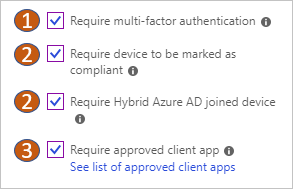

# Best practices for Conditional Access in Azure Active Directory

With [Azure Active Directory (Azure AD) Conditional Access](../active-directory-conditional-access-azure-portal.md), you can control how authorized users access your cloud apps. This article provides you with information about:

- Things you should know 
- What it is you should avoid doing when configuring Conditional Access policies. 

This article assumes that you familiar the concepts and the terminology outlined in [What is Conditional Access in Azure Active Directory?](../active-directory-conditional-access-azure-portal.md)

## What’s required to make a policy work?

When you create a new policy, there are no users, groups, apps, or access controls selected.

To make your policy work, you must configure:

| What           | How                                  | Why |
| :--            | :--                                  | :-- |
| **Cloud apps** |Select one or more apps.  | The goal of a Conditional Access policy is to enable you to control how authorized users can access cloud apps.|
| **Users and groups** | Select at least one user or group that is authorized to access your selected cloud apps. | A Conditional Access policy that has no users and groups assigned, is never triggered. |
| **Access controls** | Select at least one access control. | If your conditions are satisfied, your policy processor needs to know what to do. |

## What you should know

### How are Conditional Access policies applied?

More than one Conditional Access policy may apply when you access a cloud app. In this case, all policies that apply must be satisfied. For example, if one policy requires MFA and the second requires a compliant device, you must go through MFA, and use a compliant device. 

All policies are enforced in two phases:

- In the **first** phase, all policies are evaluated and all access controls that aren't satisfied are collected. 
- In the **second** phase, you are prompted to satisfy the requirements you haven't met. If any one of the policies block access, you are blocked and not prompted to satisfy other policy controls. If policies block you, you are prompted to satisfy other policy controls in the following order:

   
    
   External MFA providers and terms of use come next.

### How are assignments evaluated?

All assignments are logically **ANDed**. If you have more than one assignment configured, all assignments must be satisfied to trigger a policy.  

If you need to configure a location condition that applies to all connections made from outside your organization's network:

- Include **All locations**
- Exclude **All trusted IPs**

### What to do if you are locked out of the Azure AD admin portal?

If you are locked out of the Azure AD portal due to an incorrect setting in a Conditional Access policy:

- Check is there are other administrators in your organization that aren't blocked yet. An administrator with access to the Azure portal can disable the policy that is impacting your sign in. 
- If none of the administrators in your organization can update the policy, you need to submit a support request. Microsoft support can review and update Conditional Access policies that are preventing access.

### What happens if you have policies in the Azure classic portal and Azure portal configured?  

Both policies are enforced by Azure Active Directory and the user gets access only when all requirements are met.

### What happens if you have policies in the Intune Silverlight portal and the Azure portal?

Both policies are enforced by Azure Active Directory and the user gets access only when all requirements are met.

### What happens if I have multiple policies for the same user configured?  

For every sign-in, Azure Active Directory evaluates all policies and ensures that all requirements are met before granted access to the user. Block access trumps all other configuration settings. 

### Does Conditional Access work with Exchange ActiveSync?

Yes, you can use Exchange ActiveSync in a Conditional Access policy with some [limitations](block-legacy-authentication.md). 

### How should you configure Conditional Access with Office 365 apps?

Because Office 365 apps are interconnected, we recommend assigning commonly used apps together when creating policies.

Common interconnected applications include Microsoft Flow, Microsoft Planner, Microsoft Teams, Office 365 Exchange Online, Office 365 SharePoint Online, and Office 365 Yammer.

It is important for policies that require user interactions, like multi-factor authentication, when access is controlled at the beginning of a session or task. If you don’t, users won’t be able to complete some tasks within an app. For example, if you require multi-factor authentication on unmanaged devices to access SharePoint but not to email, users working in their email won’t be able to attach SharePoint files to a message. More information can be found in the article, [What are service dependencies in Azure Active Directory Conditional Access?](service-dependencies.md).

## What you should avoid doing

The Conditional Access framework provides you with a great configuration flexibility. However, great flexibility  also means that you should carefully review each configuration policy before releasing it to avoid undesirable results. In this context, you should pay special attention to assignments affecting complete sets such as **all users / groups / cloud apps**.

In your environment, you should avoid the following configurations:

**For all users, all cloud apps:**

- **Block access** - This configuration blocks your entire organization, which is definitely not a good idea.
- **Require compliant device** - For users that have not enrolled their devices yet, this policy blocks all access including access to the Intune portal. If you are an administrator without an enrolled device, this policy blocks you from getting back into the Azure portal to change the policy.
- **Require domain join** - This policy block access has also the potential to block access for all users in your organization if you don't have a domain-joined device yet.
- **Require app protection policy** - This policy block access has also the potential to block access for all users in your organization if you don't have an Intune policy. If you are an administrator without a client application that has an Intune app protection policy, this policy blocks you from getting back into portals such as Intune and Azure.

**For all users, all cloud apps, all device platforms:**

- **Block access** - This configuration blocks your entire organization, which is definitely not a good idea.

## How should you deploy a new policy?

As a first step, you should evaluate your policy using the [what if tool](what-if-tool.md).

When new policies are ready for your environment, deploy them in phases:

1. Apply a policy to a small set of users and verify it behaves as expected. 
1. When you expand a policy to include more users. Continue to exclude all administrators from the policy to ensure that they still have access and can update a policy if a change is required.
1. Apply a policy to all users only if necessary. 

As a best practice, create a user account that is:

- Dedicated to policy administration 
- Excluded from all your policies

## Policy migration

Consider migrating the policies you have not created in the Azure portal because:

- You can now address scenarios you could not handle before.
- You can reduce the number of policies you have to manage by consolidating them.   
- You can manage all your Conditional Access policies in one central location.
- The Azure classic portal has been retired.   

For more information, see [Migrate classic policies in the Azure portal](policy-migration.md).

## Next steps

If you want to know:

- How to configure a Conditional Access policy, see [Require MFA for specific apps with Azure Active Directory Conditional Access](app-based-mfa.md).
- How to plan your Conditional Access policies, see [How to plan your Conditional Access deployment in Azure Active Directory](plan-conditional-access.md).
