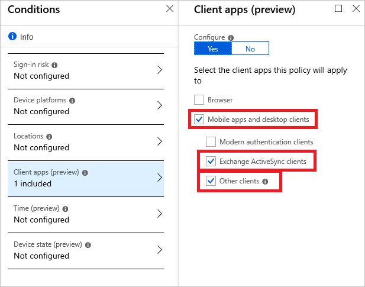
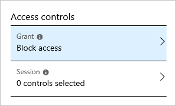
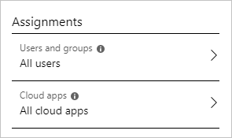
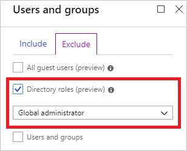
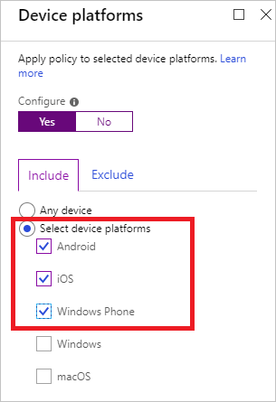

# How to: Block legacy authentication to Azure AD with Conditional Access   

To give your users easy access to your cloud apps, Azure Active Directory (Azure AD) supports a broad variety of authentication protocols including legacy authentication. However, legacy protocols don't support multi-factor authentication (MFA). MFA is in many environments a common requirement to address identity theft. 

Alex Weinert, Director of Identity Security at Microsoft, in his March 12, 2020 blog post [New tools to block legacy authentication in your organization](https://techcommunity.microsoft.com/t5/azure-active-directory-identity/new-tools-to-block-legacy-authentication-in-your-organization/ba-p/1225302#) emphasizes why organizations should block legacy authentication and what additional tools Microsoft provides to accomplish this task:

> For MFA to be effective, you also need to block legacy authentication. This is because legacy authentication protocols like POP, SMTP, IMAP, and MAPI can't enforce MFA, making them preferred entry points for adversaries attacking your organization...
> 
>...The numbers on legacy authentication from an analysis of Azure Active Directory (Azure AD) traffic are stark:
> 
> - More than 99 percent of password spray attacks use legacy authentication protocols
> - More than 97 percent of credential stuffing attacks use legacy authentication
> - Azure AD accounts in organizations that have disabled legacy authentication experience 67 percent fewer compromises than those where legacy authentication is enabled
>

If your environment is ready to block legacy authentication to improve your tenant's protection, you can accomplish this goal with Conditional Access. This article explains how you can configure Conditional Access policies that block legacy authentication for your tenant.

## Prerequisites

This article assumes that you are familiar with: 

- The [basic concepts](overview.md) of Azure AD Conditional Access 
- The [best practices](best-practices.md) for configuring Conditional Access policies in the Azure portal

## Scenario description

Azure AD supports several of the most widely used authentication and authorization protocols including legacy authentication. Legacy authentication refers to protocols that use basic authentication. Typically, these protocols can't enforce any type of second factor authentication. Examples for apps that are based on legacy authentication are:

- Older Microsoft Office apps
- Apps using mail protocols like POP, IMAP, and SMTP

Single factor authentication (for example, username and password) is not enough these days. Passwords are bad as they are easy to guess and we (humans) are bad at choosing good passwords. Passwords are also vulnerable to a variety of attacks like phishing and password spray. One of the easiest things you can do to protect against password threats is to implement MFA. With MFA, even if an attacker gets in possession of a user's password, the password alone is not sufficient to successfully authenticate and access the data.

How can you prevent apps using legacy authentication from accessing your tenant's resources? The recommendation is to just block them with a Conditional Access policy. If necessary, you allow only certain users and specific network locations to use apps that are based on legacy authentication.

Conditional Access policies are enforced after the first-factor authentication has been completed. Therefore, Conditional Access is not intended as a first line defense for scenarios like denial-of-service (DoS) attacks, but can utilize signals from these events (for example, the sign-in risk level, location of the request, and so on) to determine access.

## Implementation

This section explains how to configure a Conditional Access policy to block legacy authentication. 

### Legacy authentication protocols

The following options are considered legacy authentication protocols

- Authenticated SMTP - Used by POP and IMAP client's to send email messages.
- Autodiscover - Used by Outlook and EAS clients to find and connect to mailboxes in Exchange Online.
- Exchange Online PowerShell - Used to connect to Exchange Online with remote PowerShell. If you block Basic authentication for Exchange Online PowerShell, you need to use the Exchange Online PowerShell Module to connect. For instructions, see [Connect to Exchange Online PowerShell using multi-factor authentication](/powershell/exchange/exchange-online/connect-to-exchange-online-powershell/mfa-connect-to-exchange-online-powershell).
- Exchange Web Services (EWS) - A programming interface that's used by Outlook, Outlook for Mac, and third-party apps.
- IMAP4 - Used by IMAP email clients.
- MAPI over HTTP (MAPI/HTTP) - Used by Outlook 2010 and later.
- Offline Address Book (OAB) - A copy of address list collections that are downloaded and used by Outlook.
- Outlook Anywhere (RPC over HTTP) - Used by Outlook 2016 and earlier.
- Outlook Service - Used by the Mail and Calendar app for Windows 10.
- POP3 - Used by POP email clients.
- Reporting Web Services - Used to retrieve report data in Exchange Online.
- Other clients - Other protocols identified as utilizing legacy authentication.

For more information about these authentication protocols and services, see [Sign-in activity reports in the Azure Active Directory portal](../reports-monitoring/concept-sign-ins.md#filter-sign-in-activities).

### Identify legacy authentication use

Before you can block legacy authentication in your directory, you need to first understand if your users have apps that use legacy authentication and how it affects your overall directory. Azure AD sign-in logs can be used to understand if you're using legacy authentication.

1. Navigate to the **Azure portal** > **Azure Active Directory** > **Sign-ins**.
1. Add the Client App column if it is not shown by clicking on **Columns** > **Client App**.
1. **Add filters** > **Client App** > select all of the legacy authentication protocols, and click **Apply**.

Filtering will only show you sign-in attempts that were made by legacy authentication protocols. Clicking on each individual sign-in attempt will show you additional details. The **Client App** field under the **Basic Info** tab will indicate which legacy authentication protocol was used.

These logs will indicate which users are still depending on legacy authentication and which applications are using legacy protocols to make authentication requests. For users that do not appear in these logs and are confirmed to not be using legacy authentication, implement a Conditional Access policy for these users only.

### Block legacy authentication 

In a Conditional Access policy, you can set a condition that is tied to the client apps that are used to access your resources. The client apps condition enables you to narrow down the scope to apps using legacy authentication by selecting **Exchange ActiveSync clients** and **Other clients** under **Mobile apps and desktop clients**.

To block access for these apps, you need to select **Block access**.

### Select users and cloud apps

If you want to block legacy authentication for your organization, you probably think that you can accomplish this by selecting:

- All users
- All cloud apps
- Block access

Azure has a safety feature that prevents you from creating a policy like this because this configuration violates the  [best practices](best-practices.md) for Conditional Access policies.
 

The safety feature is necessary because *block all users and all cloud apps* has the potential to block your entire organization from signing on to your tenant. You must exclude at least one user to satisfy the minimal best practice requirement. You could also exclude a directory role.

You can satisfy this safety feature by excluding one user from your policy. Ideally, you should define a few [emergency-access administrative accounts in Azure AD](../users-groups-roles/directory-emergency-access.md) and exclude them from your policy.

Using [report-only mode](concept-conditional-access-report-only.md) when enabling your policy to block legacy authentication provides your organization an opportunity to monitor what the impact of the policy would be.

## Policy deployment

Before you put your policy into production, take care of:
 
- **Service accounts** - Identify user accounts that are used as service accounts or by devices, like conference room phones. Make sure these accounts have strong passwords and add them to an excluded group.
- **Sign-in reports** - Review the sign-in report and look for **other client** traffic. Identify top usage and investigate why it is in use. Usually, the traffic is generated by older Office clients that do not use modern authentication, or some third-party mail apps. Make a plan to move usage away from these apps, or if the impact is low, notify your users that they can't use these apps anymore.
 
For more information, see [How should you deploy a new policy?](best-practices.md#how-should-you-deploy-a-new-policy).

## What you should know

Blocking access using **Other clients** also blocks Exchange Online PowerShell and Dynamics 365 using basic auth.

Configuring a policy for **Other clients** blocks the entire organization from certain clients like SPConnect. This block happens because older clients authenticate in unexpected ways. The issue doesn't apply to major Office applications like the older Office clients.

It can take up to 24 hours for the policy to go into effect.

You can select all available grant controls for the **Other clients** condition; however, the end-user experience is always the same - blocked access.

If you block legacy authentication using the **Other clients** condition, you can also set the device platform and location condition. For example, if you only want to block legacy authentication for mobile devices, set the **device platforms** condition by selecting:

- Android
- iOS
- Windows Phone

## Next steps

- [Determine impact using Conditional Access report-only mode](howto-conditional-access-report-only.md)
- If you are not familiar with configuring Conditional Access policies yet, see [require MFA for specific apps with Azure Active Directory Conditional Access](app-based-mfa.md) for an example.
- For more information about modern authentication support, see [How modern authentication works for Office 2013 and Office 2016 client apps](/office365/enterprise/modern-auth-for-office-2013-and-2016) 
- [How to set up a multifunction device or application to send email using Office 365 and Microsoft 365](/exchange/mail-flow-best-practices/how-to-set-up-a-multifunction-device-or-application-to-send-email-using-office-3)
