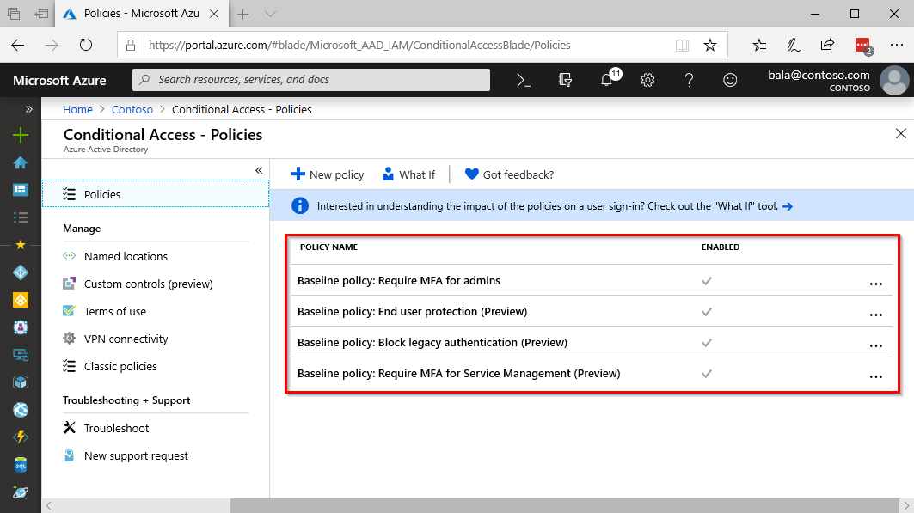

# What are baseline policies?

Baseline policies are a set of predefined policies that help protect organizations against many common attacks. These common attacks can include password spray, replay, and phishing. Baseline policies are available in all editions of Azure AD. Microsoft is making these baseline protection policies available to everyone because identity-based attacks have been on the rise over the last few years. The goal of these four policies is to ensure that all organizations have a baseline level of security enabled at no extra cost.

Managing customized Conditional Access policies requires an Azure AD Premium license.

> [!IMPORTANT]
> Baseline policies are being deprecated. See [Archive for What's new in Azure Active Directory?](../fundamentals/whats-new-archive.md#replacement-of-baseline-policies-with-security-defaults) for more information.

## Baseline policies

There are four baseline policies:

* Require MFA for admins (preview)
* End user protection (preview)
* Block legacy authentication (preview)
* Require MFA for service management (preview)

All four of these policies will impact legacy authentication flows like POP, IMAP, and older Office desktop clients.

### Exclusions

When baseline policies went into their initial public preview, there was an option to exclude users from the policies. This capability evolved through the preview and was removed in July of 2019. Organizations who had already created exclusions were able to continue to keep them new users were unable to add exclusions to the policies.

### Require MFA for admins (preview)

Due to the power and access that administrator accounts have, you should treat them with special care. One common method to improve the protection of privileged accounts is to require a stronger form of account verification when they are used to sign in. In Azure Active Directory, you can get a stronger account verification by requiring administrators to register for and use Azure Multi-Factor Authentication.

Require MFA for admins (preview) is a baseline policy that requires multi-factor authentication (MFA) for the following directory roles, considered to be the most privileged Azure AD roles:

* Global administrator
* SharePoint administrator
* Exchange administrator
* Conditional Access administrator
* Security administrator
* Helpdesk administrator / Password administrator
* Billing administrator
* User administrator

If your organization has these accounts in use in scripts or code, consider replacing them with [managed identities](../managed-identities-azure-resources/overview.md).

### End user protection (preview)

High privileged administrators aren’t the only ones targeted in attacks. Bad actors tend to target normal users. After gaining access, these bad actors can request access to privileged information on behalf of the original account holder or download the entire directory and perform a phishing attack on your whole organization. One common method to improve the protection for all users is to require a stronger form of account verification when a risky sign-in is detected.

**End user protection (preview)** is a baseline policy that protects all users in a directory. Enabling this policy requires all users to register for Azure Multi-Factor Authentication within 14 days. Once registered, users will be prompted for MFA only during risky sign-in attempts. Compromised user accounts are blocked until password reset and risk dismissal. 

> [!NOTE]
> Any users previously flagged for risk are blocked until password reset and risk dismissal upon policy activation.

### Block legacy authentication (preview)

Legacy authentication protocols (ex: IMAP, SMTP, POP3) are protocols normally used by older mail clients to authenticate. Legacy protocols do not support multi-factor authentication. Even if you have a policy requiring multi-factor authentication for your directory, a bad actor can authenticate using one of these legacy protocols and bypass multi-factor authentication.

The best way to protect your account from malicious authentication requests made by legacy protocols is to block them.

The **Block legacy authentication (preview)** baseline policy blocks authentication requests that are made using legacy protocols. Modern authentication must be used to successfully sign in for all users. Used in conjunction with the other baseline policies, requests coming from legacy protocols will be blocked. In addition, all users will be required to MFA whenever required. This policy does not block Exchange ActiveSync.

### Require MFA for service management (preview)

Organizations use a variety of Azure services and manage them from Azure Resource Manager based tools like:

* Azure portal
* Azure PowerShell
* Azure CLI

Using any of these tools to perform resource management is a highly privileged action. These tools can alter subscription-wide configurations, such as service settings and subscription billing.

To protect privileged actions, this **Require MFA for service management (preview)** policy will require multi-factor authentication for any user accessing Azure portal, Azure PowerShell, or Azure CLI.

## Next steps

For more information, see:

* [Enabling security defaults](../fundamentals/concept-fundamentals-security-defaults.md)
* [Common Conditional Access policies](concept-conditional-access-policy-common.md)
* [Five steps to securing your identity infrastructure](../../security/fundamentals/steps-secure-identity.md)
