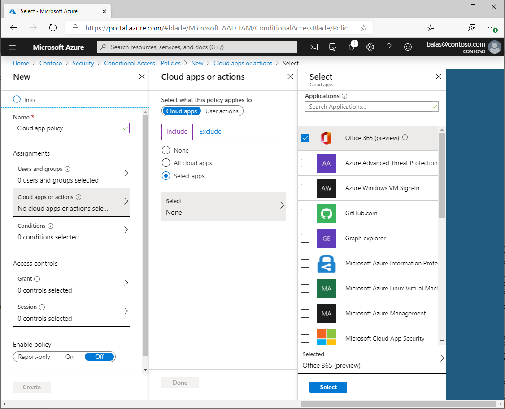

# Conditional Access: Cloud apps and actions

Cloud apps or actions is a key part of a Conditional Access policy. Conditional Access policies allow administrators to assign controls to specific applications or actions. 

- Administrators can choose from the list of applications that include built-in Microsoft applications and any [Azure AD integrated applications](../manage-apps/what-is-application-management.md) including gallery, non-gallery, and applications published through [Application Proxy](../manage-apps/what-is-application-proxy.md).
- Administrators may choose to define policy not based on a cloud application but on a user action. The only supported action is Register security information (preview), allowing Conditional Access to enforce controls around the [combined security information registration experience](../authentication/howto-registration-mfa-sspr-combined.md).

## Microsoft cloud applications

Many of the existing Microsoft cloud applications are included in the list of applications you can select from. 

Administrators can assign a Conditional Access policy to the following cloud apps from Microsoft. Some apps like the Office 365 (preview) and Microsoft Azure Management include multiple related child apps or services. The following list is not exhaustive and is subject to change.

- [Office 365 (preview)](#office-365-preview)
- Azure Analysis Services
- Azure DevOps
- [Azure SQL Database and Data Warehouse](../../sql-database/sql-database-conditional-access.md)
- Dynamics CRM Online
- Microsoft Application Insights Analytics
- [Microsoft Azure Information Protection](https://docs.microsoft.com/azure/information-protection/faqs#i-see-azure-information-protection-is-listed-as-an-available-cloud-app-for-conditional-accesshow-does-this-work)
- [Microsoft Azure Management](#microsoft-azure-management)
- Microsoft Azure Subscription Management
- Microsoft Cloud App Security
- Microsoft Commerce Tools Access Control Portal
- Microsoft Commerce Tools Authentication Service
- Microsoft Flow
- Microsoft Forms
- Microsoft Intune
- [Microsoft Intune Enrollment](https://docs.microsoft.com/intune/enrollment/multi-factor-authentication)
- Microsoft Planner
- Microsoft PowerApps
- Microsoft Search in Bing
- Microsoft StaffHub
- Microsoft Stream
- Microsoft Teams
- Office 365 Exchange Online
- Office 365 SharePoint Online
- Office 365 Yammer
- Office Delve
- Office Sway
- Outlook Groups
- Power BI Service
- Project Online
- Skype for Business Online
- Virtual Private Network (VPN)
- Windows Defender ATP

### Office 365 (preview)

Office 365 provides cloud-based productivity and collaboration services like Exchange, SharePoint, and Microsoft Teams. Office 365 cloud services are deeply integrated to ensure smooth and collaborative experiences. This integration can cause confusion when creating policies as some apps such as Microsoft Teams have dependencies on others such as SharePoint or Exchange.

The Office 365 (preview) app makes it possible to target these services all at once. We recommend using the new Office 365 (preview) app, instead of targeting individual cloud apps. Targeting this group of applications helps to avoid issues that may arise due to inconsistent policies and dependencies.

Administrators can choose to exclude specific apps from policy if they wish by including the Office 365 (preview) app and excluding the specific apps of their choice in policy.

Key applications that are included in the Office 365 (preview) client app:

   - Microsoft Flow
   - Microsoft Forms
   - Microsoft Office 365 Portal
   - Microsoft Stream
   - Microsoft To-Do
   - Microsoft Teams
   - Office 365 Exchange Online
   - Office 365 SharePoint Online
   - Office 365 Search Service
   - Office 365 Yammer
   - Office Delve
   - Office Online
   - OneDrive
   - PowerApps
   - Skype for Business Online
   - Sway

### Microsoft Azure Management

The Microsoft Azure Management application includes multiple underlying services. 

   - Azure portal
   - Azure Resource Manager provider
   - Classic deployment model APIs
   - Azure PowerShell
   - Visual Studio subscriptions administrator portal
   - Azure DevOps
   - Azure Data Factory portal

> [!NOTE]
> The Microsoft Azure Management application applies to Azure PowerShell, which calls the Azure Resource Manager API. It does not apply to Azure AD PowerShell, which calls Microsoft Graph.

## Other applications

In addition to the Microsoft apps, administrators can add any Azure AD registered application to Conditional Access policies. These applications may include: 

- Applications published through [Azure AD Application Proxy](../manage-apps/what-is-application-proxy.md)
- [Applications added from the gallery](../manage-apps/add-application-portal.md)
- [Custom applications not in the gallery](../manage-apps/add-non-gallery-app.md)
- [Legacy applications published through app delivery controllers and networks](../manage-apps/secure-hybrid-access.md)

## User actions

User actions are tasks that can be performed by a user. The only currently supported action is **Register security information (preview)**, which allows Conditional Access policy to enforce when users who are enabled for combined registration attempt to register their security information. More information can be found in the article, [Combined security information registration (preview)](../authentication/concept-registration-mfa-sspr-combined.md).

## Next steps

- [Conditional Access policy components](concept-conditional-access-policies.md)
- [Client application dependencies](service-dependencies.md)
- [Microsoft Intune: Require MFA for device enrollment](https://docs.microsoft.com/intune/enrollment/multi-factor-authentication)
