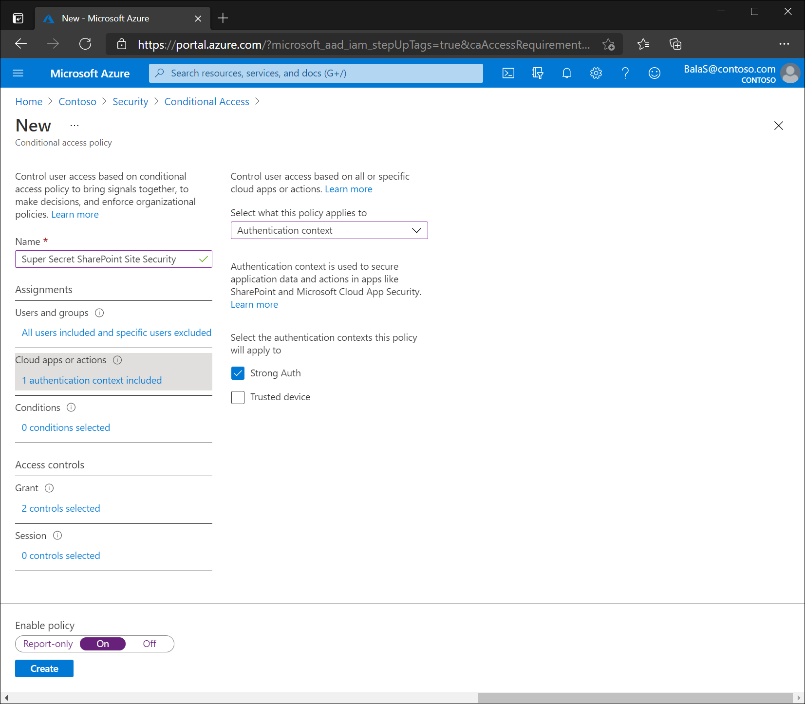
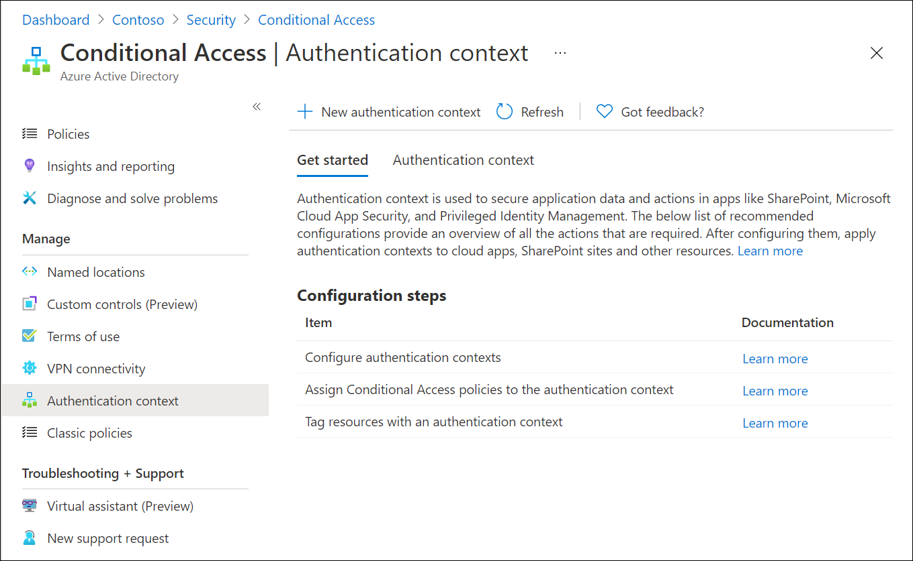

# Conditional Access: Target resources

Target resources (formerly Cloud apps, actions, and authentication context) are key signals in a Conditional Access policy. Conditional Access policies allow administrators to assign controls to specific applications, actions, or authentication context.

- Administrators can choose from the list of applications that include built-in Microsoft applications and any [Azure AD integrated applications](../manage-apps/what-is-application-management.md) including gallery, non-gallery, and applications published through [Application Proxy](../app-proxy/what-is-application-proxy.md).
- Administrators may choose to define policy not based on a cloud application but on a [user action](#user-actions) like **Register security information** or **Register or join devices**, allowing Conditional Access to enforce controls around those actions.
- Administrators can target [traffic forwarding profiles](#traffic-forwarding-profiles) from Global Secure Access for enhanced functionality.
- Administrators can use [authentication context](#authentication-context) to provide an extra layer of security in applications. 

## Microsoft cloud applications

Many of the existing Microsoft cloud applications are included in the list of applications you can select from. 

Administrators can assign a Conditional Access policy to the following cloud apps from Microsoft. Some apps like Office 365 and Microsoft Azure Management include multiple related child apps or services. We continually add more apps, so the following list isn't exhaustive and is subject to change.

- [Office 365](#office-365)
- Azure Analysis Services
- Azure DevOps
- [Azure Data Explorer](/azure/data-explorer/security-conditional-access)
- Azure Event Hubs
- Azure Service Bus
- [Azure SQL Database and Azure Synapse Analytics](/azure/azure-sql/database/conditional-access-configure)
- Common Data Service
- Microsoft Application Insights Analytics
- [Microsoft Azure Information Protection](/azure/information-protection/faqs#i-see-azure-information-protection-is-listed-as-an-available-cloud-app-for-conditional-accesshow-does-this-work)
- [Microsoft Azure Management](#microsoft-azure-management)
- Microsoft Defender for Cloud Apps
- Microsoft Commerce Tools Access Control Portal
- Microsoft Commerce Tools Authentication Service
- Microsoft Forms
- Microsoft Intune
- [Microsoft Intune Enrollment](/intune/enrollment/multi-factor-authentication)
- Microsoft Planner
- Microsoft Power Apps
- Microsoft Power Automate
- Microsoft Search in Bing
- Microsoft StaffHub
- Microsoft Stream
- Microsoft Teams
- Exchange Online
- SharePoint
- Yammer
- Office Delve
- Office Sway
- Outlook Groups
- Power BI Service
- Project Online
- Skype for Business Online
- Virtual Private Network (VPN)
- Windows Defender ATP

> [!IMPORTANT]
> Applications that are available to Conditional Access have gone through an onboarding and validation process. This list doesn't include all Microsoft apps, as many are backend services and not meant to have policy directly applied to them. If you're looking for an application that is missing, you can contact the specific application team or make a request on [UserVoice](https://feedback.azure.com/d365community/forum/22920db1-ad25-ec11-b6e6-000d3a4f0789).

### Office 365

Microsoft 365 provides cloud-based productivity and collaboration services like Exchange, SharePoint, and Microsoft Teams. Microsoft 365 cloud services are deeply integrated to ensure smooth and collaborative experiences. This integration can cause confusion when creating policies as some apps such as Microsoft Teams have dependencies on others such as SharePoint or Exchange.

The Office 365 suite makes it possible to target these services all at once. We recommend using the new Office 365 suite, instead of targeting individual cloud apps to avoid issues with [service dependencies](service-dependencies.md). 

Targeting this group of applications helps to avoid issues that may arise because of inconsistent policies and dependencies. For example: The Exchange Online app is tied to traditional Exchange Online data like mail, calendar, and contact information. Related metadata may be exposed through different resources like search. To ensure that all metadata is protected by as intended, administrators should assign policies to the Office 365 app.

Administrators can exclude the entire Office 365 suite or specific Office 365 cloud apps from the Conditional Access policy.

The following key applications are affected by the Office 365 cloud app:

- Exchange Online
- Microsoft 365 Search Service
- Microsoft Forms
- Microsoft Planner (ProjectWorkManagement)
- Microsoft Stream
- Microsoft Teams
- Microsoft To-Do
- Microsoft Flow
- Microsoft Office 365 Portal
- Microsoft Office client application
- Microsoft To-Do WebApp
- Microsoft Whiteboard Services
- Office Delve
- Office Online
- OneDrive
- Power Apps
- Power Automate
- Security & compliance portal
- SharePoint Online
- Skype for Business Online
- Skype and Teams Tenant Admin API
- Sway
- Yammer

A complete list of all services included can be found in the article [Apps included in Conditional Access Office 365 app suite](reference-office-365-application-contents.md).

### Microsoft Azure Management

When Conditional Access policy is targeted to the Microsoft Azure Management application, within the Conditional Access policy app picker the policy will be enforced for tokens issued to application IDs of a set of services closely bound to the portal.  

- Azure Resource Manager
- Azure portal, which also covers the Microsoft Entra admin center                                                          
- Azure Data Lake                                                
- Application Insights API                              
- Log Analytics API                                         

Because the policy is applied to the Azure management portal and API, services, or clients with an Azure API service dependency, can indirectly be impacted. For example: 

- Classic deployment model APIs 
- Azure PowerShell 
- Azure CLI 
- Azure DevOps 
- Azure Data Factory portal 
- Azure Event Hubs 
- Azure Service Bus 
- [Azure SQL Database](/azure/azure-sql/database/conditional-access-configure)
- SQL Managed Instance 
- Azure Synapse 
- Visual Studio subscriptions administrator portal 
- [Microsoft IoT Central](https://apps.azureiotcentral.com/)

> [!NOTE]
> The Microsoft Azure Management application applies to [Azure PowerShell](/powershell/azure/what-is-azure-powershell), which calls the [Azure Resource Manager API](../../azure-resource-manager/management/overview.md). It does not apply to [Azure AD PowerShell](/powershell/azure/active-directory/overview), which calls the [Microsoft Graph API](/graph/overview).

For more information on how to set up a sample policy for Microsoft Azure Management, see [Conditional Access: Require MFA for Azure management](howto-conditional-access-policy-azure-management.md).

> [!TIP]
> For Azure Government, you should target the Azure Government Cloud Management API application.

### Microsoft Admin Portals (preview)

When a Conditional Access policy targets the Microsoft Admin Portals cloud app, the policy is enforced for tokens issued to application IDs of the following Microsoft administrative portals:

- Microsoft 365 Admin Center
- Exchange admin center
- Azure portal
- Microsoft Entra admin center
- Security and Microsoft Purview compliance portal

Other Microsoft admin portals will be added over time.

> [!IMPORTANT]
> Microsoft Admin Poratls (preview) is not currently supported in Government clouds.

> [!NOTE]
> The Microsoft Admin Portals app applies to interactive sign-ins to the listed admin portals only. Sign-ins to the underlying resources or services like Microsoft Graph or Azure Resource Manager APIs are not covered by this application. Those resources are protected by the [Microsoft Azure Management](#microsoft-azure-management) app. This enables customers to move along the MFA adoption journey for admins without impacting automation that relies on APIs and PowerShell. When you are ready, Microsoft recommends using a [policy requiring administrators perform MFA always](howto-conditional-access-policy-admin-mfa.md) for comprehensive protection.

### Other applications

Administrators can add any Azure AD registered application to Conditional Access policies. These applications may include: 

- Applications published through [Azure AD Application Proxy](../app-proxy/what-is-application-proxy.md)
- [Applications added from the gallery](../manage-apps/add-application-portal.md)
- [Custom applications not in the gallery](../manage-apps/view-applications-portal.md)
- [Legacy applications published through app delivery controllers and networks](../manage-apps/secure-hybrid-access.md)
- Applications that use [password based single sign-on](../manage-apps/configure-password-single-sign-on-non-gallery-applications.md)

> [!NOTE]
> Since Conditional Access policy sets the requirements for accessing a service you are not able to apply it to a client (public/native) application. In other words, the policy is not set directly on a client (public/native) application, but is applied when a client calls a service. For example, a policy set on SharePoint service applies to the clients calling SharePoint. A policy set on Exchange applies to the attempt to access the email using Outlook client. That is why client (public/native) applications are not available for selection in the Cloud Apps picker and Conditional Access option is not available in the application settings for the client (public/native) application registered in your tenant. 

Some applications don't appear in the picker at all. The only way to include these applications in a Conditional Access policy is to include **All cloud apps**. 

### All cloud apps

Applying a Conditional Access policy to **All cloud apps** results in the policy being enforced for all tokens issued to web sites and services. This option includes applications that aren't individually targetable in Conditional Access policy, such as Azure Active Directory. 

In some cases, an **All cloud apps** policy could inadvertently block user access. These cases are excluded from policy enforcement and include:

- Services required to achieve the desired security posture. For example, device enrollment calls are excluded from compliant device policy targeted to All cloud apps. 

- Calls to Azure AD Graph and MS Graph, to access user profile, group membership and relationship information that is commonly used by applications excluded from policy. The excluded scopes are listed below. Consent is still required for apps to use these permissions. 
   - For native clients:
      - Azure AD Graph: email, offline_access, openid, profile, User.read
      - MS Graph: User.read, People.read, and UserProfile.read 
   - For confidential / authenticated clients:
      - Azure AD Graph: email, offline_access, openid, profile, User.read, User.read.all, and User.readbasic.all
      - MS Graph: User.read,User.read.all, User.read.All People.read, People.read.all, GroupMember.Read.All, Member.Read.Hidden, and UserProfile.read 

## User actions

User actions are tasks that can be performed by a user. Currently, Conditional Access supports two user actions: 

- **Register security information**: This user action allows Conditional Access policy to enforce when users who are enabled for combined registration attempt to register their security information. More information can be found in the article, [Combined security information registration](../authentication/concept-registration-mfa-sspr-combined.md).

> [!NOTE]
> When applying a policy targeting user actions for register security information, if the user account is a guest from [Microsoft personal account (MSA)](../external-identities/microsoft-account.md), using the control 'Require multifactor authentication', will require the MSA user to register security information with the organization. If the guest user is from another provider such as [Google](../external-identities/google-federation.md), access will be blocked.

- **Register or join devices**: This user action enables administrators to enforce Conditional Access policy when users [register](../devices/concept-device-registration.md) or [join](../devices/concept-directory-join.md) devices to Azure AD. It provides granularity in configuring multifactor authentication for registering or joining devices instead of a tenant-wide policy that currently exists. There are three key considerations with this user action: 
   - `Require multifactor authentication` is the only access control available with this user action and all others are disabled. This restriction prevents conflicts with access controls that are either dependent on Azure AD device registration or not applicable to Azure AD device registration. 
   - `Client apps`, `Filters for devices` and `Device state` conditions aren't available with this user action since they're dependent on Azure AD device registration to enforce Conditional Access policies.
   - When a Conditional Access policy is enabled with this user action, you must set **Azure Active Directory** > **Devices** > **Device Settings** - `Devices to be Azure AD joined or Azure AD registered require Multifactor Authentication` to **No**. Otherwise, the Conditional Access policy with this user action isn't properly enforced. More information about this device setting can found in [Configure device settings](../devices/manage-device-identities.md#configure-device-settings). 

## Traffic forwarding profiles

Traffic forwarding profiles in Global Secure Access enable administrators to define and control how traffic is routed through Microsoft Entra Internet Access and Microsoft Entra Private Access. Traffic forwarding profiles can be assigned to devices and remote networks. For an example of how to configure these traffic profiles in Conditional Access policy, see the article [How to require a compliant network check](../../global-secure-access/how-to-compliant-network.md).

For more information about these profiles, see the article [Global Secure Access traffic forwarding profiles](../../global-secure-access/concept-traffic-forwarding.md).

## Authentication context

Authentication context can be used to further secure data and actions in applications. These applications can be your own custom applications, custom line of business (LOB) applications, applications like SharePoint, or applications protected by Microsoft Defender for Cloud Apps. 

For example, an organization may keep files in SharePoint sites like the lunch menu or their secret BBQ sauce recipe. Everyone may have access to the lunch menu site, but users who have access to the secret BBQ sauce recipe site may need to access from a managed device and agree to specific terms of use.

### Configure authentication contexts

Authentication contexts are managed in the Azure portal under **Azure Active Directory** > **Security** > **Conditional Access** > **Authentication context**.

Create new authentication context definitions by selecting **New authentication context** in the Azure portal. Organizations are limited to a total of 25 authentication context definitions. Configure the following attributes:

- **Display name** is the name that is used to identify the authentication context in Azure AD and across applications that consume authentication contexts. We recommend names that can be used across resources, like "trusted devices", to reduce the number of authentication contexts needed. Having a reduced set limits the number of redirects and provides a better end to end-user experience.
- **Description** provides more information about the policies it's used by Azure AD administrators and those applying authentication contexts to resources.
- **Publish to apps** checkbox when checked, advertises the authentication context to apps and makes them available to be assigned. If not checked the authentication context will be unavailable to downstream resources. 
- **ID** is read-only and used in tokens and apps for request-specific authentication context definitions. It's listed here for troubleshooting and development use cases. 

#### Add to Conditional Access policy

Administrators can select published authentication contexts in their Conditional Access policies under **Assignments** > **Cloud apps or actions** and selecting **Authentication context** from the **Select what this policy applies to** menu.

:::image type="content" source="media/concept-conditional-access-cloud-apps/conditional-access-authentication-context-in-policy.png" alt-text="Adding a Conditional Access authentication context to a policy":::

#### Delete an authentication context 

When you delete an authentication context, make sure no applications are still using it. Otherwise access to app data will no longer be protected. You can confirm this prerequisite by checking sign-in logs for cases when the authentication context Conditional Access policies are being applied. 

To delete an authentication context, it must have no assigned Conditional Access policies and must not be published to apps. This requirement helps prevent the accidental deletion of an authentication context that is still in use. 

### Tag resources with authentication contexts 

For more information about authentication context use in applications, see the following articles.

- [Use sensitivity labels to protect content in Microsoft Teams, Microsoft 365 groups, and SharePoint sites](/microsoft-365/compliance/sensitivity-labels-teams-groups-sites)
- [Microsoft Defender for Cloud Apps](/cloud-app-security/session-policy-aad?branch=pr-en-us-2082#require-step-up-authentication-authentication-context)
- [Custom applications](../develop/developer-guide-conditional-access-authentication-context.md)

## Next steps

- [Conditional Access: Conditions](concept-conditional-access-conditions.md)
- [Conditional Access common policies](concept-conditional-access-policy-common.md)
- [Client application dependencies](service-dependencies.md)
