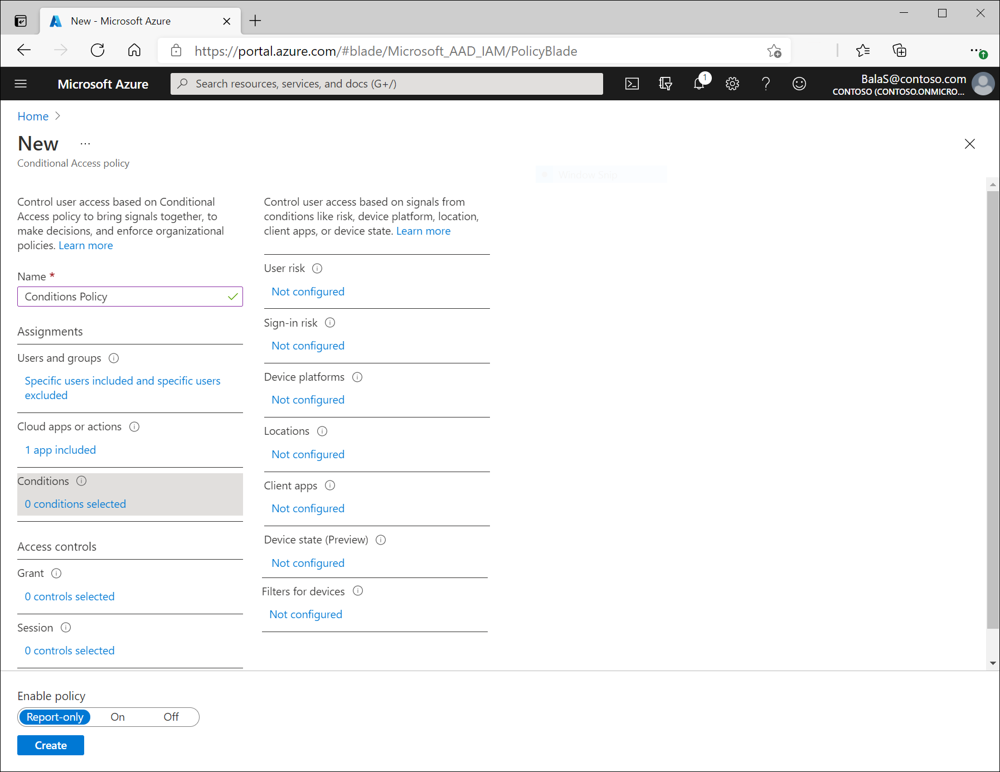

# Conditional Access: Conditions

Within a Conditional Access policy, an administrator can make use of signals from conditions like risk, device platform, or location to enhance their policy decisions. 

Multiple conditions can be combined to create fine-grained and specific Conditional Access policies.

For example, when accessing a sensitive application an administrator may factor sign-in risk information from Identity Protection and location into their access decision in addition to other controls like multi-factor authentication.

## Sign-in risk

For customers with access to [Identity Protection](../identity-protection/overview-identity-protection.md), sign-in risk can be evaluated as part of a Conditional Access policy. Sign-in risk represents the probability that a given authentication request isn't authorized by the identity owner. More information about sign-in risk can be found in the articles, [What is risk](../identity-protection/concept-identity-protection-risks.md#sign-in-risk) and [How To: Configure and enable risk policies](../identity-protection/howto-identity-protection-configure-risk-policies.md).

## Device platforms

The device platform is characterized by the operating system that runs on a device. Azure AD identifies the platform by using information provided by the device, such as user agent strings. Since user agent strings can be modified, this information is unverified. Device platform should be used in concert with Microsoft Intune device compliance policies or as part of a block statement. The default is to apply to all device platforms.

Azure AD Conditional Access supports the following device platforms:

- Android
- iOS
- Windows Phone
- Windows
- macOS

> [!WARNING]
> Microsoft is aware of an issue with Conditional Access policies and macOS 10.15.4 based devices. More information can be found in the the blog post, [Known Issue: Conditional access unexpectedly blocking macOS 10.15.4 native mail client/other apps](https://techcommunity.microsoft.com/t5/intune-customer-success/known-issue-conditional-access-unexpectedly-blocking-macos-10-15/ba-p/1322283).

If you block legacy authentication using the **Other clients** condition, you can also set the device platform condition.

## Locations

When configuring location as a condition, organizations can choose to include or exclude locations. These named locations may include the public IPv4 network information, country or region, or even unknown areas that don't map to specific countries or regions. Only IP ranges can be marked as a trusted location.

When including **any location**, this option includes any IP address on the internet not just configured named locations. When selecting **any location**, administrators can choose to exclude **all trusted** or **selected locations**.

For example, some organizations may choose to not require multi-factor authentication when their users are connected to the network in a trusted location such as their physical headquarters. Administrators could create a policy that includes any location but excludes the selected locations for their headquarters networks.

More information about locations can be found in the article, [What is the location condition in Azure Active Directory Conditional Access](location-condition.md).

## Client apps (preview)

Conditional Access policies by default apply to browser-based applications and applications that utilize modern authentication protocols. In addition to these applications, administrators can choose to include Exchange ActiveSync clients and other clients that utilize legacy protocols.

- Browser
   - These include web-based applications that use protocols like SAML, WS-Federation, OpenID Connect, or services registered as an OAuth confidential client.
- Mobile apps and desktop clients
   - Modern authentication clients
      - This option includes applications like the Office desktop and phone applications.
   - Exchange ActiveSync clients
      - By default this includes all use of the Exchange ActiveSync (EAS) protocol. Choosing **Apply policy only to supported platforms** will limit to supported platforms like iOS, Android, and Windows.
      - When policy blocks the use of Exchange ActiveSync the affected user will receive a single quarantine email. This email with provide information on why they are blocked and include remediation instructions if able.
   - Other clients
      - This option includes clients that use basic/legacy authentication protocols that do not support modern authentication.
         - Authenticated SMTP - Used by POP and IMAP client's to send email messages.
         - Autodiscover - Used by Outlook and EAS clients to find and connect to mailboxes in Exchange Online.
         - Exchange Online PowerShell - Used to connect to Exchange Online with remote PowerShell. If you block Basic authentication for Exchange Online PowerShell, you need to use the Exchange Online PowerShell Module to connect. For instructions, see [Connect to Exchange Online PowerShell using multi-factor authentication](/powershell/exchange/exchange-online/connect-to-exchange-online-powershell/mfa-connect-to-exchange-online-powershell).
         - Exchange Web Services (EWS) - A programming interface that's used by Outlook, Outlook for Mac, and third-party apps.
         - IMAP4 - Used by IMAP email clients.
         - MAPI over HTTP (MAPI/HTTP) - Used by Outlook 2010 and later.
         - Offline Address Book (OAB) - A copy of address list collections that are downloaded and used by Outlook.
         - Outlook Anywhere (RPC over HTTP) - Used by Outlook 2016 and earlier.
         - Outlook Service - Used by the Mail and Calendar app for Windows 10.
         - POP3 - Used by POP email clients.
         - Reporting Web Services - Used to retrieve report data in Exchange Online.

These conditions are commonly used when requiring a managed device, blocking legacy authentication, and blocking web applications but allowing mobile or desktop apps.

### Supported browsers

This setting works with all browsers. However, to satisfy a device policy, like a compliant device requirement, the following operating systems and browsers are supported:

| OS | Browsers |
| :-- | :-- |
| Windows 10 | Microsoft Edge, Internet Explorer, Chrome |
| Windows 8 / 8.1 | Internet Explorer, Chrome |
| Windows 7 | Internet Explorer, Chrome |
| iOS | Microsoft Edge, Intune Managed Browser, Safari |
| Android | Microsoft Edge, Intune Managed Browser, Chrome |
| Windows Phone | Microsoft Edge, Internet Explorer |
| Windows Server 2019 | Microsoft Edge, Internet Explorer, Chrome |
| Windows Server 2016 | Internet Explorer |
| Windows Server 2012 R2 | Internet Explorer |
| Windows Server 2008 R2 | Internet Explorer |
| macOS | Chrome, Safari |

#### Why do I see a certificate prompt in the browser

On Windows 7, iOS, Android, and macOS Azure AD identifies the device using a client certificate that is provisioned when the device is registered with Azure AD.  When a user first signs in through the browser the user is prompted to select the certificate. The user must select this certificate before using the browser.

#### Chrome support

For Chrome support in **Windows 10 Creators Update (version 1703)** or later, install the [Windows 10 Accounts extension](https://chrome.google.com/webstore/detail/windows-10-accounts/ppnbnpeolgkicgegkbkbjmhlideopiji). This extension is required when a Conditional Access policy requires device-specific details.

To automatically deploy this extension to Chrome browsers, create the following registry key:

- Path HKEY_LOCAL_MACHINE\Software\Policies\Google\Chrome\ExtensionInstallForcelist
- Name 1
- Type REG_SZ (String)
- Data ppnbnpeolgkicgegkbkbjmhlideopiji;https\://clients2.google.com/service/update2/crx

For Chrome support in **Windows 8.1 and 7**, create the following registry key:

- Path HKEY_LOCAL_MACHINE\SOFTWARE\Policies\Google\Chrome\AutoSelectCertificateForUrls
- Name 1
- Type REG_SZ (String)
- Data {"pattern":"https://device.login.microsoftonline.com","filter":{"ISSUER":{"CN":"MS-Organization-Access"}}}

These browsers support device authentication, allowing the device to be identified and validated against a policy. The device check fails if the browser is running in private mode.

### Supported mobile applications and desktop clients

Organizations can select **Mobile apps and desktop clients** as client app.

This setting has an impact on access attempts made from the following mobile apps and desktop clients:

| Client apps | Target Service | Platform |
| --- | --- | --- |
| Dynamics CRM app | Dynamics CRM | Windows 10, Windows 8.1, iOS, and Android |
| Mail/Calendar/People app, Outlook 2016, Outlook 2013 (with modern authentication)| Office 365 Exchange Online | Windows 10 |
| MFA and location policy for apps. Device-based policies are not supported.| Any My Apps app service | Android and iOS |
| Microsoft Teams Services - this controls all services that support Microsoft Teams and all its Client Apps - Windows Desktop, iOS, Android, WP, and web client | Microsoft Teams | Windows 10, Windows 8.1, Windows 7, iOS, Android, and macOS |
| Office 2016 apps, Office 2013 (with modern authentication), [OneDrive sync client](/onedrive/enable-conditional-access) | Office 365 SharePoint Online | Windows 8.1, Windows 7 |
| Office 2016 apps, Universal Office apps, Office 2013 (with modern authentication), [OneDrive sync client](/onedrive/enable-conditional-access) | Office 365 SharePoint Online | Windows 10 |
| Office 2016 (Word, Excel, PowerPoint, OneNote only). | Office 365 SharePoint Online | macOS |
| Office 2019| Office 365 SharePoint Online | Windows 10, macOS |
| Office mobile apps | Office 365 SharePoint Online | Android, iOS |
| Office Yammer app | Office 365 Yammer | Windows 10, iOS, Android |
| Outlook 2019 | Office 365 SharePoint Online | Windows 10, macOS |
| Outlook 2016 (Office for macOS) | Office 365 Exchange Online | macOS |
| Outlook 2016, Outlook 2013 (with modern authentication), Skype for Business (with modern authentication) | Office 365 Exchange Online | Windows 8.1, Windows 7 |
| Outlook mobile app | Office 365 Exchange Online | Android, iOS |
| Power BI app | Power BI service | Windows 10, Windows 8.1, Windows 7, Android, and iOS |
| Skype for Business | Office 365 Exchange Online| Android, iOS |
| Visual Studio Team Services app | Visual Studio Team Services | Windows 10, Windows 8.1, Windows 7, iOS, and Android |

### Exchange ActiveSync clients

- Organizations can only select Exchange ActiveSync clients when assigning policy to users or groups. Selecting **All users**, **All guest and external users**, or **Directory roles** will cause all users to become blocked.
- When creating a policy assigned to Exchange ActiveSync clients, **Office 365 Exchange Online** should be the only cloud application assigned to the policy. 
- Organizations can narrow the scope of this policy to specific platforms using the **Device platforms** condition.

If the access control assigned to the policy uses **Require approved client app**, the user is directed to install and use the Outlook mobile client. In the case that **Multi-factor authentication** is required, affected users are blocked, because basic authentication does not support multi-factor authentication.

For more information, see the following articles:

- [Block legacy authentication with Conditional Access](block-legacy-authentication.md)
- [Requiring approved client apps with Conditional Access](app-based-conditional-access.md)

### Other clients

By selecting **Other clients**, you can specify a condition that affects apps that use basic authentication with mail protocols like IMAP, MAPI, POP, SMTP, and older Office apps that don't use modern authentication.

## Device state (preview)

The device state condition can be used to exclude devices that are hybrid Azure AD joined and/or devices marked as compliant with a Microsoft Intune compliance policy from an organization's Conditional Access policies.

For example, *All users* accessing the *Microsoft Azure Management* cloud app including **All device state** excluding **Device Hybrid Azure AD joined** and **Device marked as compliant** and for *Access controls*, **Block**. 
   - This example would create a policy that only allows access to Microsoft Azure Management from devices that are hybrid Azure AD joined and/or devices marked as compliant.

## Next steps

- [Conditional Access: Grant](concept-conditional-access-grant.md)

- [Conditional Access common policies](concept-conditional-access-policy-common.md)
